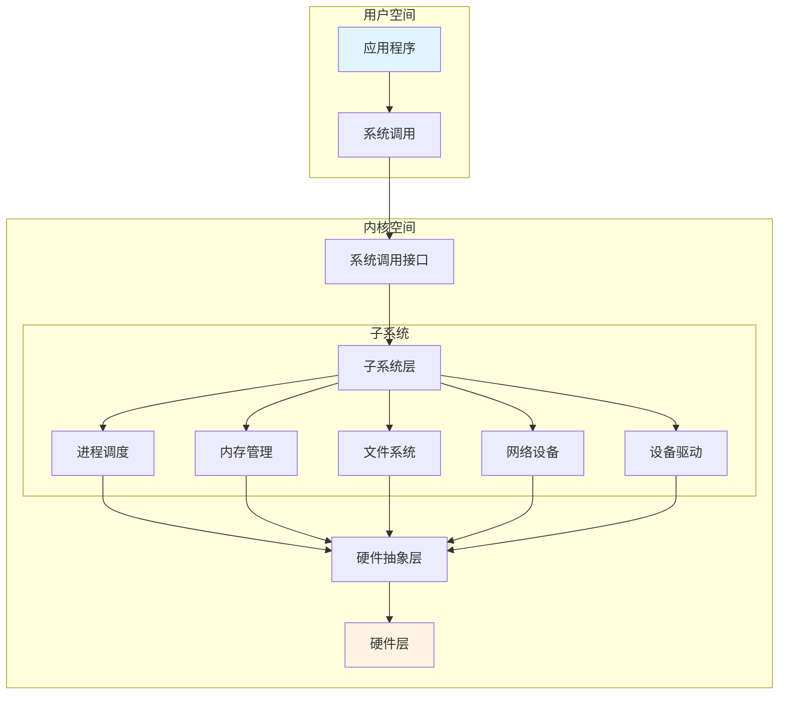
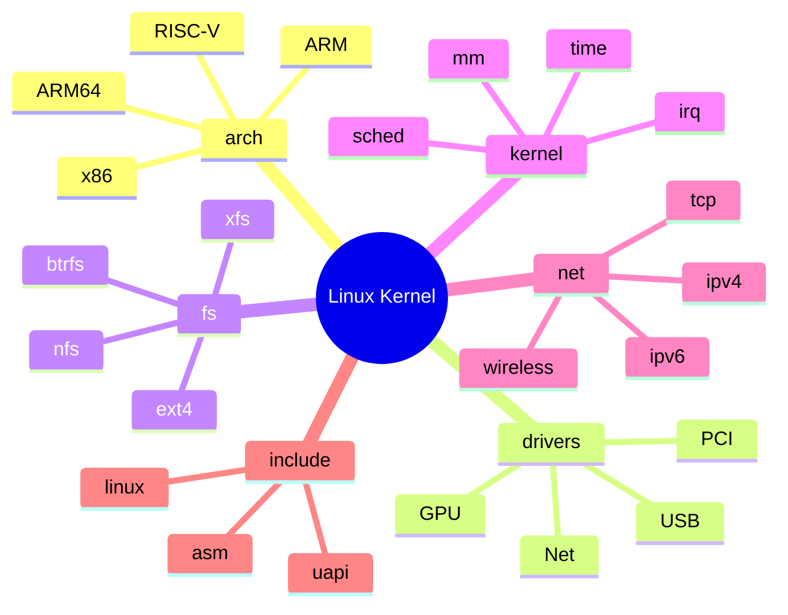
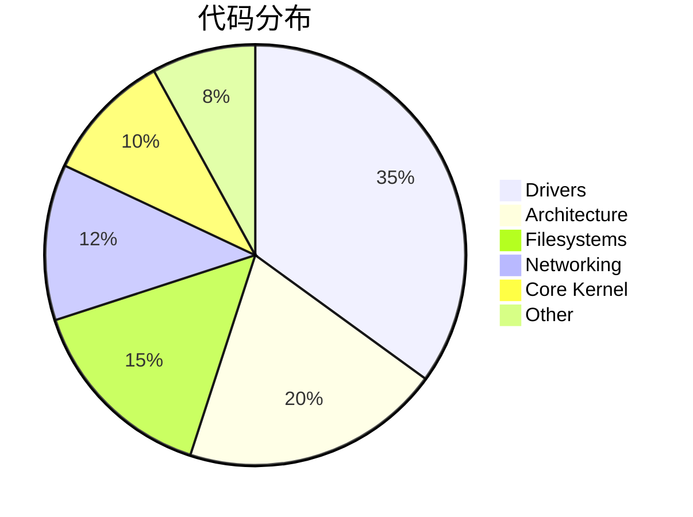

# 01-代码结构分析 - 学习资料

## 📊 内核架构图

### 整体架构

### 目录结构层次

## 📁 目录说明

| 目录 | 作用 | 核心文件 |
|------|------|----------|
| `arch/` | 架构相关代码 | `arch/x86/kernel/` |
| `drivers/` | 设备驱动 | 147 个子系统 |
| `fs/` | 文件系统 | 79 种文件系统 |
| `kernel/` | 核心内核 | 调度、中断等 |
| `mm/` | 内存管理 | 页面分配、VM |
| `net/` | 网络协议栈 | TCP/IP 实现 |
| `include/` | 头文件 | 内核 API 定义 |

## 🔍 代码统计

## 📝 学习笔记

### 关键点

1. **分离架构代码** - `arch/` 目录隔离不同 CPU 架构
2. **驱动占比最大** - 硬件支持代码占 35%+
3. **VFS 抽象** - 文件系统通过 VFS 统一接口
4. **模块化设计** - 各子系统相对独立

### 学习建议

1. 从 `kernel/` 核心代码入手
2. 理解 VFS 抽象层设计
3. 掌握设备驱动模型
4. 阅读网络协议栈实现
