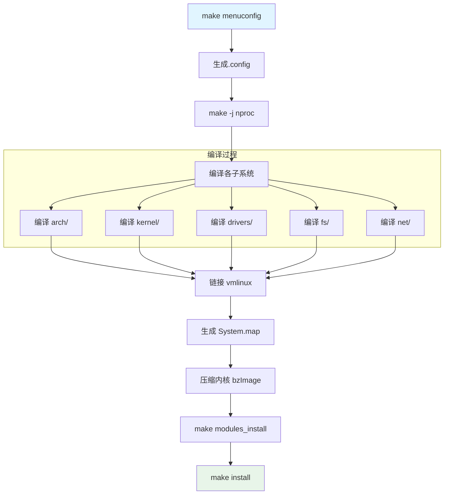
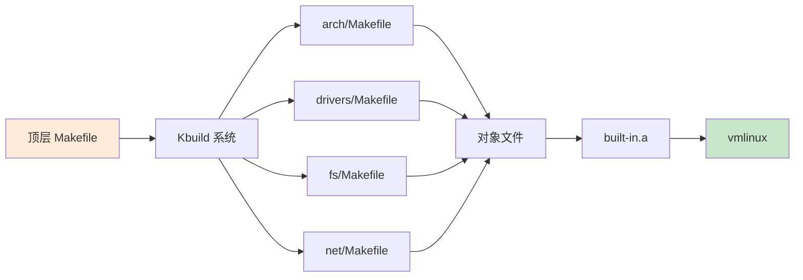
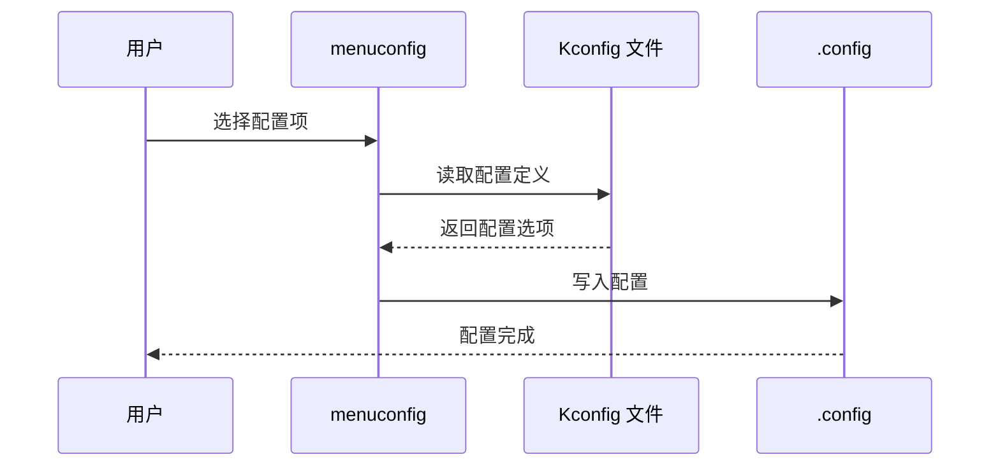

# 02-构建系统详解 - 学习资料

## 📊 构建流程图

### 内核编译流程



### Kbuild 系统架构



### 配置系统



## 📁 目录说明

| 文件 | 大小 | 作用 |
|------|------|------|
| `Makefile` | 74KB | 主构建脚本 |
| `Kbuild` | 2.8KB | 构建规则 |
| `Kconfig` | 582B | 配置选项 |

## 🔧 常用命令

```bash
# 配置
make menuconfig      # 图形配置
make defconfig       # 默认配置

# 编译
make -j$(nproc)      # 并行编译
make modules         # 编译模块

# 安装
make modules_install # 安装模块
make install         # 安装内核

# 清理
make clean           # 清理构建
make mrproper        # 彻底清理
```

## 📝 学习笔记

### Kbuild 语法

```makefile
# 内置对象
obj-y += foo.o

# 模块对象
obj-m += bar.o

# 条件编译
obj-$(CONFIG_EXT4_FS) += ext4/

# 复合对象
obj-y += net/ drivers/
```

### 优化技巧

1. 使用 `ccache` 加速编译
2. 并行编译 `-j$(nproc)`
3. 增量编译只编译修改部分
4. 使用 `cconfig` 管理配置
