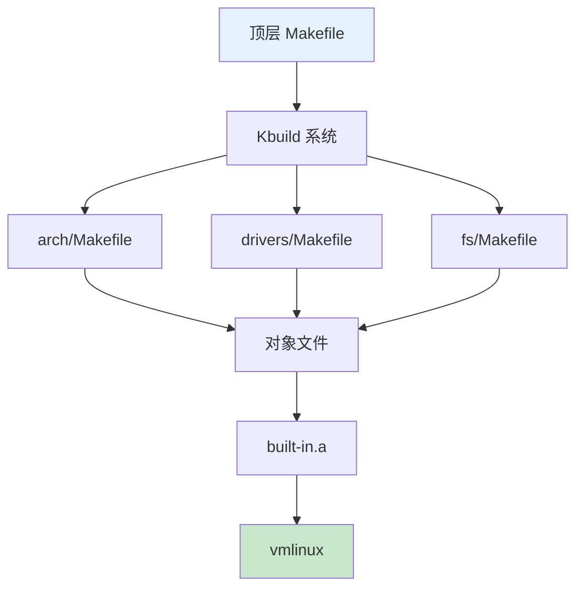

# 构建系统核心原理

> Kbuild 和 Kconfig 详解

---

## 📋 Kbuild 架构



---

## 🔧 Kbuild 语法

```makefile
# 内置对象
obj-y += foo.o

# 模块对象
obj-m += bar.o

# 条件编译
obj-$(CONFIG_EXT4_FS) += ext4/

# 复合对象
obj-y += net/ drivers/
```

---

## ✅ 总结

构建系统核心：

1. **Kbuild** - 构建规则
2. **Kconfig** - 配置管理
3. **Makefile** - 编译脚本
4. **对象管理** - 内置/模块

---

*学习笔记由 全栈工程师 维护*
