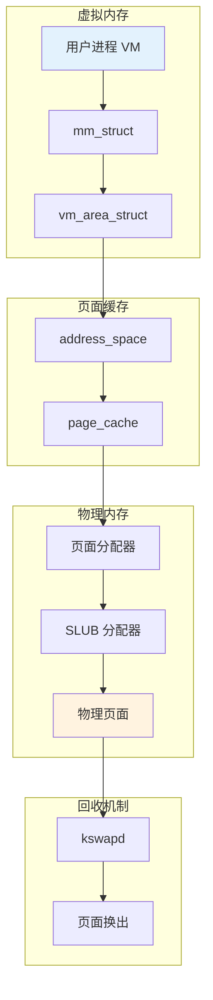
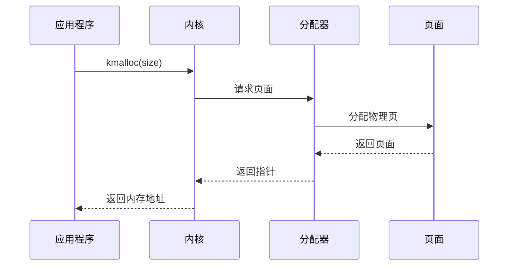
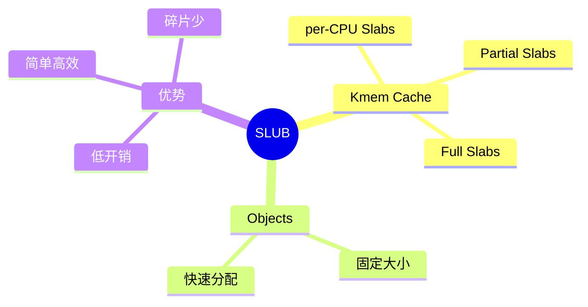

# 03-内存管理 - 学习资料

## 📊 内存管理架构

### 内存管理层次



### 页面分配流程



### SLUB 分配器架构



## 📁 内存区域

| Zone | 范围 | 用途 |
|------|------|------|
| ZONE_DMA | 0-16MB | DMA 设备 |
| ZONE_DMA32 | 16MB-4GB | 32 位设备 |
| ZONE_NORMAL | 4GB 以内 | 内核直接映射 |
| ZONE_HIGHMEM | 4GB 以上 | 高端内存 |

## 🔧 调试工具

```bash
# 查看内存信息
cat /proc/meminfo

# 查看页面统计
cat /proc/vmstat

# 查看 slab 使用
slabtop

# 查看 buddy 信息
cat /proc/buddyinfo
```

## 📝 学习笔记

### 关键数据结构

```c
struct page { }           // 页面描述符
struct zone { }           // 内存区域
struct pglist_data { }    // 节点数据
struct kmem_cache { }     // SLUB 缓存
```

### 常见问题

1. **内存泄漏** - 使用 KASAN 检测
2. **碎片化** - 定期整理或使用 CMA
3. **OOM** - 调整 oom_score_adj
4. **性能** - 使用大页 (HugeTLB)
