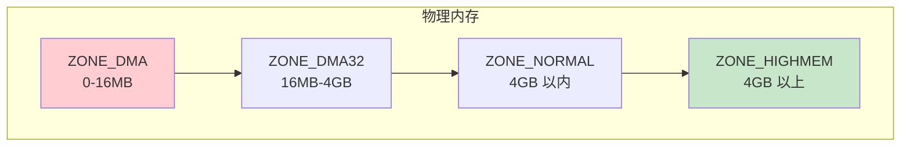
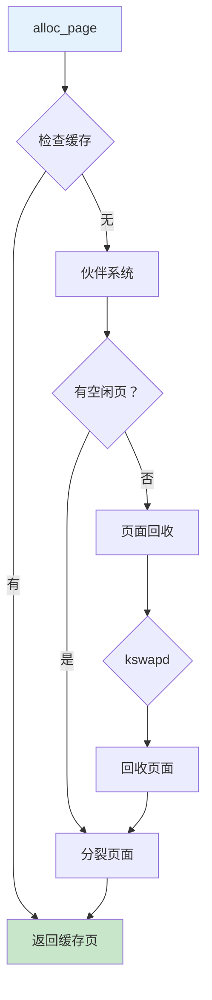

# 页面分配器详解

> 物理内存管理核心

---

## 📋 概述

页面分配器是内核内存管理的基础，负责物理页面的分配和回收。

---

## 🏗️ 页面结构

### struct page

```c
struct page {
    unsigned long flags;        // 页面标志
    struct list_head lru;       // LRU 链表
    struct address_space *mapping;
    pgoff_t index;
    void *private;
    refcount_t _refcount;       // 引用计数
    // ... 更多字段
};

// 页面标志
#define PG_locked           0   // 页面锁定
#define PG_referenced       11  // 页面被引用
#define PG_dirty            13  // 页面脏
#define PG_writeback        18  // 正在回写
#define PG_slab             9   // SLAB 分配器
```

### 内存区域 (Zones)



---

## 🔧 页面分配 API

### 基础分配

```c
// 分配单页
struct page *alloc_page(gfp_t mask);

// 分配连续页
struct page *alloc_pages(gfp_t mask, unsigned int order);

// 释放页面
void __free_page(struct page *page);
void __free_pages(struct page *page, unsigned int order);

// 使用示例
struct page *page;
page = alloc_page(GFP_KERNEL);
if (!page)
    return -ENOMEM;

// 使用后释放
__free_page(page);
```

### GFP 标志

```c
// 行为标志
GFP_KERNEL      // 标准内核分配 (可睡眠)
GFP_ATOMIC      // 原子分配 (不可睡眠)
GFP_NOWAIT      // 不等待
GFP_NOIO        // 不允许 I/O
GFP_NOFS        // 不允许文件系统操作

// 区域标志
__GFP_DMA       // DMA 区域
__GFP_DMA32     // DMA32 区域
__GFP_HIGHMEM   // 高端内存

// 修改标志
__GFP_ZERO      // 清零页面
__GFP_REPEAT    // 重试分配
__GFP_NORETRY   // 不重试
```

---

## 📊 分配流程



---

## 📝 实践示例

### 示例代码

```c
#include <linux/gfp.h>
#include <linux/mm.h>

// 分配 4KB 页面
void test_alloc_single(void)
{
    struct page *page;
    
    page = alloc_page(GFP_KERNEL);
    if (!page) {
        pr_err("Failed to alloc page\n");
        return;
    }
    
    // 获取虚拟地址
    void *addr = page_address(page);
    
    // 使用...
    
    // 释放
    __free_page(page);
}

// 分配连续 8 页 (32KB)
void test_alloc_contiguous(void)
{
    struct page *pages;
    unsigned int order = 3;  // 2^3 = 8 页
    
    pages = alloc_pages(GFP_KERNEL, order);
    if (!pages)
        return;
    
    // 使用...
    
    __free_pages(pages, order);
}
```

---

## ✅ 总结

页面分配器核心要点：

1. **struct page** - 页面元数据
2. **Zones** - 内存区域划分
3. **GFP 标志** - 分配行为控制
4. **伙伴系统** - 高效分配算法
5. **页面回收** - 内存不足处理

---

*学习笔记由 全栈工程师 维护*
