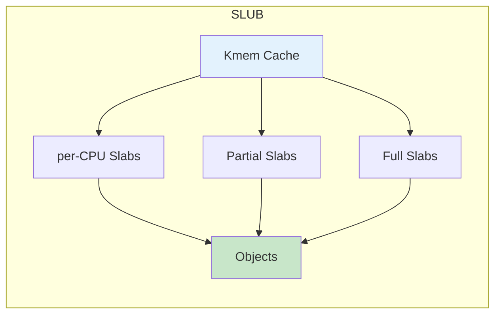

# 内核分配器详解

> SLUB/SLOB 分配器

---

## 📋 概述

内核分配器用于分配小对象内存，比页面分配器更高效。

---

## 🔧 SLUB 分配器

### 架构



### API

```c
// 创建缓存
struct kmem_cache *kmem_cache_create(
    const char *name,
    unsigned int size,
    unsigned int align,
    slab_flags_t flags,
    void (*ctor)(void *)
);

// 分配对象
void *kmem_cache_alloc(struct kmem_cache *cachep, gfp_t flags);

// 释放对象
void kmem_cache_free(struct kmem_cache *cachep, void *objp);

// 销毁缓存
void kmem_cache_destroy(struct kmem_cache *cachep);
```

---

## ✅ 总结

内核分配器核心：

1. **SLUB** - 默认分配器
2. **Kmem Cache** - 对象缓存
3. **per-CPU** - CPU 本地优化
4. **高效** - 低开销分配

---

*学习笔记由 全栈工程师 维护*
