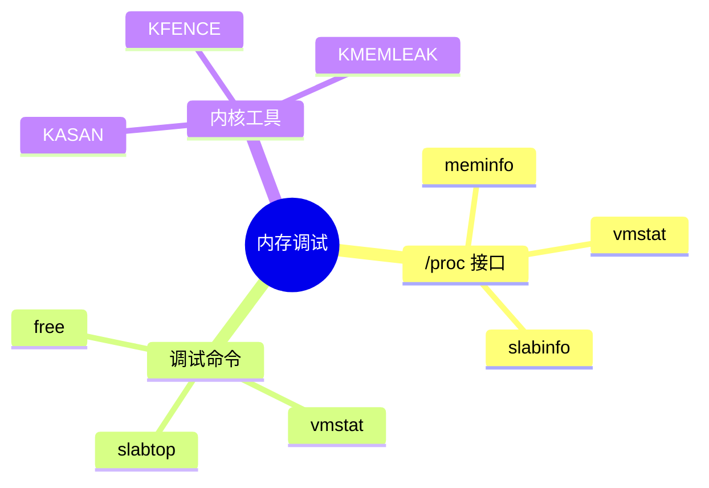

# 内存调试工具

> 从/proc 到 KASAN

---

## 📋 调试方法



---

## 🔍 常用命令

```bash
# 查看内存信息
cat /proc/meminfo

# 页面统计
cat /proc/vmstat

# slab 信息
cat /proc/slabinfo

# 实时查看
slabtop

# buddy 信息
cat /proc/buddyinfo
```

---

## ✅ 总结

内存调试核心工具：

1. **/proc/meminfo** - 系统内存信息
2. **slabtop** - SLUB 使用情况
3. **KASAN** - 地址清理器
4. **buddyinfo** - 伙伴系统状态

---

*学习笔记由 全栈工程师 维护*
