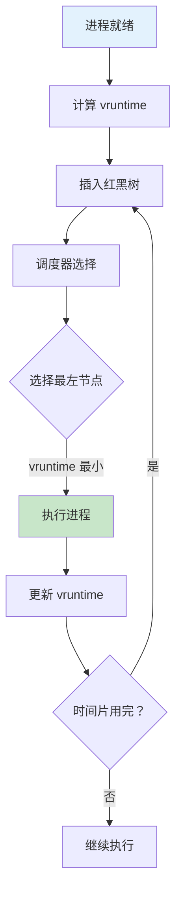
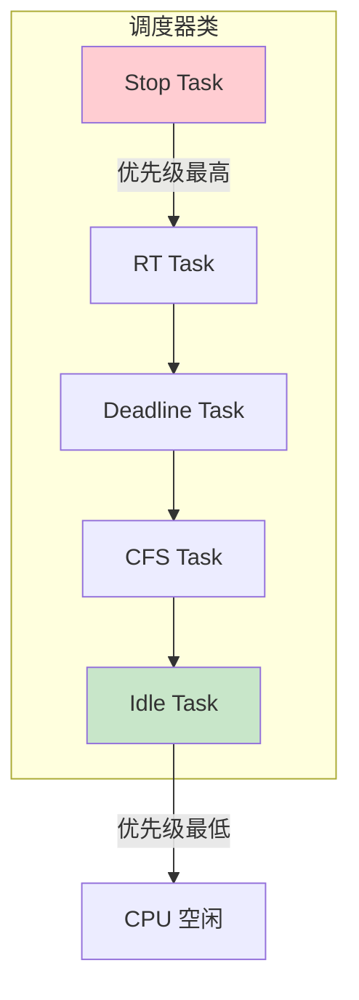
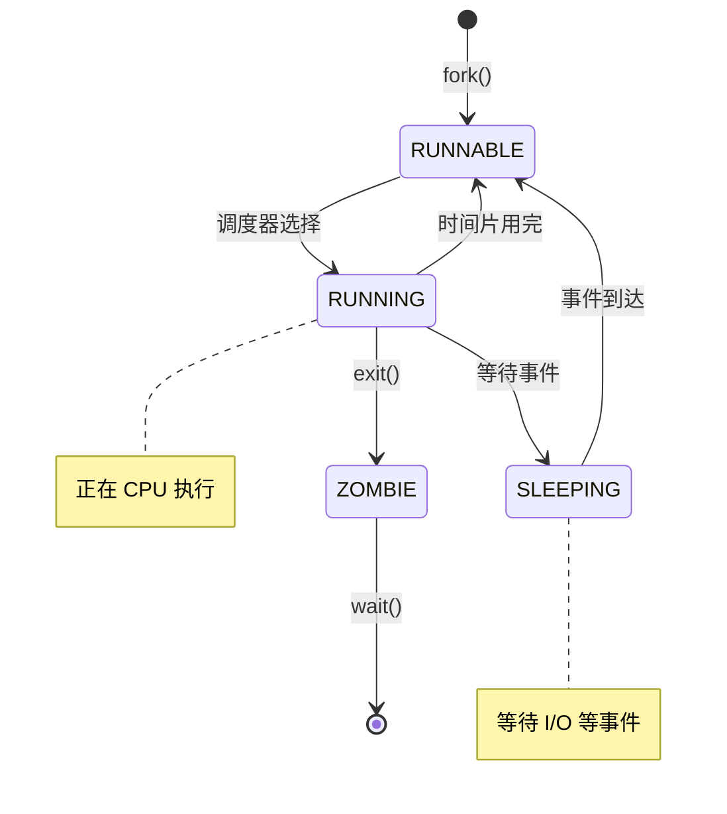

# 04-进程调度 - 学习资料

## 📊 调度器架构

### CFS 调度器流程



### 调度器类层次



### 进程状态转换



## 📊 优先级对比

| 类型 | 范围 | 默认值 |
|------|------|--------|
| RT 优先级 | 0-99 | - |
| Nice 值 | -20 到 19 | 0 |
| 普通优先级 | 100-139 | 120 |

## 🔧 调度调试

```bash
# 查看进程调度信息
cat /proc/[pid]/sched

# 查看调度统计
cat /proc/schedstat

# 实时任务查看
chrt -p [pid]

# 调度延迟分析
perf sched latency
```

## 📝 学习笔记

### CFS 核心概念

1. **vruntime** - 虚拟运行时间，保证公平
2. **红黑树** - 高效选择下一个进程
3. **权重** - Nice 值转换为负载权重
4. **唤醒粒度** - 交互式任务优化

### 调度策略

```c
SCHED_NORMAL    // 普通进程 (CFS)
SCHED_FIFO      // 实时 FIFO
SCHED_RR        // 实时轮转
SCHED_DEADLINE  // 截止时间
SCHED_IDLE      // 空闲优先级
```

### 调优参数

```bash
/proc/sys/kernel/sched_min_granularity_ns
/proc/sys/kernel/sched_latency_ns
/proc/sys/kernel/sched_wakeup_granularity_ns
```
