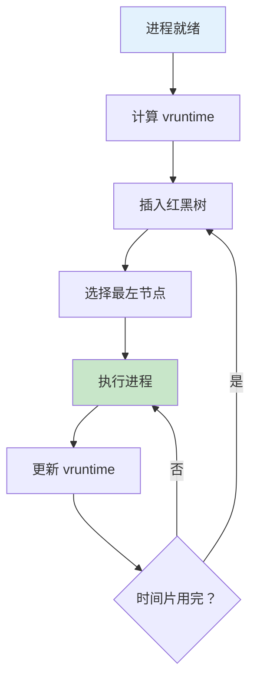

# CFS 调度器核心原理

> 完全公平调度算法

---

## 📋 CFS 架构

---

## 🔧 核心概念

| 概念 | 说明 |
|------|------|
| vruntime | 虚拟运行时间 |
| 红黑树 | 高效选择算法 |
| 权重 | Nice 值转换 |
| 唤醒粒度 | 交互式优化 |

---

## ✅ 总结

CFS 核心：

1. **vruntime** - 公平性保证
2. **红黑树** - O(logN) 选择
3. **权重** - 优先级支持
4. **唤醒** - 交互优化

---

*学习笔记由 全栈工程师 维护*
