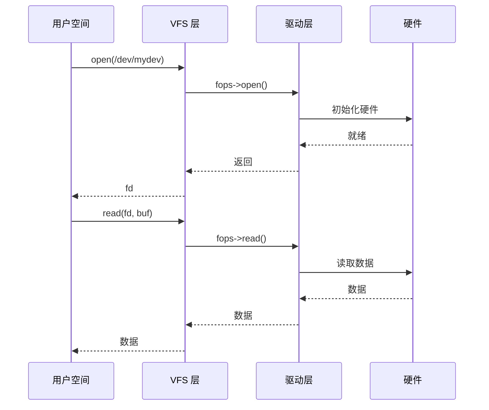
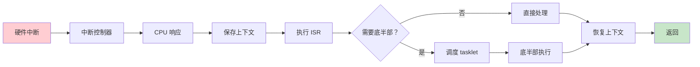

# 05-设备驱动 - 学习资料

## 📊 驱动架构

### Linux 驱动模型

```mermaid
graph TB
    subgraph 设备层
        A[设备 device] --> B[总线 bus]
    end
    
    subgraph 驱动层
        C[驱动 driver] --> B
    end
    
    B --> D[设备驱动绑定]
    D --> E[probe 回调]
    E --> F[设备就绪]
    
    subgraph 用户接口
        F --> G[/dev 设备节点]
        G --> H[用户空间]
    end
    
    style A fill:#e3f2fd
    style C fill:#fff3e0
    style H fill:#e8f5e9
```

### 字符驱动流程



### 中断处理流程



## 📁 设备类型对比

| 类型 | 访问方式 | 示例 |
|------|----------|------|
| 字符设备 | 字节流 | 串口、GPIO |
| 块设备 | 块访问 | 硬盘、SD 卡 |
| 网络设备 | 数据包 | 网卡、WiFi |
| USB 设备 | USB 协议 | U 盘、摄像头 |

## 🔧 驱动开发工具

```bash
# 查看设备
ls /dev/
ls /sys/class/

# 查看驱动
ls /sys/bus/platform/drivers/

# 加载模块
insmod driver.ko
modprobe driver

# 查看日志
dmesg | tail
```

## 📝 学习笔记

### 驱动注册模板

```c
// 平台驱动
static struct platform_driver my_driver = {
    .probe = my_probe,
    .remove = my_remove,
    .driver = {
        .name = "my-device",
        .of_match_table = my_of_match,
    },
};
module_platform_driver(my_driver);
```

### 设备树绑定

```dts
my_device@10000000 {
    compatible = "vendor,device-name";
    reg = <0x10000000 0x1000>;
    interrupts = <0 64 4>;
};
```

### 关键 API

- `platform_get_resource()` - 获取资源
- `devm_ioremap_resource()` - 映射内存
- `devm_request_irq()` - 申请中断
- `devm_kzalloc()` - 分配内存
