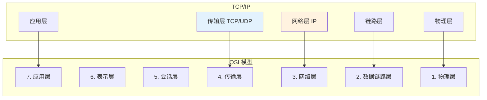
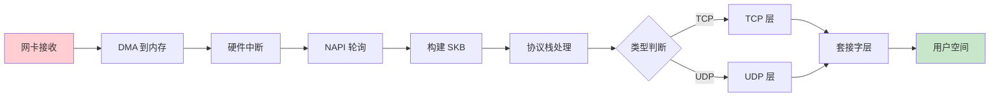
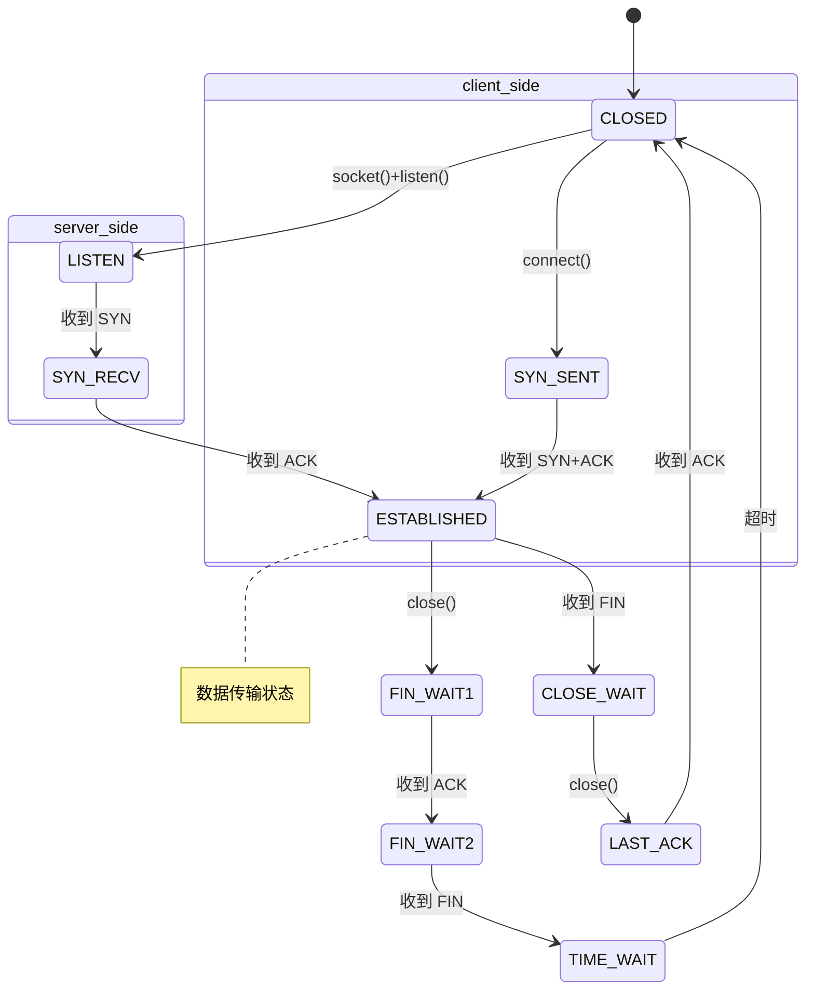

# 06-网络协议栈 - 学习资料

## 📊 网络架构

### OSI 模型对比



### SKB 数据包流转



### TCP 状态机



## 📊 协议栈层次

| 层 | 协议 | 结构 |
|----|------|------|
| 套接字层 | Socket | `struct socket` |
| 传输层 | TCP/UDP | `struct tcphdr` |
| 网络层 | IPv4/IPv6 | `struct iphdr` |
| 链路层 | Ethernet | `struct ethhdr` |

## 🔧 网络调试

```bash
# 查看连接
ss -tuln
netstat -an

# 抓包
tcpdump -i eth0 port 80

# 路由查看
ip route show

# 统计信息
cat /proc/net/snmp
```

## 📝 学习笔记

### SKB 操作

```c
// 分配
struct sk_buff *alloc_skb(unsigned int size, gfp_t priority);

// 释放
void kfree_skb(struct sk_buff *skb);

// 数据操作
skb_put()  // 添加数据到尾部
skb_push() // 添加数据到头部
skb_pull() // 从头部移除数据
```

### Netfilter 钩子

```c
NF_INET_PRE_ROUTING   // 路由前
NF_INET_LOCAL_IN      // 本地输入
NF_INET_FORWARD       // 转发
NF_INET_LOCAL_OUT     // 本地输出
NF_INET_POST_ROUTING  // 路由后
```

### 性能优化

1. **NAPI** - 减少中断开销
2. **零拷贝** - sendfile/splice
3. **RSS** - 多队列网卡
4. **XDP** - 快速数据包处理
