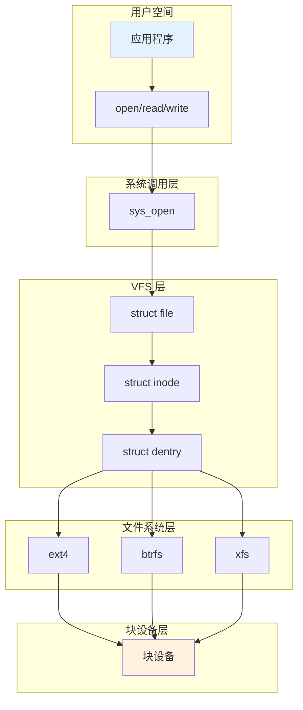
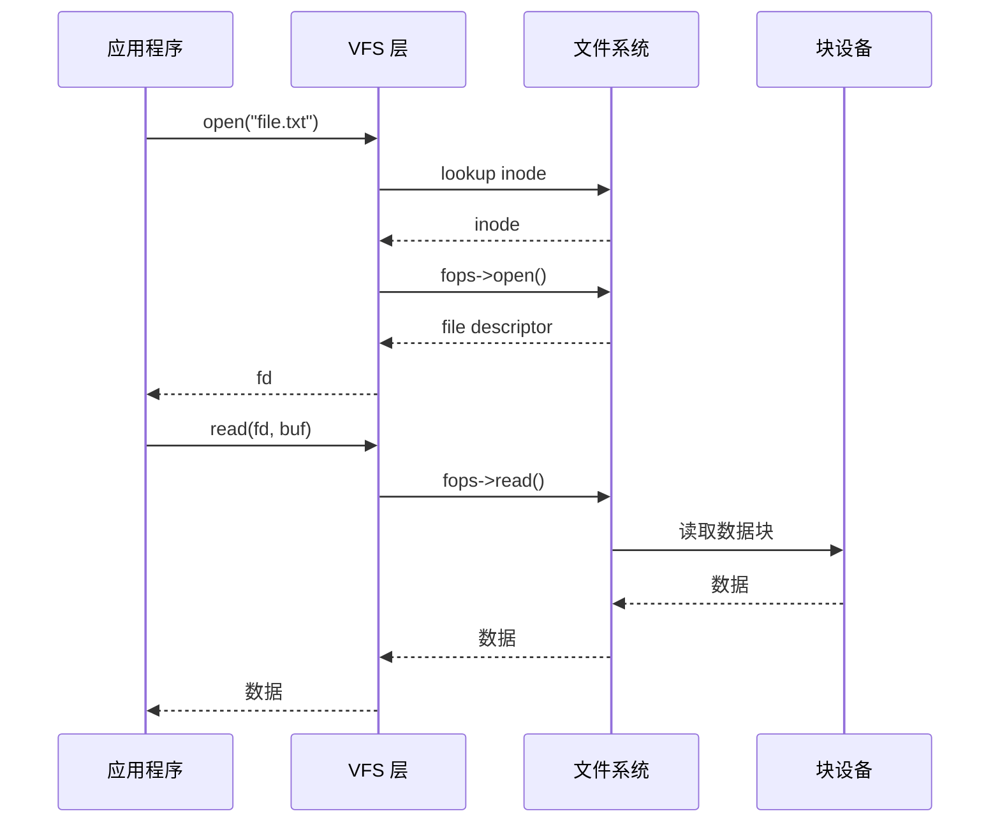
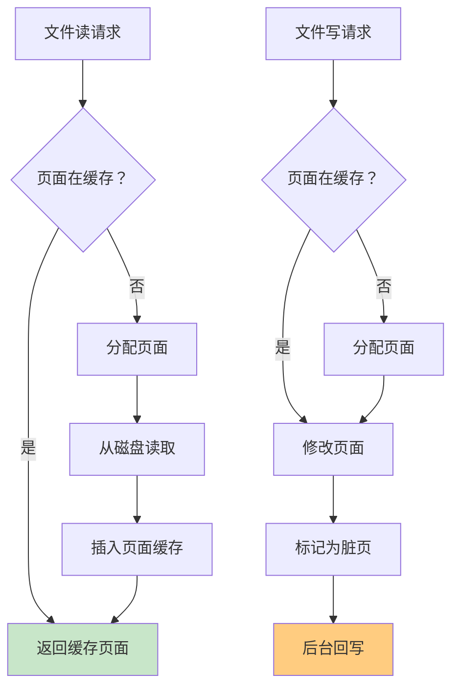

# 07-文件系统 - 学习资料

## 📊 文件系统架构

### VFS 层次结构



### 文件操作流程



### 页面缓存机制



## 📊 文件系统对比

| 文件系统 | 类型 | 最大容量 | 日志 |
|----------|------|----------|------|
| ext4 | 日志式 | 1EB | 是 |
| btrfs | CoW | 16EB | 是 |
| xfs | 日志式 | 8EB | 是 |
| nfs | 网络 | 依赖服务端 | 可选 |

## 🔧 文件系统工具

```bash
# 查看挂载
mount
df -h

# 检查文件系统
fsck /dev/sda1

# 查看 inode
df -i

# EXT4 信息
tune2fs -l /dev/sda1
```

## 📝 学习笔记

### VFS 核心结构

```c
struct super_block { }  // 超级块
struct inode { }        // inode
struct dentry { }       // 目录项
struct file { }         // 文件对象
```

### 文件操作

```c
struct file_operations {
    .open = my_open,
    .read = my_read,
    .write = my_write,
    .release = my_release,
    // ...
};
```

### 性能优化

1. **页面缓存** - 减少磁盘 I/O
2. **预读** - 顺序读优化
3. **延迟分配** - 减少碎片
4. **日志** - 快速恢复
