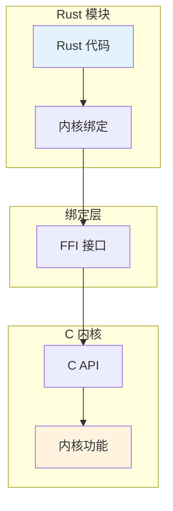
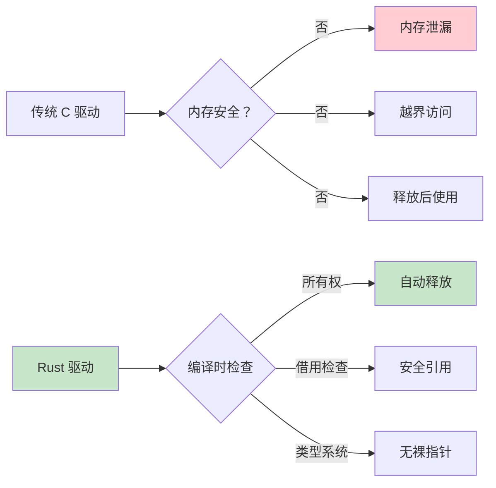
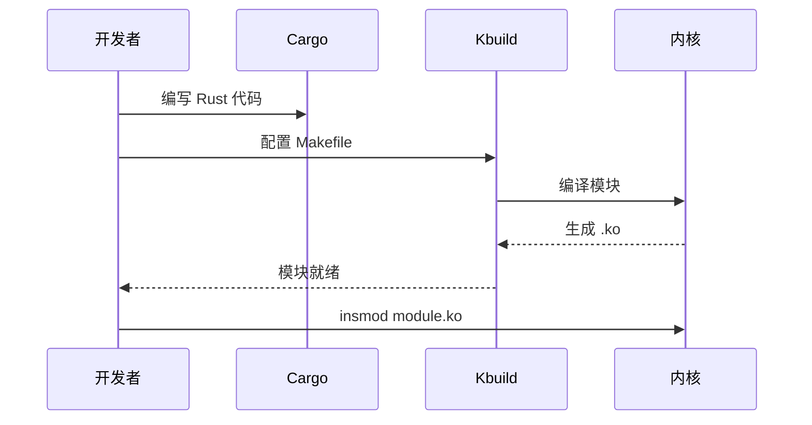

# 08-Rust 内核编程 - 学习资料

## 📊 Rust 内核架构

### Rust 与 C 互操作



### 内存安全保证



### 驱动开发流程



## 📊 Rust 特性对比

| 特性 | C | Rust | 优势 |
|------|---|------|------|
| 内存安全 | ❌ | ✅ | 编译时保证 |
| 空指针 | 常见 | Option | 类型安全 |
| 并发 | 手动 | 安全 | 数据竞争防止 |
| 错误处理 | 返回值 | Result | 强制处理 |

## 🔧 开发工具

```bash
# 检查 Rust 支持
make rustavailable

# 编译 Rust 模块
make modules

# 代码格式化
cargo fmt

# 代码检查
cargo clippy
```

## 📝 学习笔记

### 模块模板

```rust
#![no_std]
#![feature(register_module)]

use kernel::prelude::*;

module! {
    type: MyModule,
    name: "rust_module",
    author: "Name",
    description: "Description",
    license: "GPL",
}

struct MyModule;

impl kernel::Module for MyModule {
    fn init(_name: &'static CStr, 
            _module: &'static ThisModule) -> Result<Self> {
        pr_info!("Rust module loaded\n");
        Ok(Self {})
    }
}
```

### 智能指针

```rust
// 引用计数
let data = Arc::new(MyData { value: 42 });

// 堆分配
let boxed: Box<i32> = Box::new(42);

// 带锁数据
let locked = Arc::new(Mutex::new(data));
```

### 错误处理

```rust
fn may_fail() -> Result<i32> {
    if error {
        return Err(Error::EINVAL);
    }
    Ok(42)
}

// 使用？操作符
let value = may_fail()?;
```

### 优势总结

1. **内存安全** - 无泄漏、无越界
2. **类型安全** - 编译时检查
3. **并发安全** - 数据竞争防止
4. **现代语法** - 模式匹配、闭包
