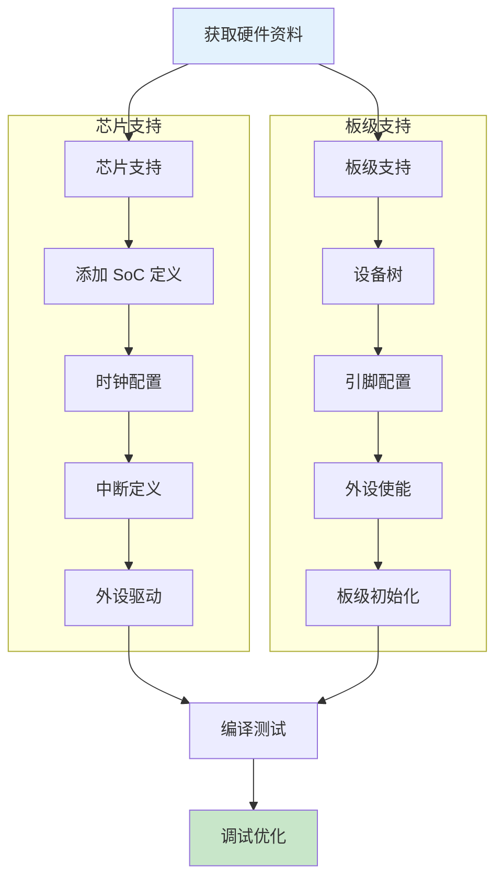
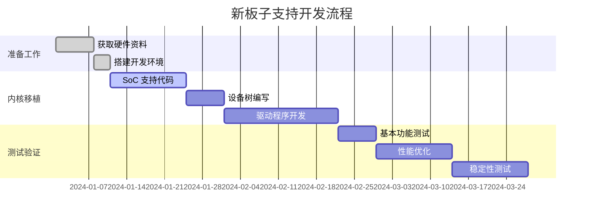

# 如何为新板子/芯片添加支持

> 以 STM32 为例  
> 更新时间：2026-03-20

---

## 📋 工作概述

添加新板子支持需要完成以下工作：



---

## 📁 需要修改的目录

```
linux-kernel/
├── arch/arm/                    # ARM 架构代码
│   ├── mach-stm32/              # STM32 机器支持 ⭐ 新增
│   │   ├── Kconfig
│   │   ├── Makefile
│   │   ├── stm32f4.c            # STM32F4 板级支持
│   │   └── stm32f7.c            # STM32F7 板级支持
│   ├── configs/
│   │   └── stm32_defconfig      # 默认配置 ⭐ 新增
│   └── boot/dts/
│       └── stm/
│           └── stm32xxx.dts     # 设备树 ⭐ 新增
│
├── drivers/                     # 驱动程序
│   ├── clk/
│   │   └── stm32/               # STM32 时钟驱动 ⭐ 新增
│   ├── gpio/
│   │   └── gpio-stm32.c         # GPIO 驱动 ⭐ 新增
│   ├── serial/
│   │   └── stm32-usart.c        # 串口驱动 ⭐ 新增
│   └── ...
│
└── include/
    └── dt-bindings/
        └── clock/
            └── stm32fx-clock.h  # 时钟绑定 ⭐ 新增
```

---

## 🔧 具体工作步骤

### 步骤 1: 添加 SoC 支持

#### 1.1 创建机器目录

```bash
mkdir -p arch/arm/mach-stm32
```

#### 1.2 创建 Kconfig

```kconfig
# arch/arm/mach-stm32/Kconfig
menuconfig ARCH_STM32
    bool "STM32 Platforms"
    depends on ARCH_MULTI_V7
    select ARM_GIC
    select CLKSRC_MMIO
    select COMMON_CLK
    select GPIO_STM32
    select PINCTRL
    help
      Support for STM32 microcontrollers from ST Microelectronics

config MACH_STM32F429
    bool "STM32F429 SoC"
    select MACH_STM32F4
    help
      Support for STM32F429 SoC

config MACH_STM32F4
    bool
    select ARM_AMBA
    select CACHE_L2X0
    select CPU_V7M
```

#### 1.3 创建 Makefile

```makefile
# arch/arm/mach-stm32/Makefile
obj-$(CONFIG_MACH_STM32F4) += stm32f4.o
obj-$(CONFIG_MACH_STM32F7) += stm32f7.o
```

#### 1.4 创建板级支持文件

```c
// arch/arm/mach-stm32/stm32f4.c
#include <linux/kernel.h>
#include <linux/init.h>
#include <linux/of_platform.h>
#include <linux/clk-provider.h>
#include <asm/mach/arch.h>
#include <asm/mach/time.h>

// 设备树兼容表
static const char *const stm32f4_compat[] __initconst = {
    "st,stm32f429",
    "st,stm32f469",
    NULL,
};

// 早期初始化
static void __init stm32f4_init_early(void)
{
    // 早期硬件初始化
}

// 初始化
static void __init stm32f4_init(void)
{
    // 平台设备注册
    of_platform_populate(NULL, of_default_bus_match_table, NULL, NULL);
}

// 机器定义
DT_MACHINE_START(STM32F4_DT, "ST STM32F4 (Device Tree)")
    .init_early       = stm32f4_init_early,
    .init_machine     = stm32f4_init,
    .dt_compat        = stm32f4_compat,
MACHINE_END
```

---

### 步骤 2: 创建设备树

#### 2.1 SoC 级设备树

```dts
// arch/arm/boot/dts/stm/stm32f429.dtsi
/dts-v1/;
#include <dt-bindings/interrupt-controller/arm-gic.h>
#include <dt-bindings/clock/stm32f4-clock.h>

/ {
    compatible = "st,stm32f429";
    interrupt-parent = <&gic>;
    
    #address-cells = <1>;
    #size-cells = <1>;
    
    // 时钟节点
    clocks {
        clk_hse: clk-hse {
            #clock-cells = <0>;
            compatible = "fixed-clock";
            clock-frequency = <8000000>;
        };
        
        clk_lse: clk-lse {
            #clock-cells = <0>;
            compatible = "fixed-clock";
            clock-frequency = <32768>;
        };
    };
    
    // 中断控制器
    gic: interrupt-controller@50021000 {
        compatible = "arm,cortex-a7-gic", "arm,cortex-a15-gic";
        interrupt-controller;
        #interrupt-cells = <3>;
        reg = <0x50021000 0x1000>,
              <0x50022000 0x2000>,
              <0x50024000 0x2000>,
              <0x50026000 0x2000>;
        interrupts = <1 9 (IRQ_TYPE_LEVEL_HIGH | 0x204)>;
    };
    
    // GPIO 控制器
    gpioa: gpio@40020000 {
        compatible = "st,stm32f4-gpio";
        reg = <0x40020000 0x400>;
        clocks = <&clk_gpioa>;
        gpio-controller;
        #gpio-cells = <2>;
        interrupt-controller;
        #interrupt-cells = <2>;
    };
    
    // 串口
    usart1: serial@40011000 {
        compatible = "st,stm32-usart";
        reg = <0x40011000 0x400>;
        interrupts = <37>;
        clocks = <&clk_usart1>;
        status = "disabled";
    };
};
```

#### 2.2 板级设备树

```dts
// arch/arm/boot/dts/stm/stm32f429-disco.dts
/dts-v1/;
#include "stm32f429.dtsi"

/ {
    model = "ST STM32F429 Discovery";
    compatible = "st,stm32f429-disco", "st,stm32f429";
    
    // 内存
    memory {
        device_type = "memory";
        reg = <0x08000000 0x00200000>;  // 2MB Flash
    };
    
    // LED
    leds {
        compatible = "gpio-leds";
        
        led_green: green-led {
            label = "stm32f429-disco:green";
            gpios = <&gpiog 13 GPIO_ACTIVE_HIGH>;
            default-state = "on";
        };
        
        led_orange: orange-led {
            label = "stm32f429-disco:orange";
            gpios = <&gpiog 14 GPIO_ACTIVE_HIGH>;
        };
    };
    
    // 按键
    button: button {
        compatible = "gpio-keys";
        
        user-button {
            label = "User";
            gpios = <&gpioa 0 GPIO_ACTIVE_HIGH>;
            linux,code = <KEY_ENTER>;
        };
    };
};

// 启用外设
&usart1 {
    status = "okay";
};

&gpioa {
    status = "okay";
};
```

---

### 步骤 3: 添加驱动程序

#### 3.1 GPIO 驱动

```c
// drivers/gpio/gpio-stm32.c
#include <linux/module.h>
#include <linux/platform_device.h>
#include <linux/gpio/driver.h>
#include <linux/irq.h>
#include <linux/of_irq.h>

struct stm32_gpio {
    struct gpio_chip gc;
    void __iomem *base;
    spinlock_t lock;
};

static int stm32_gpio_direction_input(struct gpio_chip *gc, unsigned offset)
{
    struct stm32_gpio *bank = gpiochip_get_data(gc);
    // 配置为输入模式
    return 0;
}

static int stm32_gpio_direction_output(struct gpio_chip *gc, 
                                        unsigned offset, int value)
{
    struct stm32_gpio *bank = gpiochip_get_data(gc);
    // 配置为输出模式
    return 0;
}

static int stm32_gpio_get(struct gpio_chip *gc, unsigned offset)
{
    struct stm32_gpio *bank = gpiochip_get_data(gc);
    // 读取 GPIO 状态
    return 0;
}

static void stm32_gpio_set(struct gpio_chip *gc, unsigned offset, int value)
{
    struct stm32_gpio *bank = gpiochip_get_data(gc);
    // 设置 GPIO 状态
}

static const struct gpio_chip stm32_gpio_chip = {
    .label = "stm32-gpio",
    .direction_input = stm32_gpio_direction_input,
    .direction_output = stm32_gpio_direction_output,
    .get = stm32_gpio_get,
    .set = stm32_gpio_set,
    .base = -1,
    .ngpio = 16,
    .can_sleep = false,
};

static int stm32_gpio_probe(struct platform_device *pdev)
{
    struct stm32_gpio *bank;
    struct resource *res;
    
    bank = devm_kzalloc(&pdev->dev, sizeof(*bank), GFP_KERNEL);
    if (!bank)
        return -ENOMEM;
    
    res = platform_get_resource(pdev, IORESOURCE_MEM, 0);
    bank->base = devm_ioremap_resource(&pdev->dev, res);
    if (IS_ERR(bank->base))
        return PTR_ERR(bank->base);
    
    bank->gc = stm32_gpio_chip;
    bank->gc.parent = &pdev->dev;
    bank->gc.of_node = pdev->dev.of_node;
    
    return devm_gpiochip_add_data(&pdev->dev, &bank->gc, bank);
}

static const struct of_device_id stm32_gpio_of_match[] = {
    { .compatible = "st,stm32f4-gpio" },
    { /* sentinel */ }
};

static struct platform_driver stm32_gpio_driver = {
    .probe = stm32_gpio_probe,
    .driver = {
        .name = "stm32-gpio",
        .of_match_table = stm32_gpio_of_match,
    },
};

module_platform_driver(stm32_gpio_driver);

MODULE_LICENSE("GPL");
MODULE_AUTHOR("Your Name");
MODULE_DESCRIPTION("STM32 GPIO Driver");
```

#### 3.2 串口驱动

```c
// drivers/tty/serial/stm32-usart.c
#include <linux/module.h>
#include <linux/serial_core.h>
#include <linux/platform_device.h>
#include <linux/clk.h>
#include <linux/interrupt.h>

#define STM32_USART_SR    0x00
#define STM32_USART_DR    0x04
#define STM32_USART_BRR   0x08
#define STM32_USART_CR1   0x0C

struct stm32_port {
    struct uart_port port;
    struct clk *clk;
};

static void stm32_usart_tx_chars(struct uart_port *port)
{
    struct stm32_port *stm32port = container_of(port, struct stm32_port, port);
    // 发送字符实现
}

static void stm32_usart_rx_chars(struct uart_port *port)
{
    // 接收字符实现
}

static irqreturn_t stm32_usart_interrupt(int irq, void *dev_id)
{
    struct stm32_port *stm32port = dev_id;
    struct uart_port *port = &stm32port->port;
    
    // 处理中断
    return IRQ_HANDLED;
}

static int stm32_usart_startup(struct uart_port *port)
{
    struct stm32_port *stm32port = container_of(port, struct stm32_port, port);
    // 启动串口
    return request_irq(port->irq, stm32_usart_interrupt, 0, 
                       "stm32-usart", stm32port);
}

static void stm32_usart_shutdown(struct uart_port *port)
{
    // 关闭串口
}

static const struct uart_ops stm32_usart_ops = {
    .startup = stm32_usart_startup,
    .shutdown = stm32_usart_shutdown,
    .tx_empty = NULL,
    .set_mctrl = NULL,
    .get_mctrl = NULL,
    .stop_tx = NULL,
    .start_tx = stm32_usart_tx_chars,
    .stop_rx = NULL,
    .break_ctl = NULL,
};

static const struct of_device_id stm32_usart_of_match[] = {
    { .compatible = "st,stm32-usart" },
    { /* sentinel */ }
};

static struct platform_driver stm32_usart_driver = {
    .probe = NULL,
    .remove = NULL,
    .driver = {
        .name = "stm32-usart",
        .of_match_table = stm32_usart_of_match,
    },
};

module_platform_driver(stm32_usart_driver);

MODULE_LICENSE("GPL");
```

---

### 步骤 4: 添加时钟驱动

```c
// drivers/clk/stm32/clk-stm32f4.c
#include <linux/clk-provider.h>
#include <linux/of.h>
#include <linux/of_address.h>
#include <linux/io.h>

#define RCC_CR      0x00
#define RCC_PLLCFGR 0x04
#define RCC_CFGR    0x08

static DEFINE_SPINLOCK(stm32_lock);

static void __init stm32f4_clk_init(struct device_node *np)
{
    void __iomem *base;
    struct clk *clk, *clk_hse, *clk_hsi;
    
    base = of_iomap(np, 0);
    if (!base)
        return;
    
    // 注册 HSE 时钟
    clk_hse = clk_register_fixed_rate(NULL, "hse", NULL, 0, 8000000);
    
    // 注册 HSI 时钟
    clk_hsi = clk_register_fixed_rate(NULL, "hsi", NULL, 0, 16000000);
    
    // 注册 PLL
    clk = clk_register_pll(NULL, "pll", "hsi", base + RCC_PLLCFGR, 
                           &stm32_lock);
    
    // 注册系统时钟
    clk = clk_register_fixed_factor(NULL, "sysclk", "pll", 0, 1, 1);
    
    // 注册 AHB 总线时钟
    clk = clk_register_gate(NULL, "ahb", "sysclk", 0, 
                            base + RCC_CFGR, 0, 0, &stm32_lock);
    
    // 注册 APB1 时钟
    clk = clk_register_gate(NULL, "apb1", "ahb", 0,
                            base + RCC_CFGR, 10, 0, &stm32_lock);
    
    // 注册 APB2 时钟
    clk = clk_register_gate(NULL, "apb2", "ahb", 0,
                            base + RCC_CFGR, 13, 0, &stm32_lock);
    
    // 注册外设时钟
    of_clk_add_provider(np, of_clk_src_onecell_get, &clk_data);
}

CLK_OF_DECLARE(stm32f4, "st,stm32f4-rcc", stm32f4_clk_init);
```

---

### 步骤 5: 添加配置选项

#### 5.1 添加 defconfig

```bash
# arch/arm/configs/stm32_defconfig
CONFIG_SYSVIPC=y
CONFIG_POSIX_MQUEUE=y
CONFIG_NO_HZ=y
CONFIG_HIGH_RES_TIMERS=y
CONFIG_LOG_BUF_SHIFT=14
CONFIG_BLK_DEV_INITRD=y
CONFIG_EMBEDDED=y
CONFIG_SLAB=y
CONFIG_MODULES=y
CONFIG_MODULE_UNLOAD=y

# 架构选项
CONFIG_ARCH_STM32=y
CONFIG_MACH_STM32F429=y

# 总线选项
CONFIG_ARM_AMBA=y

# 内核特性
CONFIG_VFP=y
CONFIG_NEON=y

# 网络设备
CONFIG_NET=y
CONFIG_PACKET=y
CONFIG_UNIX=y
CONFIG_INET=y

# 设备驱动
CONFIG_BLK_DEV_LOOP=y
CONFIG_SCSI=y
CONFIG_NETDEVICES=y
CONFIG_STM32_ETH=y

# 输入设备
CONFIG_INPUT_EVDEV=y
CONFIG_KEYBOARD_GPIO=y
CONFIG_GPIO_STM32=y

# 串口
CONFIG_SERIAL_STM32=y
CONFIG_SERIAL_STM32_CONSOLE=y

# I2C
CONFIG_I2C=y
CONFIG_I2C_STM32=y

# SPI
CONFIG_SPI=y
CONFIG_SPI_STM32=y

# 文件系统
CONFIG_EXT4_FS=y
CONFIG_TMPFS=y
CONFIG_JFFS2_FS=y

# 调试
CONFIG_DEBUG_KERNEL=y
CONFIG_DEBUG_INFO=y
```

#### 5.2 更新顶层 Kconfig

```kconfig
# arch/arm/Kconfig
source "arch/arm/mach-stm32/Kconfig"
```

#### 5.3 更新顶层 Makefile

```makefile
# arch/arm/Makefile
machine-$(CONFIG_ARCH_STM32)    := stm32
```

---

### 步骤 6: 编译和测试

#### 6.1 编译内核

```bash
# 配置内核
make ARCH=arm CROSS_COMPILE=arm-linux-gnueabihf- stm32_defconfig

# 编译内核
make ARCH=arm CROSS_COMPILE=arm-linux-gnueabihf- -j$(nproc)

# 编译设备树
make ARCH=arm CROSS_COMPILE=arm-linux-gnueabihf- stm32f429-disco.dtb

# 输出文件
# - arch/arm/boot/zImage
# - arch/arm/boot/dts/stm32f429-disco.dtb
```

#### 6.2 烧录和测试

```bash
# 使用 OpenOCD 烧录
openocd -f interface/stlink-v2.cfg \
        -f target/stm32f4x.cfg \
        -c "program zImage.bin 0x08000000 verify reset"

# 串口控制台
minicom -D /dev/ttyUSB0 -b 115200
```

---

## 📊 完整工作流程



---

## 📝 检查清单

### 必须完成的项目

- [ ] SoC 支持代码 (arch/arm/mach-xxx/)
- [ ] 设备树文件 (arch/arm/boot/dts/)
- [ ] 时钟驱动 (drivers/clk/)
- [ ] GPIO 驱动 (drivers/gpio/)
- [ ] 串口驱动 (drivers/tty/serial/)
- [ ] 中断配置
- [ ] defconfig 配置

### 可选项目

- [ ] 以太网驱动
- [ ] USB 驱动
- [ ] SDIO/MMC 驱动
- [ ] I2C/SPI 驱动
- [ ] ADC 驱动
- [ ] PWM 驱动
- [ ] 看门狗驱动

---

## 🔗 参考资源

| 资源 | 链接 |
|------|------|
| ARM 内核文档 | Documentation/arm/ |
| 设备树绑定 | Documentation/devicetree/bindings/ |
| STM32 参考手册 | https://www.st.com/ |
| Linux ARM 移植 | https://wiki.linuxfoundation.org/arm/ |

---

## ✅ 总结

添加新板子支持的核心工作：

1. **SoC 支持** - 芯片级基础代码
2. **设备树** - 硬件描述
3. **驱动程序** - 外设支持
4. **配置系统** - 编译选项
5. **测试验证** - 功能调试

按照这个流程，可以为任何 ARM 板子添加 Linux 支持！

---

*学习笔记由 全栈工程师 维护*
