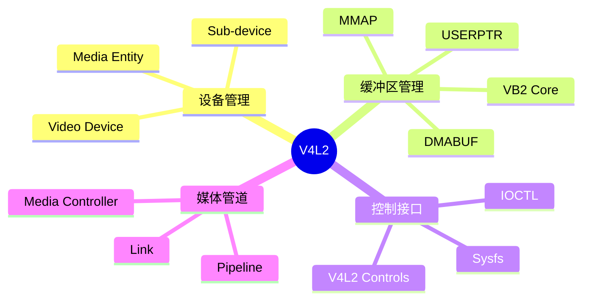
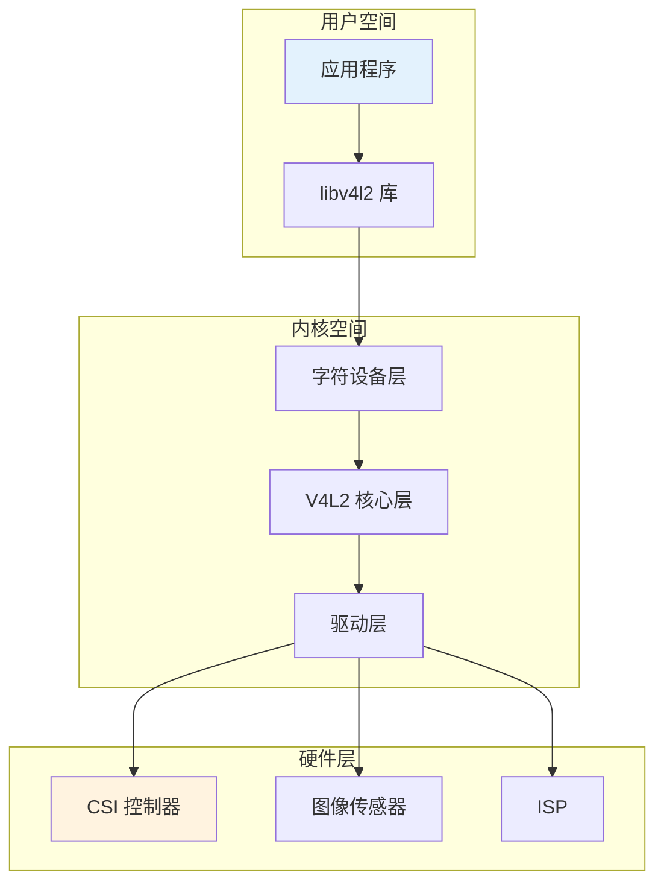
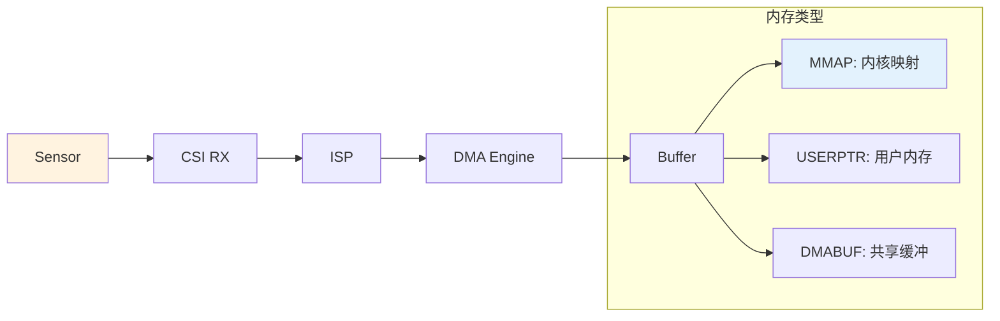
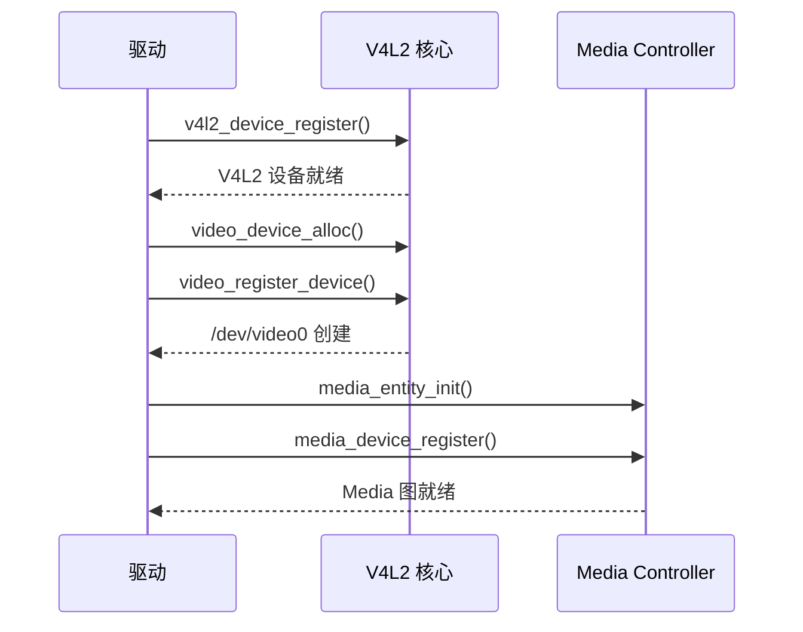
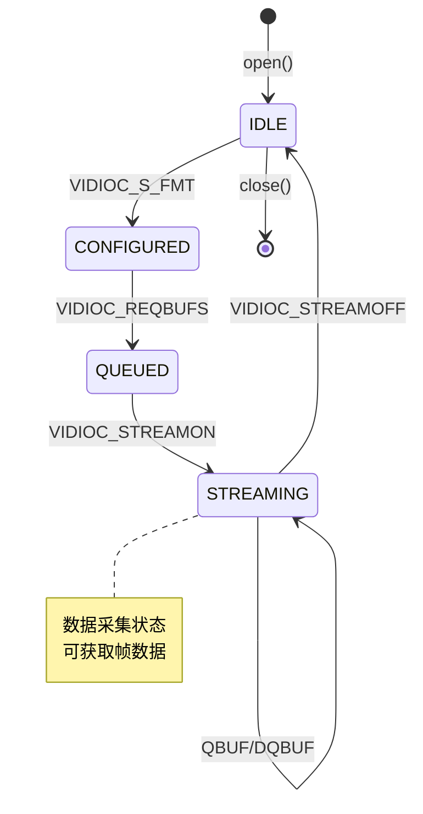

# Camera 驱动架构概述

> Linux V4L2 子系统架构详解

---

## 📋 V4L2 子系统简介

V4L2 (Video4Linux2) 是 Linux 内核中用于处理视频采集设备的框架。

### 核心功能



---

## 🏗️ 系统架构层次

### 三层架构



### 详细组件

| 层次 | 组件 | 文件位置 | 作用 |
|------|------|----------|------|
| 用户空间 | libv4l2 | `/usr/lib/libv4l/` | API 封装库 |
| 字符设备 | video_device | `drivers/media/v4l2-core/v4l2-dev.c` | 设备节点 |
| V4L2 核心 | v4l2_device | `drivers/media/v4l2-core/v4l2-device.c` | 设备管理 |
| V4L2 核心 | v4l2_subdev | `drivers/media/v4l2-core/v4l2-subdev.c` | 子设备 |
| V4L2 核心 | v4l2_ctrl | `drivers/media/v4l2-core/v4l2-ctrls.c` | 控件管理 |
| 缓冲区 | videobuf2 | `drivers/media/common/videobuf2/` | 缓冲队列 |
| 驱动层 | Sensor 驱动 | `drivers/media/i2c/` | 传感器驱动 |
| 驱动层 | Platform 驱动 | `drivers/media/platform/` | 平台接口 |

---

## 📁 内核目录结构

```
drivers/media/
├── v4l2-core/                    # V4L2 核心层
│   ├── v4l2-dev.c                # 字符设备
│   ├── v4l2-device.c             # V4L2 设备
│   ├── v4l2-subdev.c             # 子设备
│   ├── v4l2-ioctl.c              # IOCTL 处理
│   ├── v4l2-ctrls.c              # 控件管理
│   ├── v4l2-common.c             # 通用函数
│   ├── v4l2-fh.c                 # 文件句柄
│   ├── v4l2-event.c              # 事件处理
│   └── videobuf2/                # 缓冲区管理
│       ├── videobuf2-core.c      # 核心缓冲逻辑
│       ├── videobuf2-v4l2.c      # V4L2 绑定
│       ├── videobuf2-dma-contig.c
│       ├── videobuf2-dma-sg.c
│       └── videobuf2-vmalloc.c
│
├── i2c/                          # I2C 传感器驱动
│   ├── ov5640.c                  # OmniVision OV5640
│   ├── ov8865.c                  # OmniVision OV8865
│   ├── imx219.c                  # Sony IMX219
│   ├── imx477.c                  # Sony IMX477
│   └── mt9m111.c                 # OnSemi MT9M111
│
├── platform/                     # 平台 Camera 驱动
│   ├── stm32/
│   │   └── stm32-dcmi.c          # STM32 DCMI 接口
│   ├── rockchip/
│   │   ├── rk-isp1.c             # Rockchip ISP
│   │   └── rk-cif.c              # Camera Interface
│   ├── tegra/
│   │   └── tegra-vi2.c           # Tegra VI
│   └── i.MX/
│       └── imx7-media-csi.c      # i.MX7 CSI
│
├── usb/                          # USB Camera
│   └── uvc/
│       ├── uvc_driver.c          # UVC 驱动
│       └── uvc_video.c           # 视频处理
│
└── mc-core/                      # Media Controller
    ├── media-device.c            # Media 设备
    ├── media-entity.c            # Media 实体
    └── media-link.c              # Media 连接
```

---

## 🔗 设备关系图

### 典型 Camera 系统

```mermaid
graph LR
    subgraph 硬件组件
        A[CMOS 传感器] -->|MIPI CSI-2| B[CSI 控制器]
        B -->|Raw Data| C[ISP]
        C -->|Processed| D[Memory]
    end
    
    subgraph 驱动组件
        E[Sensor 驱动] -.-> A
        F[CSI 驱动] -.-> B
        G[ISP 驱动] -.-> C
    end
    
    subgraph V4L2 组件
        H[/dev/v4l-subdev0] -.-> E
        I[/dev/v4l-subdev1] -.-> G
        J[/dev/video0] -.-> F
    end
    
    style A fill:#fff3e0
    style J fill:#e3f2fd
```

### Media Controller 实体

```mermaid
graph TB
    subgraph Media Graph
        A[Sensor Entity] -->|Link 0| B[CSI Entity]
        B -->|Link 1| C[ISP Entity]
        C -->|Link 2| D[Video Node Entity]
    end
    
    subgraph Device Nodes
        E[/dev/v4l-subdev0] -.-> A
        F[/dev/v4l-subdev1] -.-> C
        G[/dev/video0] -.-> D
    end
    
    style A fill:#ffcc80
    style G fill:#e3f2fd
```

---

## 📊 数据流类型

### 采集模式对比

| 模式 | 描述 | 适用场景 | 性能 |
|------|------|----------|------|
| MMAP | 内存映射 | 通用场景 | ⭐⭐⭐⭐ |
| USERPTR | 用户指针 | 零拷贝 | ⭐⭐⭐⭐⭐ |
| DMABUF | DMA 共享 | GPU/ISP 共享 | ⭐⭐⭐⭐⭐ |
| READ/Write | 简单读写 | 调试/低性能 | ⭐⭐ |

### 数据流路径



---

## 🎯 关键数据结构

### v4l2_device

```c
struct v4l2_device {
    struct device *dev;              // 父设备
    struct list_head v4l2_dev_list;  // 设备列表
    char name[32];                   // 设备名
    struct v4l2_ctrl_handler *ctrl_handler;
    struct media_device *mdev;       // Media 设备
    // ...
};
```

### video_device

```c
struct video_device {
    struct v4l2_device *v4l2_dev;    // V4L2 设备
    const struct v4l2_file_operations *fops;
    const struct v4l2_ioctl_ops *ioctl_ops;
    const struct v4l2_ctrl_ops *ctrl_ops;
    struct vb2_queue *queue;         // 缓冲队列
    char name[32];                   // 设备名
    int minor;                       // 次设备号
    // ...
};
```

### v4l2_subdev

```c
struct v4l2_subdev {
    struct v4l2_device *v4l2_dev;    // 所属 V4L2 设备
    const struct v4l2_subdev_ops *ops;
    struct media_entity entity;      // Media 实体
    char name[V4L2_SUBDEV_NAME_SIZE];
    struct device *dev;
    // ...
};
```

---

## 🔄 工作流程

### 初始化流程



### 采集流程



---

## 📝 总结

V4L2 子系统核心要点：

1. **三层架构** - 字符设备、V4L2 核心、驱动层
2. **双接口** - Video Device (数据) + Sub-device (控制)
3. **Media Controller** - 复杂管道管理
4. **VB2 框架** - 统一缓冲区管理
5. **灵活模式** - MMAP/USERPTR/DMABUF

掌握 V4L2 架构是 Camera 驱动开发的基础！

---

*学习笔记由 全栈工程师 维护*
