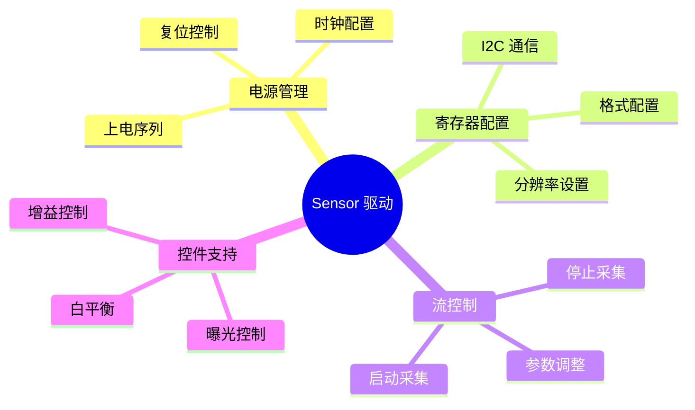

# Camera 驱动开发指南

> 从 Sensor 到 Platform 驱动完整开发流程

---

## 📋 开发概述

Camera 驱动开发分为两部分：
- **Sensor 驱动** - I2C 接口，控制图像传感器
- **Platform 驱动** - CSI/DCMI 接口，数据采集

---

## 🔧 Sensor 驱动开发

### 驱动框架

```c
// 基本结构
struct sensor_driver {
    struct i2c_client *client;
    struct v4l2_subdev sd;
    struct media_pad pad;
    struct v4l2_ctrl_handler ctrls;
    struct regmap *regmap;
    struct clk *xclk;
    struct gpio_desc *pwdn_gpio;
    struct gpio_desc *reset_gpio;
    struct v4l2_mbus_framefmt fmt;
};
```

### 核心操作



### 完整示例：OV5640 驱动

```c
// 1. 设备树匹配表
static const struct of_device_id ov5640_of_match[] = {
    { .compatible = "ovti,ov5640" },
    { /* sentinel */ }
};
MODULE_DEVICE_TABLE(of, ov5640_of_match);

// 2. 支持的分辨率
static const struct ov5640_format {
    u32 code;
    u32 width;
    u32 height;
} ov5640_formats[] = {
    { MEDIA_BUS_FMT_UYVY8_2X8, 640, 480 },   // VGA
    { MEDIA_BUS_FMT_UYVY8_2X8, 1280, 720 },  // 720p
    { MEDIA_BUS_FMT_UYVY8_2X8, 1920, 1080 }, // 1080p
    { MEDIA_BUS_FMT_UYVY8_2X8, 2592, 1944 }, // 5MP
};

// 3. 寄存器配置序列
static const struct regval ov5640_1080p_regs[] = {
    {0x3103, 0x11},  // 系统时钟
    {0x3008, 0x82},  // 软件复位
    {0x3008, 0x42},  // 流模式
    
    // 1080p 配置
    {0x3800, 0x00},  // 水平起始高 8 位
    {0x3801, 0x00},  // 水平起始低 8 位
    {0x3802, 0x01},  // 水平长度高 8 位
    {0x3803, 0xa0},  // 水平长度低 8 位
    {0x3804, 0x00},  // 垂直起始高 8 位
    {0x3805, 0x00},  // 垂直起始低 8 位
    {0x3806, 0x07},  // 垂直长度高 8 位
    {0x3807, 0x9f},  // 垂直长度低 8 位
    
    // 输出尺寸
    {0x3808, 0x07},  // 水平输出高 8 位 (1920)
    {0x3809, 0x80},  // 水平输出低 8 位
    {0x380a, 0x04},  // 垂直输出高 8 位 (1080)
    {0x380b, 0x38},  // 垂直输出低 8 位
    
    {0x300d, 0x01},  // 启动流
    {0x0000, 0x00},  // 结束标记
};

// 4. 电源管理
static int ov5640_set_power(struct ov5640_dev *sensor, bool on)
{
    if (on) {
        // 上电序列
        gpiod_set_value(sensor->pwdn_gpio, 0);  // 退出掉电
        udelay(10);
        gpiod_set_value(sensor->reset_gpio, 0); // 复位
        udelay(20);
        gpiod_set_value(sensor->reset_gpio, 1); // 释放复位
        msleep(100);                            // 稳定时间
    } else {
        // 断电序列
        gpiod_set_value(sensor->reset_gpio, 0);
        gpiod_set_value(sensor->pwdn_gpio, 1);
    }
    return 0;
}

// 5. 格式设置
static int ov5640_set_fmt(struct v4l2_subdev *sd,
                          struct v4l2_subdev_pad_config *cfg,
                          struct v4l2_subdev_format *format)
{
    struct ov5640_dev *sensor = to_ov5640(sd);
    const struct regval *regs;
    
    // 选择分辨率
    switch (format->format.width) {
    case 640:
        regs = ov5640_vga_regs;
        break;
    case 1280:
        regs = ov5640_720p_regs;
        break;
    case 1920:
        regs = ov5640_1080p_regs;
        break;
    default:
        return -EINVAL;
    }
    
    // 写入配置
    for (; regs->reg != 0; regs++) {
        regmap_write(sensor->regmap, regs->reg, regs->val);
        udelay(100);
    }
    
    // 保存格式
    sensor->fmt = format->format;
    return 0;
}

// 6. 流控制
static int ov5640_s_stream(struct v4l2_subdev *sd, int enable)
{
    struct ov5640_dev *sensor = to_ov5640(sd);
    
    if (enable) {
        // 启动流
        regmap_write(sensor->regmap, 0x300d, 0x01);
    } else {
        // 停止流
        regmap_write(sensor->regmap, 0x300d, 0x00);
    }
    return 0;
}

// 7. 控件处理
static const struct v4l2_ctrl_config ov5640_ctrls[] = {
    {
        .ops = &ov5640_ctrl_ops,
        .id = V4L2_CID_EXPOSURE,
        .name = "Exposure",
        .type = V4L2_CTRL_TYPE_INTEGER,
        .min = 0,
        .max = 1023,
        .step = 1,
        .def = 500,
    },
    {
        .ops = &ov5640_ctrl_ops,
        .id = V4L2_CID_GAIN,
        .name = "Gain",
        .type = V4L2_CTRL_TYPE_INTEGER,
        .min = 0,
        .max = 255,
        .step = 1,
        .def = 128,
    },
};

static int ov5640_s_ctrl(struct v4l2_ctrl *ctrl)
{
    struct ov5640_dev *sensor = container_of(ctrl->handler, 
                                              struct ov5640_dev, ctrls);
    
    switch (ctrl->id) {
    case V4L2_CID_EXPOSURE:
        // 设置曝光时间
        regmap_write(sensor->regmap, 0x3500, ctrl->val >> 8);
        regmap_write(sensor->regmap, 0x3501, ctrl->val & 0xff);
        break;
    case V4L2_CID_GAIN:
        // 设置增益
        regmap_write(sensor->regmap, 0x350a, ctrl->val);
        break;
    }
    return 0;
}
```

---

## 💻 Platform 驱动开发

### DCMI 接口驱动

```c
// 1. 数据结构
struct dcmi_dev {
    struct v4l2_device v4l2_dev;
    struct video_device vdev;
    struct vb2_queue queue;
    struct v4l2_subdev *sensor;
    
    void __iomem *regs;
    struct clk *clk;
    int irq;
    
    spinlock_t lock;
    struct list_head buffer_queue;
    struct dcmi_buffer *active;
};

// 2. 硬件寄存器定义
#define DCMI_CR          0x00
#define DCMI_SR          0x04
#define DCMI_RISR        0x08
#define DCMI_IER         0x0C
#define DCMI_ESCR        0x10
#define DCMI_ESUR        0x14
#define DCMI_CWSTTR      0x18
#define DCMI_CWSTR       0x1C
#define DCMI_DR          0x28

// 3. 中断处理
static irqreturn_t dcmi_irq_handler(int irq, void *data)
{
    struct dcmi_dev *dcmi = data;
    u32 status = readl(dcmi->regs + DCMI_RISR);
    
    if (status & 0x01) {  // 帧完成中断
        writel(0x01, dcmi->regs + DCMI_RISR);  // 清除中断
        dcmi_frame_complete(dcmi);
        return IRQ_HANDLED;
    }
    return IRQ_NONE;
}

// 4. 帧完成处理
static void dcmi_frame_complete(struct dcmi_dev *dcmi)
{
    struct dcmi_buffer *buf;
    unsigned long flags;
    
    spin_lock_irqsave(&dcmi->lock, flags);
    
    if (list_empty(&dcmi->buffer_queue)) {
        spin_unlock_irqrestore(&dcmi->lock, flags);
        return;
    }
    
    // 获取当前缓冲区
    buf = list_first_entry(&dcmi->buffer_queue, struct dcmi_buffer, list);
    list_del(&buf->list);
    
    // 标记缓冲区完成
    buf->vb.vb2_buf.timestamp = ktime_get_ns();
    buf->vb.sequence = dcmi->sequence++;
    vb2_buffer_done(&buf->vb.vb2_buf, VB2_BUF_STATE_DONE);
    
    spin_unlock_irqrestore(&dcmi->lock, flags);
}

// 5. 缓冲区队列
static void dcmi_buf_queue(struct vb2_buffer *vb)
{
    struct dcmi_dev *dcmi = vb2_get_drv_priv(vb->vb2_queue);
    struct dcmi_buffer *buf = to_dcmi_buffer(vb);
    unsigned long flags;
    
    spin_lock_irqsave(&dcmi->lock, flags);
    list_add_tail(&buf->list, &dcmi->buffer_queue);
    
    // 如果是第一个缓冲区，启动采集
    if (dcmi->active == NULL) {
        dcmi_start_capture(dcmi, buf);
    }
    spin_unlock_irqrestore(&dcmi->lock, flags);
}

// 6. 启动采集
static void dcmi_start_capture(struct dcmi_dev *dcmi, struct dcmi_buffer *buf)
{
    u32 cr;
    
    dcmi->active = buf;
    
    // 配置 DMA
    writel(dma_buf_dma_address(&buf->vb.vb2_buf), dcmi->regs + DCMI_DR);
    
    // 启用 DCMI
    cr = readl(dcmi->regs + DCMI_CR);
    cr |= BIT(0);  // DCMIEN
    cr |= BIT(1);  // CM
    writel(cr, dcmi->regs + DCMI_CR);
    
    // 启用中断
    writel(0x01, dcmi->regs + DCMI_IER);  // FRAME_IE
}

// 7. 停止采集
static void dcmi_stop_capture(struct dcmi_dev *dcmi)
{
    u32 cr;
    
    // 禁用 DCMI
    cr = readl(dcmi->regs + DCMI_CR);
    cr &= ~BIT(0);
    writel(cr, dcmi->regs + DCMI_CR);
    
    // 禁用中断
    writel(0, dcmi->regs + DCMI_IER);
}
```

---

## 🔗 Media Controller 集成

### 实体注册

```c
// 注册 Media 实体
static int sensor_register_media(struct sensor_dev *sensor)
{
    struct media_pad *pad = &sensor->pad;
    int ret;
    
    // 初始化 Pad
    pad->flags = MEDIA_PAD_FL_SOURCE;
    
    // 初始化实体
    sensor->sd.entity.function = MEDIA_ENT_F_CAM_SENSOR;
    ret = media_entity_pads_init(&sensor->sd.entity, 1, pad);
    if (ret)
        return ret;
    
    return 0;
}

// 注册 Pipeline
static int dcmi_register_pipeline(struct dcmi_dev *dcmi)
{
    struct media_device *mdev;
    struct media_pad *sensor_pad, *dcmi_pad;
    int ret;
    
    // 创建 Media 设备
    mdev = devm_kzalloc(dcmi->dev, sizeof(*mdev), GFP_KERNEL);
    mdev->dev = dcmi->dev;
    strscpy(mdev->model, "STM32 DCMI", sizeof(mdev->model));
    
    ret = media_device_register(mdev);
    if (ret)
        return ret;
    
    // 关联 V4L2 设备
    dcmi->v4l2_dev.mdev = mdev;
    
    // 创建 Link
    sensor_pad = &sensor->sd.entity.pads[0];
    dcmi_pad = &dcmi->vdev.entity.pads[0];
    
    ret = media_create_pad_link(sensor_pad, 0, dcmi_pad, 0, 
                                MEDIA_LNK_FL_ENABLED);
    return ret;
}
```

---

## 📝 驱动开发检查清单

### Sensor 驱动

- [ ] I2C 通信测试
- [ ] 电源时序控制
- [ ] 时钟配置
- [ ] 复位序列
- [ ] 寄存器读写
- [ ] 分辨率配置
- [ ] 格式支持
- [ ] 流控制
- [ ] V4L2 控件
- [ ] Media 实体

### Platform 驱动

- [ ] 内存映射
- [ ] 中断处理
- [ ] DMA 配置
- [ ] 缓冲区管理
- [ ] VB2 队列
- [ ] Video 设备注册
- [ ] Pipeline 集成
- [ ] 设备树解析
- [ ] 时钟/电源管理
- [ ] 错误处理

---

## 📚 参考资源

| 资源 | 说明 |
|------|------|
| `drivers/media/i2c/ov5640.c` | Sensor 驱动参考 |
| `drivers/media/platform/stm32/stm32-dcmi.c` | Platform 驱动参考 |
| `Documentation/media/` | 官方文档 |
| `v4l2-ctl --help` | 调试工具 |

---

## ✅ 总结

Camera 驱动开发核心：

1. **Sensor 驱动** - I2C 控制、寄存器配置
2. **Platform 驱动** - CSI/DCMI 接口、DMA 采集
3. **V4L2 框架** - 标准接口、控件管理
4. **Media Controller** - Pipeline 配置
5. **VB2 缓冲** - 高效数据传输

掌握这些就能开发完整的 Camera 驱动！

---

*学习笔记由 全栈工程师 维护*
