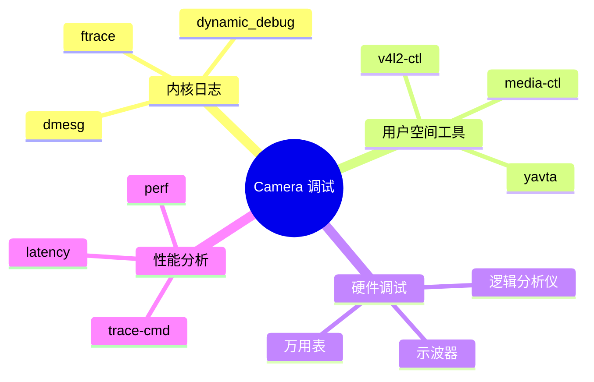

# Camera 驱动调试指南

> 从内核日志到用户空间工具

---

## 📋 调试方法概述



---

## 🔍 内核日志调试

### dmesg 基础

```bash
# 查看 Camera 相关日志
dmesg | grep -i camera
dmesg | grep -i ov5640
dmesg | grep -i dcmi

# 实时查看日志
dmesg -w

# 清除日志后重新测试
dmesg -C
# ... 执行操作 ...
dmesg

# 查看内核日志级别
cat /proc/sys/kernel/printk
```

### 动态调试

```bash
# 启用驱动调试
echo 'file drivers/media/i2c/ov5640.c +p' > \
     /sys/kernel/debug/dynamic_debug/control

# 启用所有 V4L2 调试
echo 'file drivers/media/v4l2-core/*.c +p' > \
     /sys/kernel/debug/dynamic_debug/control

# 查看调试设置
cat /sys/kernel/debug/dynamic_debug/control | grep ov5640

# 关闭调试
echo 'file drivers/media/i2c/ov5640.c -p' > \
     /sys/kernel/debug/dynamic_debug/control
```

### 内核配置选项

```kconfig
# 启用调试功能
CONFIG_VIDEO_ADV_DEBUG=y
CONFIG_MEDIA_CONTROLLER=y
CONFIG_MEDIA_USB_SUPPORT=y
CONFIG_MEDIA_CAMERA_SUPPORT=y

# V4L2 调试
CONFIG_VIDEO_V4L2_DEBUG=y

# 动态调试
CONFIG_DYNAMIC_DEBUG=y
```

---

## 🛠️ V4L2 工具调试

### v4l2-ctl 命令

```bash
# 1. 列出所有视频设备
v4l2-ctl --list-devices

# 输出示例：
# Platform (platform:00000000):
#         /dev/video0
#         /dev/video1
#         /dev/media0

# 2. 查询设备能力
v4l2-ctl -d /dev/video0 --all

# 3. 枚举支持的格式
v4l2-ctl -d /dev/video0 --list-formats-ext

# 输出示例：
# ioctl: VIDIOC_ENUM_FMT
# Type: Video Capture
#     [0]: 'YUYV' (YUYV 4:2:2)
#         Size: Discrete 640x480
#         Size: Discrete 1280x720
#         Size: Discrete 1920x1080

# 4. 查询控件
v4l2-ctl -d /dev/video0 --list-ctrls

# 输出示例：
# brightness 0x00980900 (int) : min=0 max=255 step=1 default=128 value=128
# exposure 0x00980911 (int) : min=0 max=1023 step=1 default=500 value=500

# 5. 设置格式
v4l2-ctl -d /dev/video0 \
    --set-fmt-video=width=1920,height=1080,pixelformat=YUYV

# 6. 设置控件
v4l2-ctl -d /dev/video0 \
    -c brightness=128 \
    -c exposure_auto=3 \
    -c gain=64

# 7. 捕获单帧
v4l2-ctl -d /dev/video0 \
    --stream-mmap \
    --stream-count=1 \
    --stream-to=frame.yuv

# 8. 连续采集测试
v4l2-ctl -d /dev/video0 \
    --stream-mmap \
    --stream-count=100 \
    --stream-to=/dev/null

# 9. 查询缓冲区
v4l2-ctl -d /dev/video0 --get-fmt-video

# 10. 导出格式为 JSON
v4l2-ctl -d /dev/video0 --list-formats-ext --output-json
```

### media-ctl 工具

```bash
# 1. 打印 Media 拓扑
media-ctl -p

# 输出示例：
# Media controller API version 5.15.0
# Media device information
# ------------------------
# driver          stm32-dcmi
# model           STM32 DCMI
# ...
# Entity graph:
# entity 1: ov5640 3-003c (1 pad, 1 link)
# entity 2: stm32-dcmi (1 pad, 1 link)

# 2. 配置 Link
media-ctl -l '"ov5640 3-003c":0 -> "stm32-dcmi":0[1]'

# 3. 设置格式
media-ctl -V '"ov5640 3-003c":0 [fmt:UYVY8_2X8/1920x1080]'

# 4. 重置 Media 设备
media-ctl -r

# 5. 打印为 DOT 格式
media-ctl -p -d /dev/media0 --dot | dot -Tsvg > media.svg
```

### yavta 工具

```bash
# 安装
git clone git://linuxtv.org/yavta.git
cd yavta && make

# 1. 查询设备
./yavta -q /dev/video0

# 2. 捕获视频流
./yavta -f YUYV -s 1920x1080 -n 4 --capture=10 /dev/video0

# 3. 测试不同格式
./yavta -f NV12 -s 640x480 -n 2 --capture=5 /dev/video0

# 4. 性能测试
./yavta -f YUYV -s 1920x1080 -n 4 --capture=100 --stream-to=/dev/null /dev/video0
```

---

## 🔬 ftrace 调试

### 启用 ftrace

```bash
# 挂载 debugfs
mount -t debugfs none /sys/kernel/debug

# 查看可用的事件
cat /sys/kernel/debug/tracing/available_events | grep v4l2

# 启用 V4L2 事件
echo v4l2:* > /sys/kernel/debug/tracing/set_event

# 启用特定函数
echo v4l2_* > /sys/kernel/debug/tracing/set_ftrace_filter

# 开始跟踪
echo 1 > /sys/kernel/debug/tracing/tracing_on

# 查看跟踪结果
cat /sys/kernel/debug/tracing/trace

# 停止跟踪
echo 0 > /sys/kernel/debug/tracing/tracing_on
```

### trace-cmd 工具

```bash
# 安装
apt install trace-cmd

# 录制 V4L2 事件
trace-cmd record -e v4l2:* -e media:*

# 录制特定函数
trace-cmd record -g v4l2_*

# 查看结果
trace-cmd report

# 生成图形
trace-cmd report -F > trace.txt
```

---

## 📊 性能调试

### perf 工具

```bash
# 录制性能数据
perf record -g ./camera_app

# 查看报告
perf report

# 查看热点函数
perf top

# 统计 V4L2 调用
perf stat -e v4l2:* ./camera_app
```

### 延迟测试

```bash
# 安装
apt install rt-tests

# 测试系统延迟
cyclictest -t -a -p 95 -m

# 测试 Camera 采集延迟
# 使用自定义程序测量 QBUF 到 DQBUF 的时间
```

---

## 🐛 常见问题排查

### 问题 1: 设备未识别

```bash
# 检查 I2C 通信
i2cdetect -y 3

# 检查设备节点
ls -l /dev/video*
ls -l /dev/v4l-subdev*

# 检查内核模块
lsmod | grep ov5640
lsmod | grep v4l2

# 查看 dmesg
dmesg | grep -E "(i2c|camera|ov5640)"
```

### 问题 2: 无法采集图像

```bash
# 检查 Media Pipeline
media-ctl -p

# 检查 Link 状态
media-ctl -p | grep -A 5 "link"

# 检查缓冲区
v4l2-ctl -d /dev/video0 --list-buffers

# 测试采集
v4l2-ctl -d /dev/video0 --stream-mmap --stream-count=10
```

### 问题 3: 图像质量差

```bash
# 调整曝光
v4l2-ctl -c exposure_auto=1
v4l2-ctl -c exposure_absolute=100

# 调整增益
v4l2-ctl -c gain=128

# 调整白平衡
v4l2-ctl -c auto_white_balance=0
v4l2-ctl -c white_balance_temperature=6500
```

### 问题 4: 帧率不稳定

```bash
# 检查时钟源
cat /sys/kernel/debug/clk/clk_summary | grep camera

# 检查 CPU 负载
top -H

# 检查中断
cat /proc/interrupts | grep dcmi

# 使用 perf 分析
perf record -g ./camera_app
perf report --stdio
```

---

## 📝 调试脚本示例

### 完整测试脚本

```bash
#!/bin/bash
# camera_test.sh

DEVICE="/dev/video0"

echo "=== Camera 调试脚本 ==="

# 1. 检查设备
echo -e "\n1. 检查设备节点..."
ls -l $DEVICE

# 2. 查询能力
echo -e "\n2. 查询设备能力..."
v4l2-ctl -d $DEVICE --all

# 3. 枚举格式
echo -e "\n3. 支持的格式..."
v4l2-ctl -d $DEVICE --list-formats-ext

# 4. 查询控件
echo -e "\n4. 可用控件..."
v4l2-ctl -d $DEVICE --list-ctrls

# 5. 测试采集
echo -e "\n5. 测试采集..."
v4l2-ctl -d $DEVICE \
    --set-fmt-video=width=640,height=480,pixelformat=YUYV \
    --stream-mmap \
    --stream-count=5 \
    --stream-to=test.yuv

# 6. 检查结果
if [ -f test.yuv ]; then
    echo "✓ 采集成功，文件大小：$(ls -lh test.yuv | awk '{print $5}')"
    rm test.yuv
else
    echo "✗ 采集失败"
fi

# 7. Media 拓扑
echo -e "\n7. Media 拓扑..."
media-ctl -p

echo -e "\n=== 调试完成 ==="
```

---

## ✅ 总结

Camera 调试核心方法：

1. **内核日志** - dmesg、dynamic_debug
2. **V4L2 工具** - v4l2-ctl、media-ctl、yavta
3. **ftrace** - 内核函数跟踪
4. **性能分析** - perf、trace-cmd
5. **脚本自动化** - 批量测试

掌握这些工具，快速定位 Camera 问题！

---

*学习笔记由 全栈工程师 维护*
