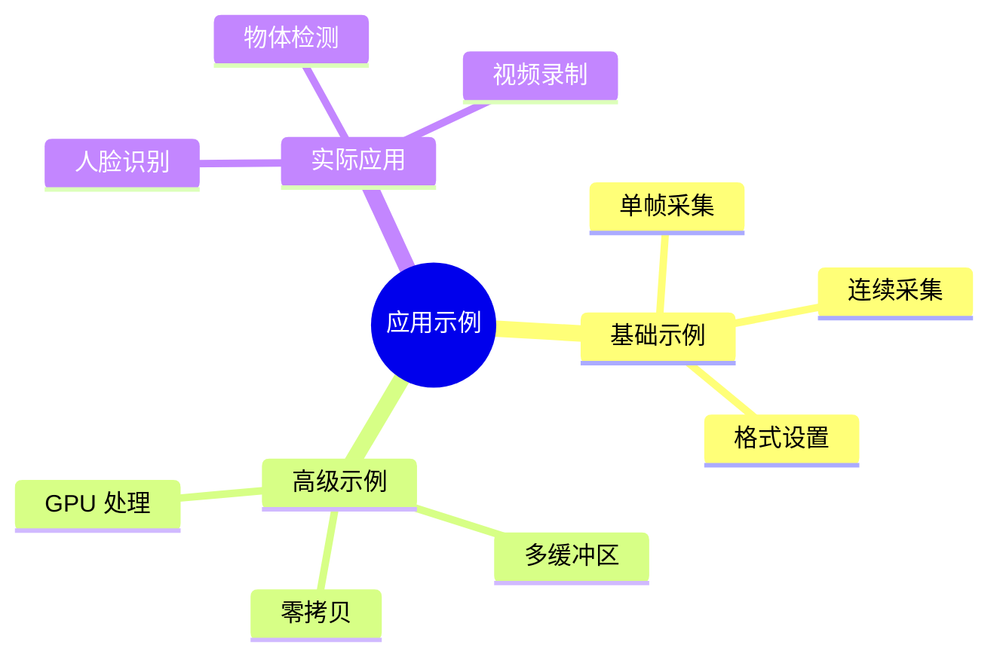

# Camera 应用开发示例

> 从简单采集到高级应用

---

## 📋 示例概述



---

## 📷 基础示例

### 示例 1: 单帧采集

```c
// capture_single.c
#include <linux/videodev2.h>
#include <fcntl.h>
#include <sys/ioctl.h>
#include <sys/mman.h>
#include <unistd.h>
#include <stdio.h>
#include <string.h>

#define DEVICE "/dev/video0"
#define WIDTH 640
#define HEIGHT 480

int main()
{
    int fd;
    struct v4l2_format fmt;
    struct v4l2_requestbuffers req;
    struct v4l2_buffer buf;
    void *buffer;
    
    // 1. 打开设备
    fd = open(DEVICE, O_RDWR);
    if (fd < 0) {
        perror("open");
        return 1;
    }
    
    // 2. 设置格式
    memset(&fmt, 0, sizeof(fmt));
    fmt.type = V4L2_BUF_TYPE_VIDEO_CAPTURE;
    fmt.fmt.pix.width = WIDTH;
    fmt.fmt.pix.height = HEIGHT;
    fmt.fmt.pix.pixelformat = V4L2_PIX_FMT_YUYV;
    fmt.fmt.pix.field = V4L2_FIELD_NONE;
    
    if (ioctl(fd, VIDIOC_S_FMT, &fmt) < 0) {
        perror("S_FMT");
        return 1;
    }
    
    // 3. 请求缓冲区
    memset(&req, 0, sizeof(req));
    req.count = 1;
    req.type = V4L2_BUF_TYPE_VIDEO_CAPTURE;
    req.memory = V4L2_MEMORY_MMAP;
    
    if (ioctl(fd, VIDIOC_REQBUFS, &req) < 0) {
        perror("REQBUFS");
        return 1;
    }
    
    // 4. 映射缓冲区
    memset(&buf, 0, sizeof(buf));
    buf.type = V4L2_BUF_TYPE_VIDEO_CAPTURE;
    buf.memory = V4L2_MEMORY_MMAP;
    buf.index = 0;
    
    if (ioctl(fd, VIDIOC_QUERYBUF, &buf) < 0) {
        perror("QUERYBUF");
        return 1;
    }
    
    buffer = mmap(NULL, buf.length, PROT_READ | PROT_WRITE,
                  MAP_SHARED, fd, buf.m.offset);
    if (buffer == MAP_FAILED) {
        perror("mmap");
        return 1;
    }
    
    // 5. 队列缓冲区
    if (ioctl(fd, VIDIOC_QBUF, &buf) < 0) {
        perror("QBUF");
        return 1;
    }
    
    // 6. 开始采集
    int type = V4L2_BUF_TYPE_VIDEO_CAPTURE;
    if (ioctl(fd, VIDIOC_STREAMON, &type) < 0) {
        perror("STREAMON");
        return 1;
    }
    
    // 7. 等待帧完成
    fd_set fds;
    FD_ZERO(&fds);
    FD_SET(fd, &fds);
    
    struct timeval tv;
    tv.tv_sec = 2;
    tv.tv_usec = 0;
    
    if (select(fd + 1, &fds, NULL, NULL, &tv) < 0) {
        perror("select");
        return 1;
    }
    
    // 8. 获取完成的帧
    if (ioctl(fd, VIDIOC_DQBUF, &buf) < 0) {
        perror("DQBUF");
        return 1;
    }
    
    // 9. 保存图像
    FILE *fp = fopen("frame.yuv", "wb");
    fwrite(buffer, buf.bytesused, 1, fp);
    fclose(fp);
    
    printf("已捕获单帧图像：frame.yuv\n");
    
    // 10. 清理
    ioctl(fd, VIDIOC_STREAMOFF, &type);
    munmap(buffer, buf.length);
    close(fd);
    
    return 0;
}
```

**编译和运行：**
```bash
gcc -o capture_single capture_single.c
./capture_single
```

---

### 示例 2: 连续采集

```c
// capture_continuous.c
#include <linux/videodev2.h>
#include <fcntl.h>
#include <sys/ioctl.h>
#include <sys/mman.h>
#include <unistd.h>
#include <stdio.h>
#include <string.h>

#define DEVICE "/dev/video0"
#define WIDTH 1920
#define HEIGHT 1080
#define BUFFER_COUNT 4

struct buffer {
    void *start;
    size_t length;
};

int main()
{
    int fd;
    struct buffer buffers[BUFFER_COUNT];
    struct v4l2_format fmt;
    struct v4l2_requestbuffers req;
    struct v4l2_buffer buf;
    
    fd = open(DEVICE, O_RDWR);
    
    // 设置格式
    memset(&fmt, 0, sizeof(fmt));
    fmt.type = V4L2_BUF_TYPE_VIDEO_CAPTURE;
    fmt.fmt.pix.width = WIDTH;
    fmt.fmt.pix.height = HEIGHT;
    fmt.fmt.pix.pixelformat = V4L2_PIX_FMT_MJPEG;
    
    // 请求缓冲区
    memset(&req, 0, sizeof(req));
    req.count = BUFFER_COUNT;
    req.type = V4L2_BUF_TYPE_VIDEO_CAPTURE;
    req.memory = V4L2_MEMORY_MMAP;
    
    // 映射缓冲区
    for (int i = 0; i < BUFFER_COUNT; i++) {
        memset(&buf, 0, sizeof(buf));
        buf.type = V4L2_BUF_TYPE_VIDEO_CAPTURE;
        buf.memory = V4L2_MEMORY_MMAP;
        buf.index = i;
        
        ioctl(fd, VIDIOC_QUERYBUF, &buf);
        
        buffers[i].length = buf.length;
        buffers[i].start = mmap(NULL, buf.length,
                                PROT_READ | PROT_WRITE,
                                MAP_SHARED, fd, buf.m.offset);
    }
    
    // 队列所有缓冲区
    for (int i = 0; i < BUFFER_COUNT; i++) {
        memset(&buf, 0, sizeof(buf));
        buf.type = V4L2_BUF_TYPE_VIDEO_CAPTURE;
        buf.memory = V4L2_MEMORY_MMAP;
        buf.index = i;
        ioctl(fd, VIDIOC_QBUF, &buf);
    }
    
    // 开始采集
    int type = V4L2_BUF_TYPE_VIDEO_CAPTURE;
    ioctl(fd, VIDIOC_STREAMON, &type);
    
    printf("开始采集，按 Ctrl+C 停止...\n");
    
    // 采集循环
    int frame_count = 0;
    while (frame_count < 100) {
        fd_set fds;
        FD_ZERO(&fds);
        FD_SET(fd, &fds);
        
        if (select(fd + 1, &fds, NULL, NULL, NULL) < 0)
            break;
        
        memset(&buf, 0, sizeof(buf));
        buf.type = V4L2_BUF_TYPE_VIDEO_CAPTURE;
        buf.memory = V4L2_MEMORY_MMAP;
        
        if (ioctl(fd, VIDIOC_DQBUF, &buf) < 0)
            break;
        
        printf("帧 %d: %d 字节\n", frame_count++, buf.bytesused);
        
        // 保存为 JPEG
        char filename[64];
        sprintf(filename, "frame_%04d.jpg", frame_count);
        FILE *fp = fopen(filename, "wb");
        fwrite(buffers[buf.index].start, buf.bytesused, 1, fp);
        fclose(fp);
        
        // 重新队列
        ioctl(fd, VIDIOC_QBUF, &buf);
    }
    
    // 停止采集
    ioctl(fd, VIDIOC_STREAMOFF, &type);
    
    // 清理
    for (int i = 0; i < BUFFER_COUNT; i++) {
        munmap(buffers[i].start, buffers[i].length);
    }
    close(fd);
    
    return 0;
}
```

---

## 🚀 高级示例

### 示例 3: DMABUF 零拷贝

```c
// capture_dmabuf.c
#include <linux/videodev2.h>
#include <fcntl.h>
#include <sys/ioctl.h>
#include <linux/dma-buf.h>
#include <unistd.h>
#include <stdio.h>

#define DEVICE "/dev/video0"
#define WIDTH 1920
#define HEIGHT 1080

int main()
{
    int fd = open(DEVICE, O_RDWR);
    
    // 设置格式
    struct v4l2_format fmt = {0};
    fmt.type = V4L2_BUF_TYPE_VIDEO_CAPTURE;
    fmt.fmt.pix.width = WIDTH;
    fmt.fmt.pix.height = HEIGHT;
    fmt.fmt.pix.pixelformat = V4L2_PIX_FMT_NV12;
    ioctl(fd, VIDIOC_S_FMT, &fmt);
    
    // 请求 DMABUF 缓冲区
    struct v4l2_requestbuffers req = {0};
    req.count = 4;
    req.type = V4L2_BUF_TYPE_VIDEO_CAPTURE;
    req.memory = V4L2_MEMORY_DMABUF;
    ioctl(fd, VIDIOC_REQBUFS, &req);
    
    // 分配 DMABUF
    int dma_fds[4];
    for (int i = 0; i < 4; i++) {
        dma_fds[i] = ioctl(fd, VIDIOC_EXPBUF, &(struct v4l2_exportbuffer){
            .type = V4L2_BUF_TYPE_VIDEO_CAPTURE,
            .index = i,
        });
    }
    
    // 队列 DMABUF
    for (int i = 0; i < 4; i++) {
        struct v4l2_buffer buf = {0};
        buf.type = V4L2_BUF_TYPE_VIDEO_CAPTURE;
        buf.memory = V4L2_MEMORY_DMABUF;
        buf.index = i;
        buf.m.fd = dma_fds[i];
        ioctl(fd, VIDIOC_QBUF, &buf);
    }
    
    // 开始采集
    int type = V4L2_BUF_TYPE_VIDEO_CAPTURE;
    ioctl(fd, VIDIOC_STREAMON, &type);
    
    // 采集循环
    for (int i = 0; i < 100; i++) {
        struct v4l2_buffer buf = {0};
        buf.type = V4L2_BUF_TYPE_VIDEO_CAPTURE;
        buf.memory = V4L2_MEMORY_DMABUF;
        
        ioctl(fd, VIDIOC_DQBUF, &buf);
        
        // 直接使用 DMABUF (可传递给 GPU/ISP)
        process_frame(dma_fds[buf.index]);
        
        ioctl(fd, VIDIOC_QBUF, &buf);
    }
    
    ioctl(fd, VIDIOC_STREAMOFF, &type);
    close(fd);
    
    return 0;
}
```

---

### 示例 4: Python 应用

```python
#!/usr/bin/env python3
# camera_capture.py

import fcntl
import mmap
import os
import struct
import time

# V4L2 常量
VIDIOC_QUERYCAP = 0x80685600
VIDIOC_S_FMT = 0xc0c05605
VIDIOC_REQBUFS = 0xc00c5608
VIDIOC_QUERYBUF = 0xc0205609
VIDIOC_QBUF = 0xc020560f
VIDIOC_DQBUF = 0xc0205611
VIDIOC_STREAMON = 0x80045612
VIDIOC_STREAMOFF = 0x80045613

V4L2_BUF_TYPE_VIDEO_CAPTURE = 1
V4L2_MEMORY_MMAP = 1
V4L2_PIX_FMT_YUYV = 0x56595559

class V4L2Camera:
    def __init__(self, device="/dev/video0"):
        self.fd = os.open(device, os.O_RDWR)
        self.buffers = []
        
    def query_cap(self):
        """查询设备能力"""
        cap = fcntl.ioctl(self.fd, VIDIOC_QUERYCAP, b' ' * 104)
        driver, card, bus_info = struct.unpack('32s32s32s', cap[:96])
        print(f"驱动：{driver.decode().strip()}")
        print(f"设备：{card.decode().strip()}")
        
    def set_format(self, width, height, pixelformat=V4L2_PIX_FMT_YUYV):
        """设置格式"""
        fmt = struct.pack('I' * 11,
                         V4L2_BUF_TYPE_VIDEO_CAPTURE,
                         width, height,
                         pixelformat,
                         0, 0, 0, 0, 0, 0, 0)
        fcntl.ioctl(self.fd, VIDIOC_S_FMT, fmt)
        
    def reqbufs(self, count=4):
        """请求缓冲区"""
        req = struct.pack('I' * 4,
                         V4L2_BUF_TYPE_VIDEO_CAPTURE,
                         V4L2_MEMORY_MMAP,
                         count, 0)
        fcntl.ioctl(self.fd, VIDIOC_REQBUFS, req)
        
    def querybuf(self, index):
        """查询缓冲区"""
        buf = struct.pack('I' * 14,
                         V4L2_BUF_TYPE_VIDEO_CAPTURE,
                         V4L2_MEMORY_MMAP,
                         index, 0, 0, 0, 0, 0, 0, 0, 0, 0, 0, 0)
        result = fcntl.ioctl(self.fd, VIDIOC_QUERYBUF, buf)
        length, offset = struct.unpack('I' * 14, result)[5], struct.unpack('I' * 14, result)[13]
        return length, offset
        
    def mmap_buffer(self, length, offset):
        """映射缓冲区"""
        return mmap.mmap(self.fd, length, offset=offset)
        
    def qbuf(self, index):
        """队列缓冲区"""
        buf = struct.pack('I' * 14,
                         V4L2_BUF_TYPE_VIDEO_CAPTURE,
                         V4L2_MEMORY_MMAP,
                         index, 0, 0, 0, 0, 0, 0, 0, 0, 0, 0, 0)
        fcntl.ioctl(self.fd, VIDIOC_QBUF, buf)
        
    def dqbuf(self):
        """获取完成的缓冲区"""
        buf = struct.pack('I' * 14,
                         V4L2_BUF_TYPE_VIDEO_CAPTURE,
                         V4L2_MEMORY_MMAP,
                         0, 0, 0, 0, 0, 0, 0, 0, 0, 0, 0)
        result = fcntl.ioctl(self.fd, VIDIOC_DQBUF, buf)
        index = struct.unpack('I' * 14, result)[2]
        bytesused = struct.unpack('I' * 14, result)[7]
        return index, bytesused
        
    def streamon(self):
        """开始采集"""
        fcntl.ioctl(self.fd, VIDIOC_STREAMON,
                   struct.pack('I', V4L2_BUF_TYPE_VIDEO_CAPTURE))
                   
    def streamoff(self):
        """停止采集"""
        fcntl.ioctl(self.fd, VIDIOC_STREAMOFF,
                   struct.pack('I', V4L2_BUF_TYPE_VIDEO_CAPTURE))
    
    def capture(self, count=10):
        """采集帧"""
        import select
        
        # 队列所有缓冲区
        for i in range(4):
            self.qbuf(i)
            
        # 开始采集
        self.streamon()
        
        frames = []
        for i in range(count):
            # 等待数据
            ready, _, _ = select.select([self.fd], [], [], 2.0)
            if not ready:
                break
                
            # 获取帧
            index, bytesused = self.dqbuf()
            data = self.buffers[index][:bytesused]
            frames.append(data)
            
            # 重新队列
            self.qbuf(index)
            print(f"捕获帧 {i+1}/{count}")
            
        # 停止
        self.streamoff()
        return frames
        
    def close(self):
        """关闭设备"""
        os.close(self.fd)

# 使用示例
if __name__ == "__main__":
    cam = V4L2Camera("/dev/video0")
    
    # 查询能力
    cam.query_cap()
    
    # 设置格式
    cam.set_format(640, 480)
    
    # 请求缓冲区
    cam.reqbufs(4)
    
    # 映射缓冲区
    for i in range(4):
        length, offset = cam.querybuf(i)
        cam.buffers.append(cam.mmap_buffer(length, offset))
    
    # 采集
    frames = cam.capture(10)
    
    # 保存
    for i, frame in enumerate(frames):
        with open(f"frame_{i}.yuv", "wb") as f:
            f.write(frame)
    
    cam.close()
    print("采集完成！")
```

---

## 📚 参考资源

| 示例 | 说明 |
|------|------|
| `capture_single.c` | 单帧采集 |
| `capture_continuous.c` | 连续采集 |
| `capture_dmabuf.c` | 零拷贝采集 |
| `camera_capture.py` | Python 示例 |

---

## ✅ 总结

Camera 应用开发要点：

1. **基础采集** - open/set_fmt/reqbufs/streamon
2. **缓冲管理** - MMAP/USERPTR/DMABUF
3. **数据获取** - QBUF/DQBUF 循环
4. **高级用法** - 零拷贝、GPU 共享
5. **多语言** - C/C++/Python

掌握这些示例，快速开发 Camera 应用！

---

*学习笔记由 全栈工程师 维护*
