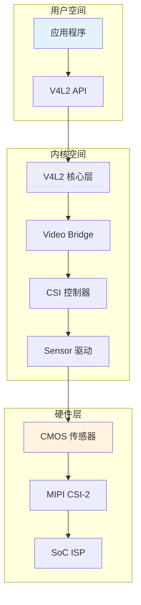
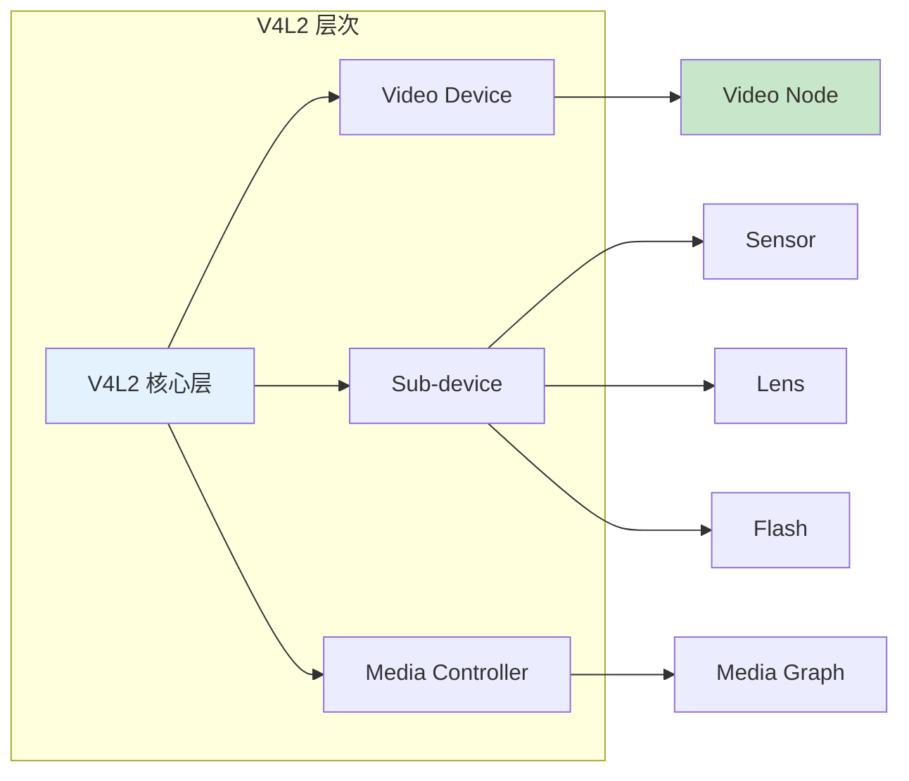
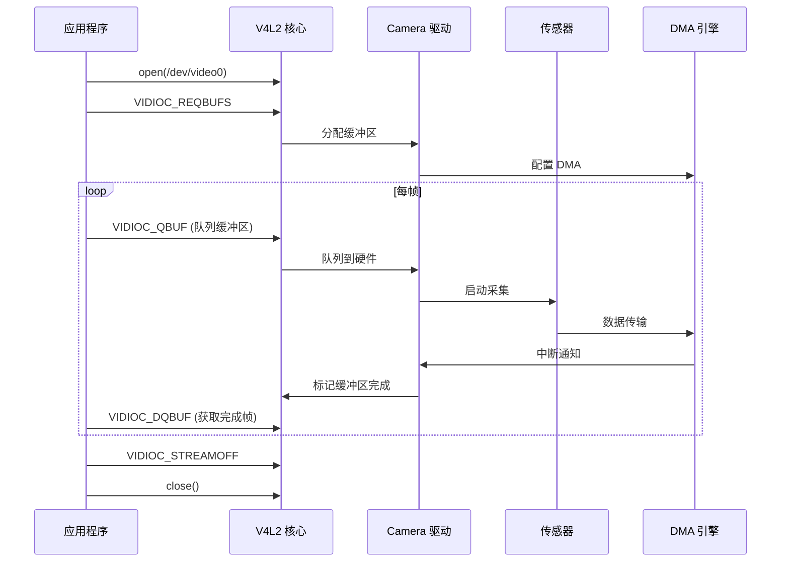

# Camera 驱动配置与工作原理

> Linux V4L2 子系统  
> 更新时间：2026-03-20

---

## 📋 概述

Linux Camera 驱动基于 **V4L2 (Video4Linux2)** 子系统，负责：
- 图像传感器控制
- 图像数据采集
- 图像格式转换
- 视频流管理

---

## 🏗️ Camera 系统架构

### 整体架构



### V4L2 子系统层次



---

## 📁 Camera 驱动目录结构

```
drivers/media/
├── i2c/                    # I2C 相机传感器
│   ├── ov5640.c            # OV5640 传感器 ⭐
│   ├── ov8865.c            # OV8865 传感器
│   ├── imx219.c            # IMX219 传感器
│   └── mt9m111.c           # MT9M111 传感器
│
├── platform/               # 平台 Camera 驱动
│   ├── stm32/
│   │   └── stm32-dcmi.c    # STM32 DCMI 接口 ⭐
│   ├── rockchip/
│   │   └── rk-isp1.c       # Rockchip ISP
│   └── tegra/
│       └── tegra-vi2.c     # Tegra VI
│
├── usb/                    # USB Camera
│   └── uvc/
│       └── uvc_driver.c    # UVC 驱动
│
└── v4l2-core/              # V4L2 核心
    ├── v4l2-device.c       # 设备管理
    ├── v4l2-ioctl.c        # IOCTL 处理
    ├── v4l2-subdev.c       # Sub-device
    └── videobuf2/          # 缓冲区管理
        ├── videobuf2-core.c
        ├── videobuf2-v4l2.c
        └── videobuf2-dma-contig.c
```

---

## 🔧 Camera 驱动配置

### 内核配置选项

```kconfig
# 启用 Media 支持
CONFIG_MEDIA_SUPPORT=y
CONFIG_MEDIA_CAMERA_SUPPORT=y

# V4L2 核心
CONFIG_VIDEO_DEV=y
CONFIG_V4L_PLATFORM_DRIVERS=y
CONFIG_VIDEO_V4L2_SUBDEV_API=y
CONFIG_MEDIA_CONTROLLER=y

# 视频缓冲区
CONFIG_VIDEOBUF2_CORE=y
CONFIG_VIDEOBUF2_V4L2=y
CONFIG_VIDEOBUF2_DMA_CONTIG=y

# I2C 传感器驱动
CONFIG_VIDEO_OV5640=y
CONFIG_VIDEO_OV8865=y
CONFIG_VIDEO_IMX219=y

# 平台 Camera 接口
CONFIG_VIDEO_STM32_DCMI=y
CONFIG_VIDEO_RK_ISP1=y

# ISP (图像信号处理)
CONFIG_VIDEO_IMX_ISI=y
CONFIG_VIDEO_TEGRA_VI=y
```

### 设备树配置

```dts
// Camera 节点配置
&i2c3 {
    clock-frequency = <400000>;
    status = "okay";
    
    ov5640: camera@3c {
        compatible = "ovti,ov5640";
        reg = <0x3c>;
        
        // 时钟输入
        clocks = <&clk_camera>;
        clock-names = "xvclk";
        
        // 电源
        DOVDD-supply = <&reg_1v8>;
        AVDD-supply = <&reg_2v8>;
        DVDD-supply = <&reg_1v2>;
        
        // GPIO 控制
        powerdown-gpios = <&gpio1 5 GPIO_ACTIVE_HIGH>;
        reset-gpios = <&gpio1 6 GPIO_ACTIVE_LOW>;
        
        // MIPI CSI-2 端点
        port {
            ov5640_to_csi2: endpoint {
                remote-endpoint = <&csi2_to_ov5640>;
                clock-lanes = <0>;
                data-lanes = <1 2>;
                link-frequencies = /bits/ 64 <400000000>;
            };
        };
    };
};

// CSI 控制器
&csi2 {
    status = "okay";
    
    port {
        csi2_to_ov5640: endpoint {
            remote-endpoint = <&ov5640_to_csi2>;
        };
    };
};

// DCMI 接口 (并行接口)
&dcmi {
    pinctrl-0 = <&dcmi_pins>;
    status = "okay";
    
    port {
        dcmi_to_sensor: endpoint {
            remote-endpoint = <&sensor_to_dcmi>;
            bus-width = <8>;
            hsync-active = <1>;
            vsync-active = <1>;
            pixelclk-active = <1>;
        };
    };
};
```

---

## 💻 Camera 驱动开发

### Sensor 驱动示例

```c
// drivers/media/i2c/ov5640.c
#include <linux/module.h>
#include <linux/i2c.h>
#include <linux/videodev2.h>
#include <linux/v4l2-subdev.h>
#include <linux/regmap.h>
#include <linux/gpio/consumer.h>
#include <linux/clk.h>
#include <media/v4l2-subdev.h>
#include <media/v4l2-ctrls.h>

struct ov5640_dev {
    struct i2c_client *client;
    struct v4l2_subdev sd;
    struct regmap *regmap;
    struct gpio_desc *pwdn_gpio;
    struct gpio_desc *reset_gpio;
    struct clk *xclk;
    struct v4l2_ctrl_handler ctrls;
    struct v4l2_mbus_framefmt fmt;
    struct v4l2_rect crop;
};

// 寄存器配置表
static const struct regval ov5640_init_regs[] = {
    {0x3103, 0x11},  // 系统时钟
    {0x3008, 0x82},  // 软件上电复位
    {0x3008, 0x42},  // 流模式
    // ... 更多寄存器配置
};

// 设置分辨率
static int ov5640_set_fmt(struct v4l2_subdev *sd,
                          struct v4l2_subdev_pad_config *cfg,
                          struct v4l2_subdev_format *format)
{
    struct ov5640_dev *sensor = to_ov5640(sd);
    
    // 设置格式
    sensor->fmt.width = format->format.width;
    sensor->fmt.height = format->format.height;
    sensor->fmt.code = MEDIA_BUS_FMT_UYVY8_2X8;
    sensor->fmt.field = V4L2_FIELD_NONE;
    
    // 配置传感器寄存器
    ov5640_configure(sensor, &sensor->fmt);
    
    return 0;
}

// 启动/停止流
static int ov5640_s_stream(struct v4l2_subdev *sd, int enable)
{
    struct ov5640_dev *sensor = to_ov5640(sd);
    
    if (enable) {
        // 写入流配置寄存器
        regmap_write(sensor->regmap, 0x300D, 0x01);
    } else {
        // 停止流
        regmap_write(sensor->regmap, 0x300D, 0x00);
    }
    
    return 0;
}

// V4L2 Subdev 操作
static const struct v4l2_subdev_video_ops ov5640_video_ops = {
    .s_stream = ov5640_s_stream,
};

static const struct v4l2_subdev_pad_ops ov5640_pad_ops = {
    .set_fmt = ov5640_set_fmt,
    .get_fmt = ov5640_get_fmt,
};

static const struct v4l2_subdev_ops ov5640_subdev_ops = {
    .video = &ov5640_video_ops,
    .pad = &ov5640_pad_ops,
};

// 探测函数
static int ov5640_probe(struct i2c_client *client)
{
    struct ov5640_dev *sensor;
    int ret;
    
    sensor = devm_kzalloc(&client->dev, sizeof(*sensor), GFP_KERNEL);
    if (!sensor)
        return -ENOMEM;
    
    sensor->client = client;
    
    // 初始化 GPIO
    sensor->pwdn_gpio = devm_gpiod_get(&client->dev, "powerdown", GPIOD_OUT_HIGH);
    sensor->reset_gpio = devm_gpiod_get(&client->dev, "reset", GPIOD_OUT_HIGH);
    
    // 初始化时钟
    sensor->xclk = devm_clk_get(&client->dev, "xvclk");
    clk_prepare_enable(sensor->xclk);
    
    // 初始化 I2C Regmap
    sensor->regmap = devm_regmap_init_i2c(client, &ov5640_regmap_config);
    
    // 初始化 V4L2 Subdev
    v4l2_i2c_subdev_init(&sensor->sd, client, &ov5640_subdev_ops);
    
    // 初始化控制
    v4l2_ctrl_handler_init(&sensor->ctrls, 8);
    v4l2_ctrl_new_std(&sensor->ctrls, &ov5640_ctrl_ops,
                      V4L2_CID_EXPOSURE, 0, 1023, 1, 500);
    sensor->sd.ctrl_handler = &sensor->ctrls;
    
    // 注册 Subdev
    ret = v4l2_async_register_subdev(&sensor->sd);
    if (ret)
        return ret;
    
    dev_info(&client->dev, "OV5640 sensor registered\n");
    return 0;
}

static const struct of_device_id ov5640_of_match[] = {
    { .compatible = "ovti,ov5640" },
    { /* sentinel */ }
};

static struct i2c_driver ov5640_driver = {
    .driver = {
        .name = "ov5640",
        .of_match_table = ov5640_of_match,
    },
    .probe = ov5640_probe,
    .remove = ov5640_remove,
};

module_i2c_driver(ov5640_driver);

MODULE_LICENSE("GPL");
MODULE_AUTHOR("Your Name");
MODULE_DESCRIPTION("OV5640 Camera Sensor Driver");
```

### Platform Camera 接口驱动

```c
// drivers/media/platform/stm32/stm32-dcmi.c
#include <linux/module.h>
#include <linux/platform_device.h>
#include <linux/clk.h>
#include <linux/interrupt.h>
#include <linux/io.h>
#include <media/videobuf2-v4l2.h>
#include <media/videobuf2-dma-contig.h>
#include <media/v4l2-device.h>
#include <media/v4l2-ioctl.h>

struct stm32_dcmi {
    struct v4l2_device v4l2_dev;
    struct video_device vdev;
    struct vb2_queue queue;
    struct v4l2_subdev *sensor;
    
    void __iomem *regs;
    struct clk *clk;
    int irq;
    
    spinlock_t lock;
    struct list_head buffer_queue;
};

#define DCMI_CR         0x00
#define DCMI_SR         0x04
#define DCMI_RISR       0x08
#define DCMI_IER        0x0C
#define DCMI_DR         0x28

// 中断处理
static irqreturn_t stm32_dcmi_irq_handler(int irq, void *data)
{
    struct stm32_dcmi *dcmi = data;
    u32 status = readl(dcmi->regs + DCMI_RISR);
    
    if (status & 0x01) {  // Frame complete
        // 清除中断
        writel(0x01, dcmi->regs + DCMI_RISR);
        
        // 处理完成的帧
        stm32_dcmi_frame_complete(dcmi);
        
        return IRQ_HANDLED;
    }
    
    return IRQ_NONE;
}

// 缓冲区队列
static int stm32_dcmi_start_streaming(struct vb2_queue *q, unsigned int count)
{
    struct stm32_dcmi *dcmi = vb2_get_drv_priv(q);
    u32 cr;
    
    // 启用 DCMI
    cr = readl(dcmi->regs + DCMI_CR);
    cr |= BIT(0);  // DCMIEN
    writel(cr, dcmi->regs + DCMI_CR);
    
    // 启用中断
    writel(0x01, dcmi->regs + DCMI_IER);  // FRAME_IE
    
    return 0;
}

static void stm32_dcmi_stop_streaming(struct vb2_queue *q)
{
    struct stm32_dcmi *dcmi = vb2_get_drv_priv(q);
    u32 cr;
    
    // 禁用 DCMI
    cr = readl(dcmi->regs + DCMI_CR);
    cr &= ~BIT(0);
    writel(cr, dcmi->regs + DCMI_CR);
    
    // 禁用中断
    writel(0, dcmi->regs + DCMI_IER);
}

static const struct vb2_ops stm32_dcmi_qops = {
    .queue_setup = stm32_dcmi_queue_setup,
    .buf_prepare = stm32_dcmi_buf_prepare,
    .buf_queue = stm32_dcmi_buf_queue,
    .start_streaming = stm32_dcmi_start_streaming,
    .stop_streaming = stm32_dcmi_stop_streaming,
};

// 文件操作
static const struct v4l2_file_operations stm32_dcmi_fops = {
    .owner = THIS_MODULE,
    .open = v4l2_fh_open,
    .release = vb2_fop_release,
    .unlocked_ioctl = video_ioctl2,
    .mmap = vb2_fop_mmap,
    .poll = vb2_fop_poll,
    .read = vb2_fop_read,
};

// 探测函数
static int stm32_dcmi_probe(struct platform_device *pdev)
{
    struct stm32_dcmi *dcmi;
    struct resource *res;
    int ret;
    
    dcmi = devm_kzalloc(&pdev->dev, sizeof(*dcmi), GFP_KERNEL);
    if (!dcmi)
        return -ENOMEM;
    
    // 获取资源
    res = platform_get_resource(pdev, IORESOURCE_MEM, 0);
    dcmi->regs = devm_ioremap_resource(&pdev->dev, res);
    
    // 获取中断
    dcmi->irq = platform_get_irq(pdev, 0);
    ret = devm_request_irq(&pdev->dev, dcmi->irq, stm32_dcmi_irq_handler,
                           0, dev_name(&pdev->dev), dcmi);
    
    // 初始化时钟
    dcmi->clk = devm_clk_get(&pdev->dev, NULL);
    clk_prepare_enable(dcmi->clk);
    
    // 初始化 V4L2 设备
    ret = v4l2_device_register(&pdev->dev, &dcmi->v4l2_dev);
    
    // 初始化 Video Device
    dcmi->vdev.v4l2_dev = &dcmi->v4l2_dev;
    dcmi->vdev.fops = &stm32_dcmi_fops;
    dcmi->vdev.ioctl_ops = &stm32_dcmi_ioctl_ops;
    dcmi->vdev.device_caps = V4L2_CAP_VIDEO_CAPTURE | V4L2_CAP_STREAMING;
    strscpy(dcmi->vdev.name, "stm32-dcmi", sizeof(dcmi->vdev.name));
    video_set_drvdata(&dcmi->vdev, dcmi);
    
    // 初始化 VB2 队列
    dcmi->queue.type = V4L2_BUF_TYPE_VIDEO_CAPTURE;
    dcmi->queue.io_modes = VB2_MMAP | VB2_DMABUF | VB2_READ;
    dcmi->queue.drv_priv = dcmi;
    dcmi->queue.buf_struct_size = sizeof(struct stm32_buffer);
    dcmi->queue.ops = &stm32_dcmi_qops;
    dcmi->queue.mem_ops = &vb2_dma_contig_memops;
    dcmi->queue.timestamp_flags = V4L2_BUF_FLAG_TIMESTAMP_MONOTONIC;
    dcmi->queue.lock = &dcmi->lock;
    dcmi->queue.dev = &pdev->dev;
    
    ret = vb2_queue_init(&dcmi->queue);
    
    // 注册 Video Device
    ret = video_register_device(&dcmi->vdev, VFL_TYPE_VIDEO, -1);
    
    dev_info(&pdev->dev, "STM32 DCMI registered\n");
    return 0;
}

static const struct of_device_id stm32_dcmi_of_match[] = {
    { .compatible = "st,stm32-dcmi" },
    { /* sentinel */ }
};

static struct platform_driver stm32_dcmi_driver = {
    .probe = stm32_dcmi_probe,
    .remove = stm32_dcmi_remove,
    .driver = {
        .name = "stm32-dcmi",
        .of_match_table = stm32_dcmi_of_match,
    },
};

module_platform_driver(stm32_dcmi_driver);

MODULE_LICENSE("GPL");
```

---

## 📊 Camera 工作流程

### 数据采集流程



### Media Controller 管道

```mermaid
graph LR
    subgraph Media Pipeline
        A[Sensor] -->|MIPI CSI-2| B[CSI Controller]
        B -->|Raw Data| C[ISP]
        C -->|YUV/RGB| D[Video Input]
        D -->|DMA| E[Memory]
    end
    
    subgraph V4L2 Nodes
        F[/dev/v4l-subdev0] -.-> A
        G[/dev/v4l-subdev1] -.-> C
        H[/dev/video0] -.-> D
    end
    
    style A fill:#fff3e0
    style H fill:#e3f2fd
```

---

## 🔍 V4L2 IOCTL 接口

### 常用 IOCTL 命令

```c
// 1. 查询能力
int ioctl(int fd, VIDIOC_QUERYCAP, struct v4l2_capability *cap);

// 2. 枚举格式
struct v4l2_fmtdesc fmt = {0};
fmt.type = V4L2_BUF_TYPE_VIDEO_CAPTURE;
fmt.index = 0;
ioctl(fd, VIDIOC_ENUM_FMT, &fmt);

// 3. 设置格式
struct v4l2_format format = {0};
format.type = V4L2_BUF_TYPE_VIDEO_CAPTURE;
format.fmt.pix.width = 1920;
format.fmt.pix.height = 1080;
format.fmt.pix.pixelformat = V4L2_PIX_FMT_YUYV;
ioctl(fd, VIDIOC_S_FMT, &format);

// 4. 请求缓冲区
struct v4l2_requestbuffers req = {0};
req.count = 4;
req.type = V4L2_BUF_TYPE_VIDEO_CAPTURE;
req.memory = V4L2_MEMORY_MMAP;
ioctl(fd, VIDIOC_REQBUFS, &req);

// 5. 队列缓冲区
struct v4l2_buffer buf = {0};
buf.type = V4L2_BUF_TYPE_VIDEO_CAPTURE;
buf.memory = V4L2_MEMORY_MMAP;
buf.index = 0;
ioctl(fd, VIDIOC_QBUF, &buf);

// 6. 开始采集
int type = V4L2_BUF_TYPE_VIDEO_CAPTURE;
ioctl(fd, VIDIOC_STREAMON, &type);

// 7. 获取完成的帧
ioctl(fd, VIDIOC_DQBUF, &buf);

// 8. 停止采集
ioctl(fd, VIDIOC_STREAMOFF, &type);
```

---

## 🧪 调试工具

### v4l2-ctl 命令

```bash
# 列出所有视频设备
v4l2-ctl --list-devices

# 查询设备能力
v4l2-ctl -d /dev/video0 --all

# 枚举支持的格式
v4l2-ctl -d /dev/video0 --list-formats-ext

# 设置格式
v4l2-ctl -d /dev/video0 --set-fmt-video=width=1920,height=1080,pixelformat=YUYV

# 捕获单帧
v4l2-ctl -d /dev/video0 --stream-mmap --stream-count=1 --stream-to=frame.yuv

# 控制参数
v4l2-ctl -d /dev/video0 -c brightness=128
v4l2-ctl -d /dev/video0 -c exposure_auto=3
```

### yavta 工具

```bash
# 安装
git clone git://linuxtv.org/yavta.git
cd yavta && make

# 捕获视频流
./yavta -f YUYV -s 1920x1080 -n 4 --capture=10 /dev/video0

# 查询控件
./yavta -q /dev/video0
```

### Media Controller 工具

```bash
# 安装
apt install v4l-utils

# 列出 Media 设备
media-ctl -p

# 配置 Media 管道
media-ctl -l '"ov5640 3-003c":0 -> "stm32-dcmi":0[1]'

# 设置格式
media-ctl -V '"ov5640 3-003c":0 [fmt:UYVY8_2X8/1920x1080]'
```

---

## 📝 实践示例

### 完整的 Camera 应用

```c
// camera_capture.c
#include <linux/videodev2.h>
#include <fcntl.h>
#include <sys/ioctl.h>
#include <sys/mman.h>
#include <unistd.h>

#define DEVICE_NAME "/dev/video0"
#define WIDTH 1920
#define HEIGHT 1080
#define BUFFER_COUNT 4

struct buffer {
    void *start;
    size_t length;
};

int main()
{
    int fd;
    struct buffer buffers[BUFFER_COUNT];
    struct v4l2_buffer buf;
    
    // 1. 打开设备
    fd = open(DEVICE_NAME, O_RDWR);
    if (fd < 0) {
        perror("open");
        return 1;
    }
    
    // 2. 查询能力
    struct v4l2_capability cap;
    ioctl(fd, VIDIOC_QUERYCAP, &cap);
    printf("Driver: %s\n", cap.driver);
    
    // 3. 设置格式
    struct v4l2_format fmt = {0};
    fmt.type = V4L2_BUF_TYPE_VIDEO_CAPTURE;
    fmt.fmt.pix.width = WIDTH;
    fmt.fmt.pix.height = HEIGHT;
    fmt.fmt.pix.pixelformat = V4L2_PIX_FMT_YUYV;
    ioctl(fd, VIDIOC_S_FMT, &fmt);
    
    // 4. 请求缓冲区
    struct v4l2_requestbuffers req = {0};
    req.count = BUFFER_COUNT;
    req.type = V4L2_BUF_TYPE_VIDEO_CAPTURE;
    req.memory = V4L2_MEMORY_MMAP;
    ioctl(fd, VIDIOC_REQBUFS, &req);
    
    // 5. 映射缓冲区
    for (int i = 0; i < req.count; i++) {
        buf.index = i;
        buf.type = V4L2_BUF_TYPE_VIDEO_CAPTURE;
        buf.memory = V4L2_MEMORY_MMAP;
        ioctl(fd, VIDIOC_QUERYBUF, &buf);
        
        buffers[i].length = buf.length;
        buffers[i].start = mmap(NULL, buf.length,
                                PROT_READ | PROT_WRITE,
                                MAP_SHARED, fd, buf.m.offset);
    }
    
    // 6. 队列缓冲区
    for (int i = 0; i < req.count; i++) {
        buf.index = i;
        buf.type = V4L2_BUF_TYPE_VIDEO_CAPTURE;
        buf.memory = V4L2_MEMORY_MMAP;
        ioctl(fd, VIDIOC_QBUF, &buf);
    }
    
    // 7. 开始采集
    int type = V4L2_BUF_TYPE_VIDEO_CAPTURE;
    ioctl(fd, VIDIOC_STREAMON, &type);
    
    // 8. 采集循环
    for (int frame = 0; frame < 100; frame++) {
        // 等待帧完成
        fd_set fds;
        FD_ZERO(&fds);
        FD_SET(fd, &fds);
        select(fd + 1, &fds, NULL, NULL, NULL);
        
        // 获取完成的帧
        buf.type = V4L2_BUF_TYPE_VIDEO_CAPTURE;
        buf.memory = V4L2_MEMORY_MMAP;
        ioctl(fd, VIDIOC_DQBUF, &buf);
        
        printf("Frame %d captured, bytesused: %d\n", 
               frame, buf.bytesused);
        
        // 处理帧数据...
        
        // 重新队列缓冲区
        ioctl(fd, VIDIOC_QBUF, &buf);
    }
    
    // 9. 停止采集
    ioctl(fd, VIDIOC_STREAMOFF, &type);
    
    // 10. 清理
    for (int i = 0; i < req.count; i++) {
        munmap(buffers[i].start, buffers[i].length);
    }
    close(fd);
    
    return 0;
}
```

---

## 📚 参考资源

| 资源 | 链接 |
|------|------|
| V4L2 官方文档 | https://linuxtv.org/downloads/ |
| V4L2 API 文档 | https://www.kernel.org/doc/html/latest/userspace-api/media/v4l/ |
| Media Controller | Documentation/userspace-api/media/media-controller.rst |
| Camera 传感器 | Documentation/devicetree/bindings/media/ |

---

## ✅ 总结

Linux Camera 驱动核心要点：

- **V4L2 子系统** - 统一的视频设备接口
- **Sub-device API** - 传感器、ISP 等组件管理
- **Media Controller** - 复杂管道配置
- **Video Buffer 2** - 高效的缓冲区管理
- **设备树** - 硬件配置描述

Camera 驱动 = Sensor 驱动 + Platform 接口 + Media 管道！

---

*学习笔记由 全栈工程师 维护*
