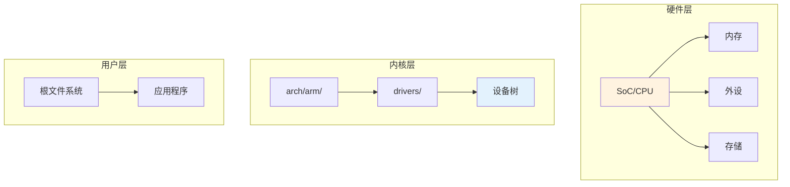

# 板级支持开发架构概述

> Linux 内核移植基础

---

## 📋 概述

板级支持开发 (BSP - Board Support Package) 是将 Linux 内核移植到新硬件平台的关键工作。

---

## 🏗️ 移植层次



---

## 📁 目录结构

```
arch/arm/
├── mach-xxx/              # 机器支持
│   ├── Kconfig
│   ├── Makefile
│   └── xxx.c
├── configs/
│   └── xxx_defconfig      # 默认配置
└── boot/dts/
    └── xxx/
        ├── xxx.dtsi       # SoC 级
        └── xxx-board.dts  # 板级
```

---

## ✅ 总结

板级开发核心：

1. **SoC 支持** - 芯片级代码
2. **设备树** - 硬件描述
3. **驱动移植** - 外设支持
4. **配置系统** - 编译选项

---

*学习笔记由 全栈工程师 维护*
