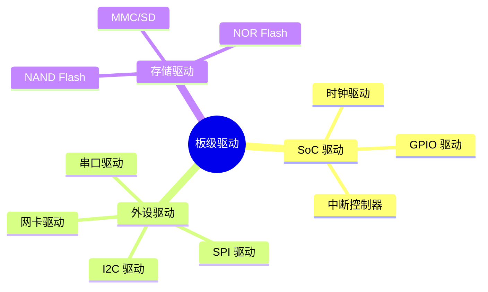

# 板级驱动开发

> 从 SoC 到外设驱动完整流程

---

## 📋 驱动分类



---

## 🔧 驱动开发流程

### 1. 平台设备注册

```c
// 设备树匹配
static const struct of_device_id my_of_match[] = {
    { .compatible = "vendor,device-name" },
    { /* sentinel */ }
};

// 平台驱动
static struct platform_driver my_driver = {
    .probe = my_probe,
    .remove = my_remove,
    .driver = {
        .name = "my-device",
        .of_match_table = my_of_match,
    },
};
module_platform_driver(my_driver);
```

### 2. 资源获取

```c
static int my_probe(struct platform_device *pdev)
{
    struct resource *res;
    void __iomem *base;
    int irq;
    
    // 获取内存资源
    res = platform_get_resource(pdev, IORESOURCE_MEM, 0);
    base = devm_ioremap_resource(&pdev->dev, res);
    
    // 获取中断
    irq = platform_get_irq(pdev, 0);
    
    // 获取时钟
    struct clk *clk = devm_clk_get(&pdev->dev, NULL);
    
    return 0;
}
```

---

## 📝 驱动示例

### GPIO 驱动

```c
#include <linux/gpio/driver.h>

struct my_gpio {
    struct gpio_chip gc;
    void __iomem *base;
};

static int my_gpio_probe(struct platform_device *pdev)
{
    struct my_gpio *chip;
    
    chip = devm_kzalloc(&pdev->dev, sizeof(*chip), GFP_KERNEL);
    chip->gc.label = dev_name(&pdev->dev);
    chip->gc.parent = &pdev->dev;
    chip->gc.base = -1;
    chip->gc.ngpio = 32;
    
    return devm_gpiochip_add_data(&pdev->dev, &chip->gc, chip);
}
```

### 串口驱动

```c
#include <linux/serial_core.h>

static const struct uart_ops my_uart_ops = {
    .startup = my_uart_startup,
    .shutdown = my_uart_shutdown,
    .tx_empty = my_uart_tx_empty,
    .set_mctrl = my_uart_set_mctrl,
    .get_mctrl = my_uart_get_mctrl,
};

static struct uart_driver my_uart_driver = {
    .owner = THIS_MODULE,
    .driver_name = "my_uart",
    .dev_name = "ttyMY",
    .nr = 4,
};
```

---

## ✅ 总结

板级驱动开发核心：

1. **平台驱动** - 标准接口
2. **资源管理** - 自动释放
3. **设备树匹配** - 自动绑定
4. **时钟/电源** - 功耗管理

---

*学习笔记由 全栈工程师 维护*
