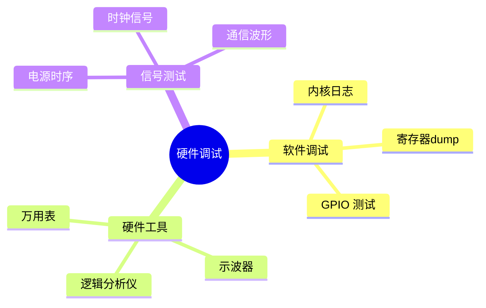

# 硬件调试指南

> 从原理图到示波器

---

## 📋 调试方法



---

## 🔍 调试步骤

### 1. 电源检查

```bash
# 测量关键电压
VDD_CORE: 1.2V
VDD_IO:   3.3V
VDD_MEM:  1.8V

# 检查电源时序
1. VDD_CORE 先上电
2. VDD_IO 后上电
3. 复位信号释放
```

### 2. 时钟检查

```bash
# 测量晶振频率
EXT_CLK: 25MHz ± 50ppm

# 检查时钟输出
CLK_OUT: 使用示波器测量
```

### 3. 通信总线测试

```bash
# I2C 测试
i2cdetect -y 1
i2cget -y 1 0x50 0x00

# SPI 测试
spidev_test -D /dev/spidev0.0

# UART 测试
echo "test" > /dev/ttyS0
cat /dev/ttyS0
```

---

## 🛠️ 常用工具

| 工具 | 用途 | 示例 |
|------|------|------|
| 万用表 | 电压/电阻测量 | 电源电压 |
| 示波器 | 波形观测 | 时钟信号 |
| 逻辑分析仪 | 数字信号 | I2C/SPI 协议 |
| JTAG 调试器 | 内核调试 | OpenOCD |

---

## ✅ 总结

硬件调试核心：

1. **电源** - 电压/时序检查
2. **时钟** - 频率/波形测量
3. **通信** - 协议测试
4. **工具** - 仪器使用

---

*学习笔记由 全栈工程师 维护*
