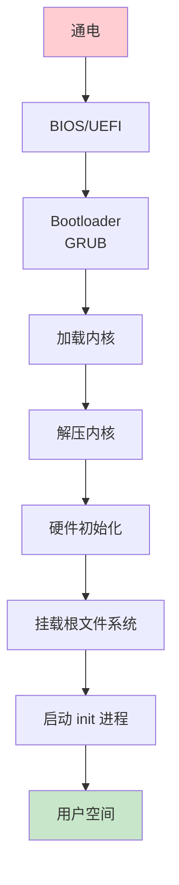
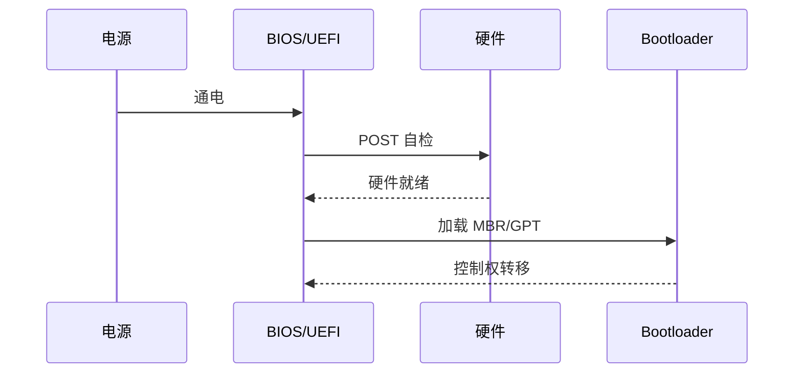
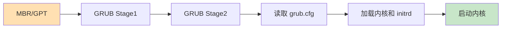
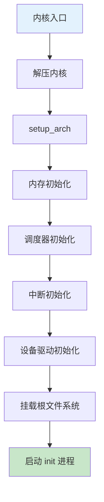
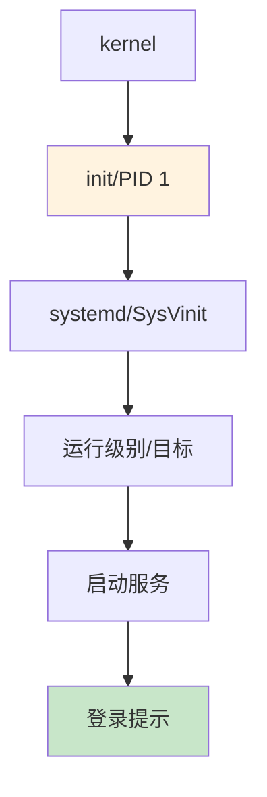

# Linux 启动流程详解

> 从 BIOS 到用户空间的完整过程

---

## 📋 启动流程概述



---

## 🔧 详细启动步骤

### 阶段 1: BIOS/UEFI



**主要工作：**
- CPU 和芯片组初始化
- 内存检测和映射
- 硬件设备枚举
- 查找可启动设备
- 加载 Bootloader

---

### 阶段 2: Bootloader (GRUB)



**GRUB 配置示例：**

```bash
# /boot/grub/grub.cfg
menuentry 'Ubuntu' {
    load_video
    insmod gzio
    insmod part_gpt
    insmod ext2
    
    set root='hd0,gpt2'
    
    linux   /vmlinuz-5.15.0 root=/dev/sda2 ro quiet splash
    initrd  /initrd.img-5.15.0
}
```

---

### 阶段 3: 内核启动



**内核启动日志：**

```bash
[    0.000000] Linux version 5.15.0-generic
[    0.000000] Command line: BOOT_IMAGE=/vmlinuz-5.15.0 root=/dev/sda2
[    0.000000] BIOS-provided physical RAM map:
[    0.000000] BIOS-e820: [mem 0x0000000000000000-0x000000000009fbff] usable
[    0.000000] NX (Execute Disable) protection: active
[    0.000000] DMI detected.
[    0.100000] sched_clock: 32 bits at 24MHz
[    1.000000] Freeing unused kernel memory: 2048K
[    2.000000] Run /sbin/init as init process
```

---

### 阶段 4: init 进程



**systemd 启动流程：**

```bash
# 查看启动过程
systemd-analyze

# 查看服务启动时间
systemd-analyze blame

# 查看关键链
systemd-analyze critical-chain
```

---

## 📊 启动时间分析

| 阶段 | 时间 | 占比 |
|------|------|------|
| BIOS/UEFI | 3-10 秒 | 30% |
| Bootloader | 1-2 秒 | 10% |
| 内核加载 | 2-5 秒 | 25% |
| init 进程 | 5-15 秒 | 35% |

---

## ✅ 总结

Linux 启动核心流程：

1. **BIOS/UEFI** - 硬件自检和初始化
2. **Bootloader** - 加载内核
3. **内核启动** - 硬件初始化和驱动加载
4. **init 进程** - 用户空间启动

掌握启动流程是系统调试的基础！

---

*学习笔记由 全栈工程师 维护*
