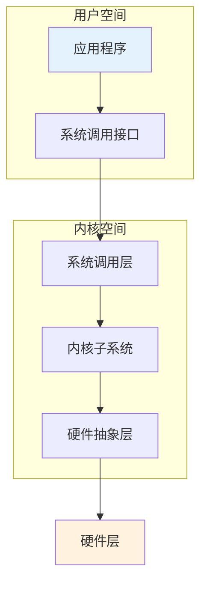
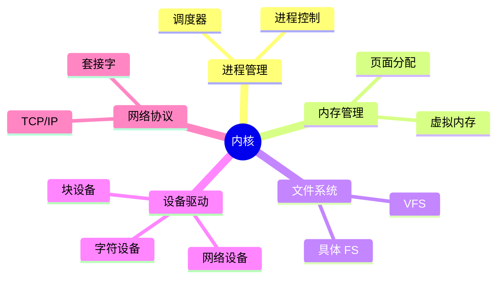

# Linux 内核架构

> 内核空间与用户空间

---

## 📋 内核架构概述

---

## 🏗️ 内核空间 vs 用户空间

| 特性 | 用户空间 | 内核空间 |
|------|----------|----------|
| 地址范围 | 0x00000000-0x7FFFFFFF | 0x80000000-0xFFFFFFFF |
| 权限 | 受限 (Ring 3) | 完全 (Ring 0) |
| 访问硬件 | 不可直接访问 | 可直接访问 |
| 稳定性 | 崩溃不影响系统 | 崩溃导致系统宕机 |

---

## 🔧 内核子系统

---

## 📊 内存布局

---

## ✅ 总结

Linux 内核架构核心：

1. **双空间** - 用户空间/内核空间隔离
2. **系统调用** - 唯一通信接口
3. **子系统** - 模块化设计
4. **硬件抽象** - 统一接口

---

*学习笔记由 全栈工程师 维护*
