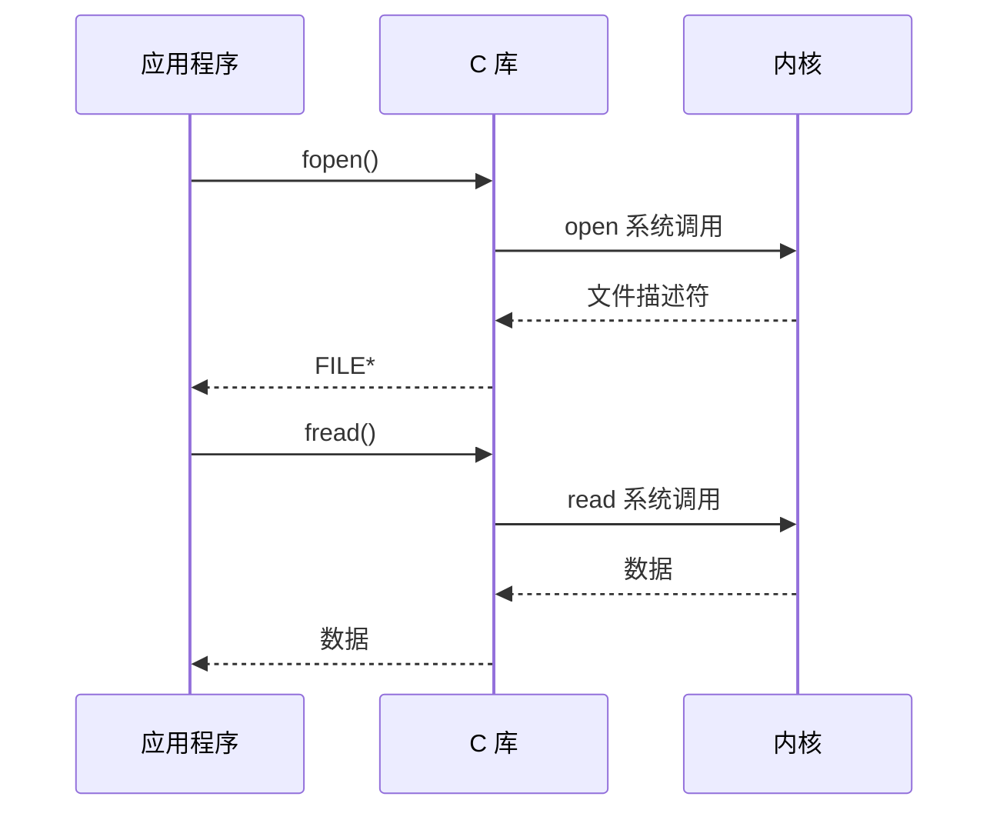
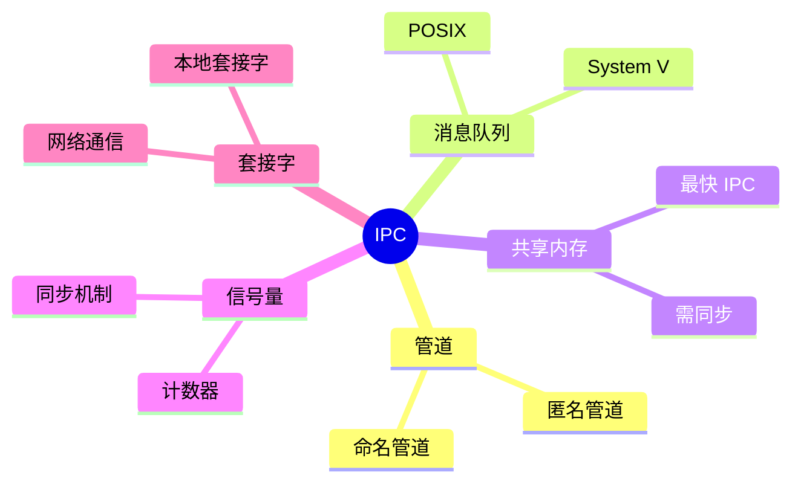

# 系统调用与进程通信

> 操作系统与应用程序交互机制

---

## 📋 系统调用概述

系统调用是应用程序与内核交互的唯一接口。



---

## 🔧 常用系统调用

### 文件操作

| 系统调用 | 功能 | 示例 |
|----------|------|------|
| open() | 打开文件 | `fd = open("file", O_RDONLY)` |
| read() | 读取文件 | `read(fd, buf, size)` |
| write() | 写入文件 | `write(fd, buf, size)` |
| close() | 关闭文件 | `close(fd)` |

### 进程控制

| 系统调用 | 功能 | 示例 |
|----------|------|------|
| fork() | 创建进程 | `pid = fork()` |
| exec() | 执行程序 | `execve(path, argv, envp)` |
| wait() | 等待子进程 | `wait(&status)` |
| exit() | 退出进程 | `exit(0)` |

### 进程间通信

| 系统调用 | 功能 | 示例 |
|----------|------|------|
| pipe() | 管道 | `pipe(fd)` |
| shmget() | 共享内存 | `shmget(key, size, flags)` |
| msgget() | 消息队列 | `msgget(key, flags)` |
| semget() | 信号量 | `semget(key, nsems, flags)` |

---

## 📊 进程通信 (IPC) 方式



---

## 💻 实践示例

### 系统调用示例

```c
#include <unistd.h>
#include <fcntl.h>
#include <stdio.h>

int main() {
    // 打开文件
    int fd = open("test.txt", O_RDONLY);
    if (fd < 0) {
        perror("open");
        return 1;
    }
    
    // 读取文件
    char buf[100];
    int n = read(fd, buf, sizeof(buf));
    write(STDOUT_FILENO, buf, n);
    
    // 关闭文件
    close(fd);
    return 0;
}
```

### 管道通信示例

```c
#include <unistd.h>
#include <stdio.h>
#include <string.h>

int main() {
    int pipefd[2];
    pid_t pid;
    char buf[100];
    
    // 创建管道
    pipe(pipefd);
    
    pid = fork();
    if (pid == 0) {
        // 子进程 - 写
        close(pipefd[0]);
        write(pipefd[1], "Hello from child", 17);
        close(pipefd[1]);
    } else {
        // 父进程 - 读
        close(pipefd[1]);
        read(pipefd[0], buf, sizeof(buf));
        printf("Received: %s\n", buf);
        close(pipefd[0]);
    }
    
    return 0;
}
```

---

## ✅ 总结

系统调用与 IPC 核心：

1. **系统调用** - 应用程序与内核交互接口
2. **文件操作** - open/read/write/close
3. **进程控制** - fork/exec/wait/exit
4. **IPC** - 管道/消息/共享内存/信号量

---

*学习笔记由 全栈工程师 维护*
