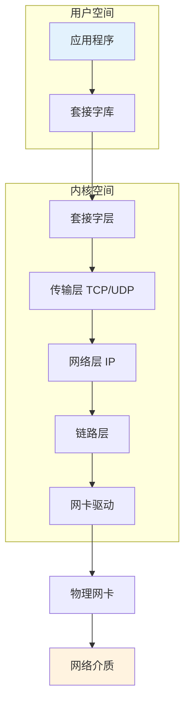
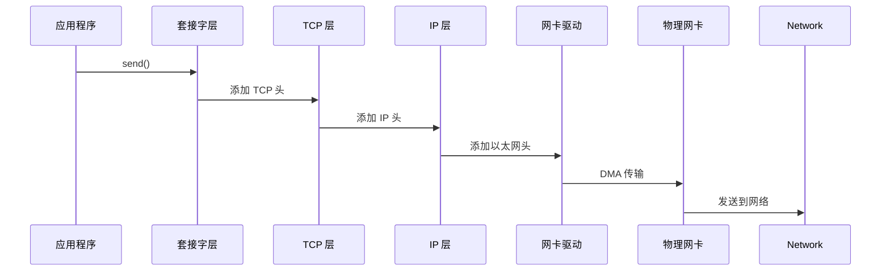

# Linux 网络架构详解

> 从物理网卡到应用层的完整架构

---

## 📋 网络架构概述



---

## 🏗️ 网络子系统层次

| 层次 | 模块 | 功能 |
|------|------|------|
| 应用层 | 应用程序 | HTTP/FTP/SSH 等 |
| 套接字层 | socket | BSD 套接字接口 |
| 传输层 | TCP/UDP | 端到端通信 |
| 网络层 | IP | 路由和寻址 |
| 链路层 | Ethernet | 帧传输 |
| 驱动层 | NIC Driver | 硬件控制 |

---

## 🔧 核心数据结构

### sk_buff 结构

```c
struct sk_buff {
    union {
        struct {
            struct sk_buff *next;
            struct sk_buff *prev;
        };
        struct rb_node rbnode;
    };
    
    struct sock *sk;
    ktime_t tstamp;
    
    unsigned char *head;
    unsigned char *data;
    u32 len;
    u16 data_len;
    
    // 协议头指针
    union {
        struct ethhdr *eth_header;
        struct iphdr *iph;
        struct ipv6hdr *ipv6h;
        struct tcphdr *th;
        struct udphdr *uh;
    };
    
    // 控制块
    union {
        struct iphdr ip_hdr;
        // ... 更多协议控制块
    };
};
```

### net_device 结构

```c
struct net_device {
    char name[IFNAMSIZ];          // 设备名 eth0
    unsigned long ifindex;        // 接口索引
    unsigned int flags;           // 标志
    unsigned char addr[32];       // MAC 地址
    unsigned int mtu;             // 最大传输单元
    
    const struct net_device_ops *netdev_ops;
    netdev_tx_t (*hard_start_xmit)(struct sk_buff *skb, 
                                    struct net_device *dev);
    
    struct net_device_stats *stats;
};
```

---

## 📊 网络数据包流向



---

## ✅ 总结

Linux 网络架构核心：

1. **分层设计** - OSI 7 层模型
2. **sk_buff** - 数据包缓冲
3. **net_device** - 网络设备抽象
4. **NAPI** - 中断优化

---

*学习笔记由 全栈工程师 维护*
