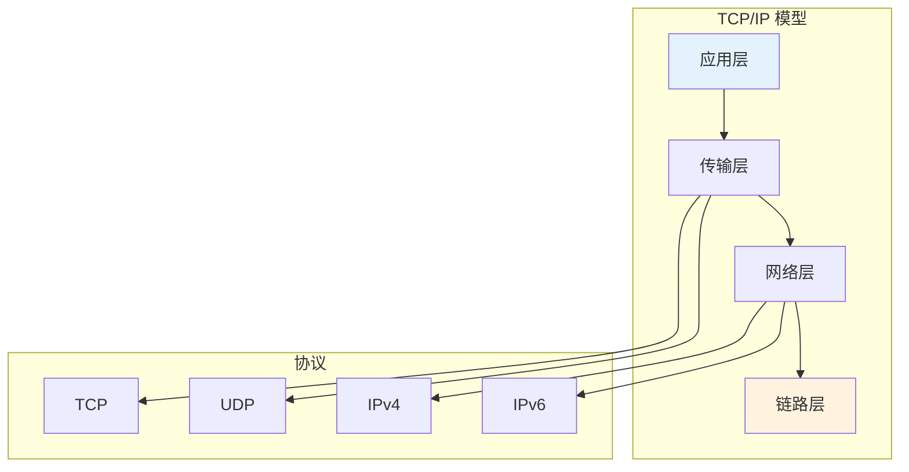
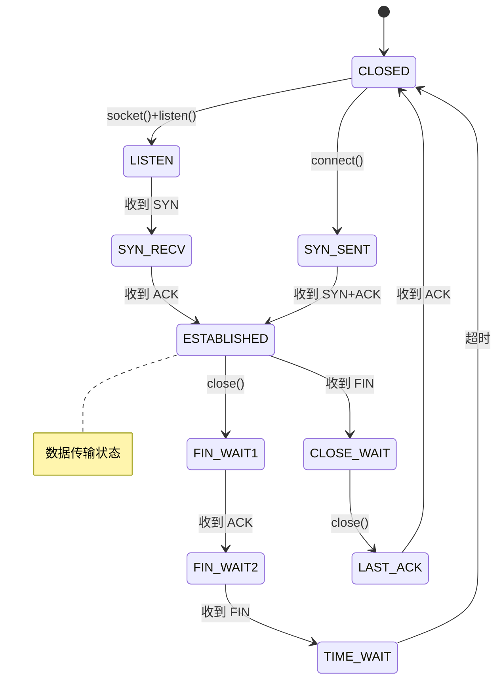
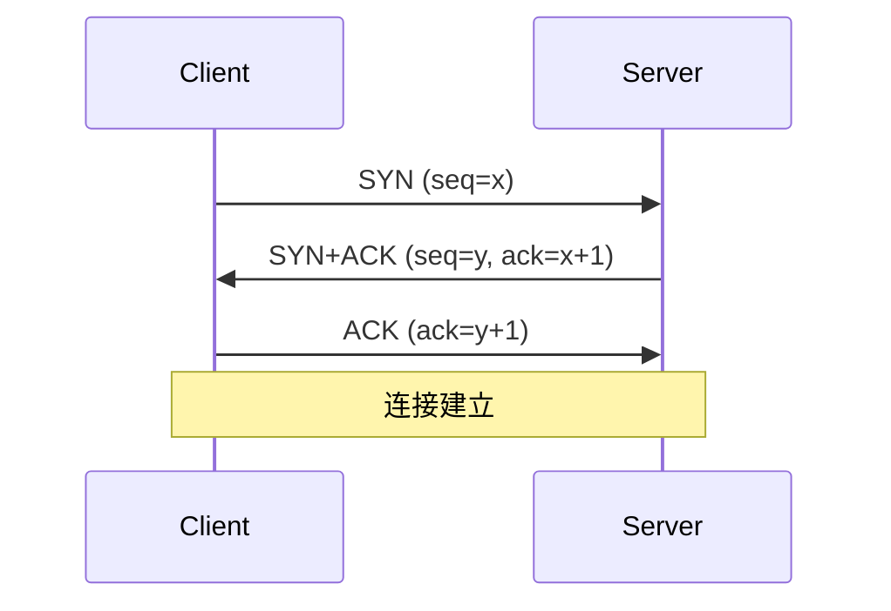
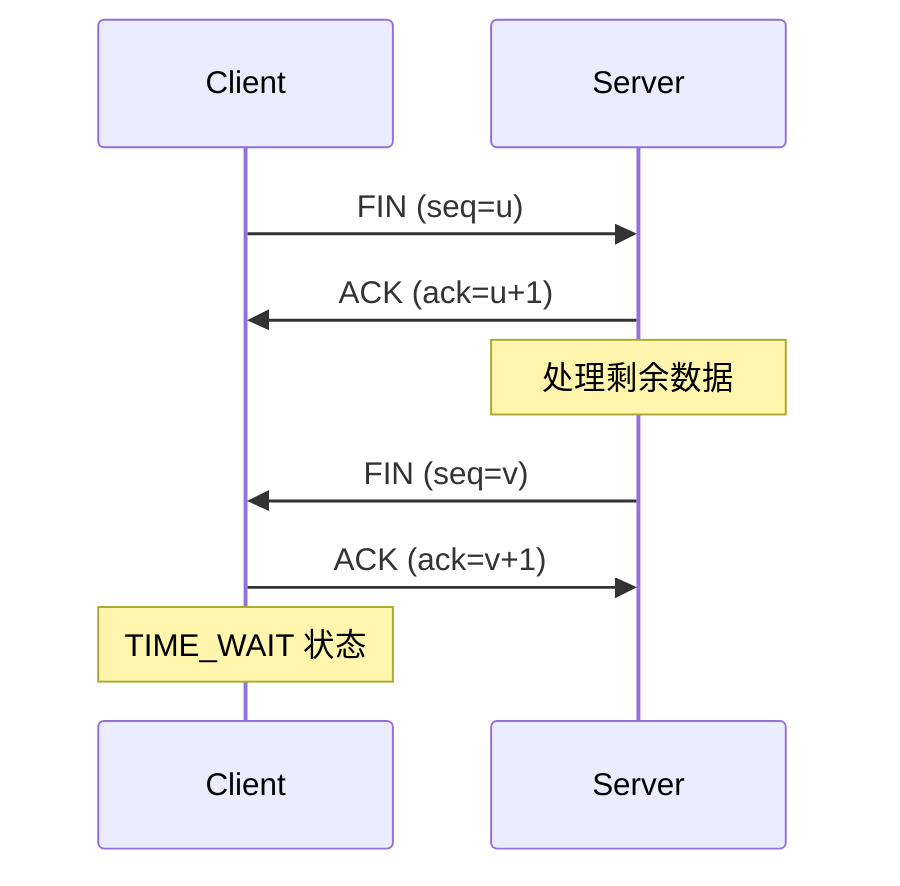

# TCP/IP 协议栈详解

> 传输层和网络层核心原理

---

## 📋 TCP/IP 协议栈



---

## 🔧 TCP 协议

### TCP 头结构

```c
struct tcphdr {
    __u16 source;      // 源端口
    __u16 dest;        // 目的端口
    __u32 seq;         // 序列号
    __u32 ack_seq;     // 确认号
    __u16 res1:4;
    __u16 doff:4;
    __u16 fin:1;
    __u16 syn:1;
    __u16 rst:1;
    __u16 psh:1;
    __u16 ack:1;
    __u16 urg:1;
    __u16 window;      // 窗口大小
    __u16 check;       // 校验和
    __u16 urg_ptr;
};
```

### TCP 状态机



### TCP 三次握手



### TCP 四次挥手



---

## 🔧 UDP 协议

### UDP 头结构

```c
struct udphdr {
    __u16 source;    // 源端口
    __u16 dest;      // 目的端口
    __u16 len;       // 长度
    __u16 check;     // 校验和
};
```

### TCP vs UDP

| 特性 | TCP | UDP |
|------|-----|-----|
| 连接 | 面向连接 | 无连接 |
| 可靠性 | 可靠 | 不可靠 |
| 顺序 | 保证顺序 | 不保证 |
| 速度 | 较慢 | 快 |
| 场景 | Web/邮件 | 视频/语音 |

---

## 🔧 IP 协议

### IPv4 头结构

```c
struct iphdr {
    __u8 ihl:4;           // 头长度
    __u8 version:4;       // 版本 (4)
    __u8 tos;             // 服务类型
    __be16 tot_len;       // 总长度
    __be16 id;            // 标识
    __be16 frag_off;      // 分片偏移
    __u8 ttl;             // 生存时间
    __u8 protocol;        // 协议 (TCP=6, UDP=17)
    __sum16 check;        // 校验和
    __be32 saddr;         // 源地址
    __be32 daddr;         // 目的地址
};
```

### 路由表

```bash
# 查看路由表
ip route show

# 输出示例
default via 192.168.1.1 dev eth0
192.168.1.0/24 dev eth0 proto kernel scope link src 192.168.1.100
```

---

## ✅ 总结

TCP/IP 协议栈核心：

1. **TCP** - 可靠、面向连接
2. **UDP** - 快速、无连接
3. **IP** - 寻址和路由
4. **状态机** - 连接管理

---

*学习笔记由 全栈工程师 维护*
