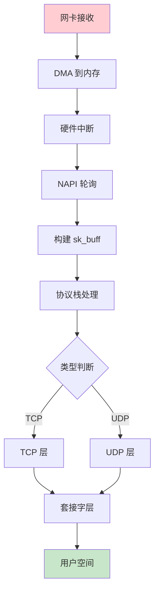
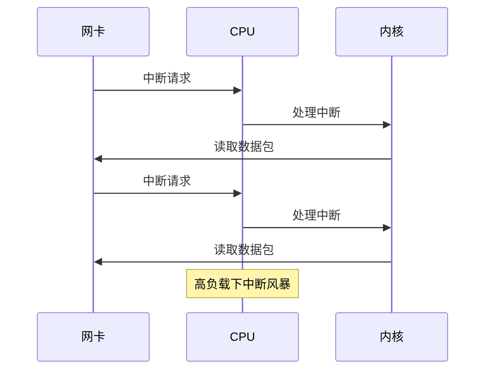
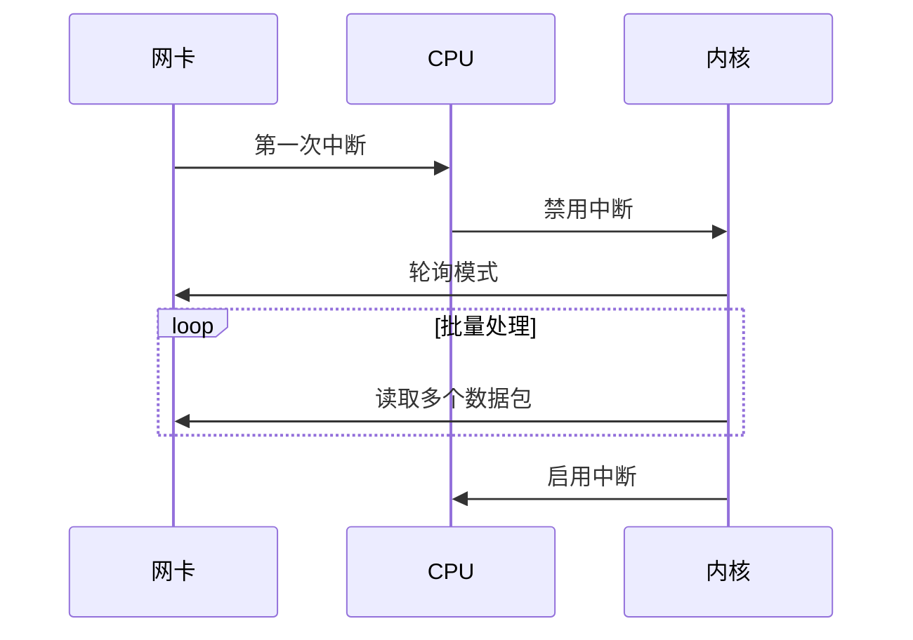

# 网络数据包流转

> 从网卡到应用的完整路径

---

## 📋 数据包接收流程



---

## 🔧 NAPI 机制

### 传统中断方式问题



### NAPI 混合方式



---

## 📊 数据包发送流程


---

## 💻 实践示例

### 抓包分析

```bash
# 使用 tcpdump 抓包
tcpdump -i eth0 -n port 80

# 使用 wireshark 分析
wireshark capture.pcap

# 内核跟踪
trace-cmd record -e net:*
trace-cmd report
```

### 网络统计

```bash
# 查看网络统计
cat /proc/net/dev

# 查看 TCP 统计
netstat -s

# 查看连接状态
ss -tuln
```

---

## ✅ 总结

数据包流转核心：

1. **接收** - 中断→NAPI→协议栈
2. **发送** - 应用→协议栈→DMA
3. **NAPI** - 中断 + 轮询
4. **sk_buff** - 统一缓冲

---

*学习笔记由 全栈工程师 维护*
