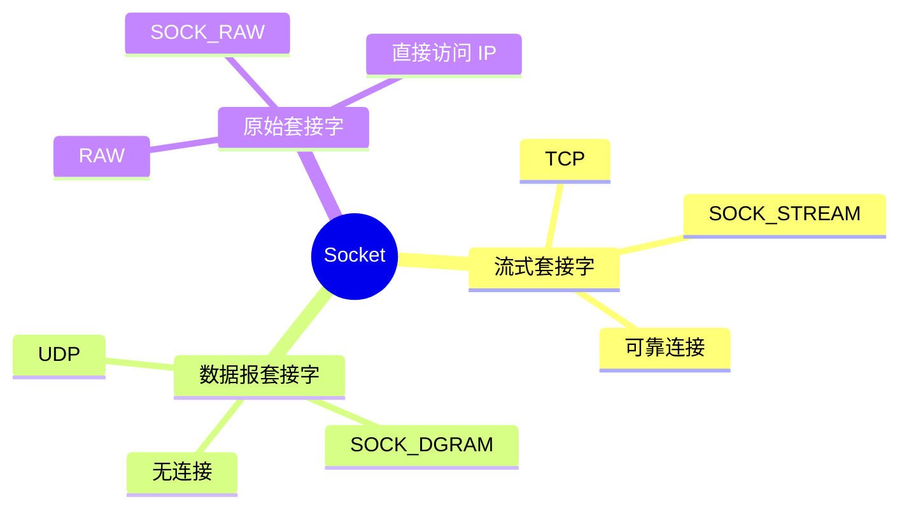

# 套接字编程指南

> 网络应用开发基础

---

## 📋 套接字类型



---

## 🔧 套接字 API

### 基础 API

| 函数 | 功能 | 示例 |
|------|------|------|
| socket() | 创建套接字 | `sock = socket(AF_INET, SOCK_STREAM, 0)` |
| bind() | 绑定地址 | `bind(sock, addr, sizeof(addr))` |
| listen() | 监听端口 | `listen(sock, BACKLOG)` |
| accept() | 接受连接 | `client = accept(sock, ...)` |
| connect() | 发起连接 | `connect(sock, addr, ...)` |
| send()/recv() | 发送/接收 | `send(sock, buf, len, 0)` |
| close() | 关闭套接字 | `close(sock)` |

---

## 💻 TCP 服务器示例

```c
#include <stdio.h>
#include <stdlib.h>
#include <string.h>
#include <unistd.h>
#include <arpa/inet.h>

#define PORT 8080
#define BUFFER_SIZE 1024

int main() {
    int server_fd, new_socket;
    struct sockaddr_in address;
    int opt = 1;
    int addrlen = sizeof(address);
    char buffer[BUFFER_SIZE] = {0};
    
    // 1. 创建套接字
    if ((server_fd = socket(AF_INET, SOCK_STREAM, 0)) == 0) {
        perror("socket failed");
        exit(EXIT_FAILURE);
    }
    
    // 2. 设置选项
    if (setsockopt(server_fd, SOL_SOCKET, SO_REUSEADDR, &opt, sizeof(opt))) {
        perror("setsockopt");
        exit(EXIT_FAILURE);
    }
    
    // 3. 绑定地址
    address.sin_family = AF_INET;
    address.sin_addr.s_addr = INADDR_ANY;
    address.sin_port = htons(PORT);
    
    if (bind(server_fd, (struct sockaddr *)&address, sizeof(address)) < 0) {
        perror("bind failed");
        exit(EXIT_FAILURE);
    }
    
    // 4. 监听
    if (listen(server_fd, 3) < 0) {
        perror("listen");
        exit(EXIT_FAILURE);
    }
    
    printf("Server listening on port %d\n", PORT);
    
    // 5. 接受连接
    if ((new_socket = accept(server_fd, (struct sockaddr *)&address, 
                             (socklen_t*)&addrlen)) < 0) {
        perror("accept");
        exit(EXIT_FAILURE);
    }
    
    // 6. 读取数据
    int valread = read(new_socket, buffer, BUFFER_SIZE);
    printf("Received: %s\n", buffer);
    
    // 7. 发送响应
    char *response = "HTTP/1.1 200 OK\r\nContent-Length: 13\r\n\r\nHello World!";
    send(new_socket, response, strlen(response), 0);
    
    close(new_socket);
    close(server_fd);
    
    return 0;
}
```

---

## 💻 UDP 客户端示例

```c
#include <stdio.h>
#include <stdlib.h>
#include <string.h>
#include <unistd.h>
#include <arpa/inet.h>

#define PORT 8080
#define SERVER_IP "127.0.0.1"
#define MESSAGE "Hello UDP Server"

int main() {
    int sock;
    struct sockaddr_in server_addr;
    char buffer[1024] = {0};
    
    // 1. 创建套接字
    if ((sock = socket(AF_INET, SOCK_DGRAM, 0)) < 0) {
        perror("socket failed");
        exit(EXIT_FAILURE);
    }
    
    // 2. 配置服务器地址
    memset(&server_addr, 0, sizeof(server_addr));
    server_addr.sin_family = AF_INET;
    server_addr.sin_port = htons(PORT);
    
    if (inet_pton(AF_INET, SERVER_IP, &server_addr.sin_addr) <= 0) {
        perror("inet_pton");
        exit(EXIT_FAILURE);
    }
    
    // 3. 发送数据
    sendto(sock, MESSAGE, strlen(MESSAGE), 0,
           (struct sockaddr *)&server_addr, sizeof(server_addr));
    
    printf("Message sent: %s\n", MESSAGE);
    
    // 4. 接收响应
    int len = recvfrom(sock, buffer, sizeof(buffer), 0, NULL, NULL);
    buffer[len] = '\0';
    printf("Response: %s\n", buffer);
    
    close(sock);
    return 0;
}
```

---

## ✅ 总结

套接字编程核心：

1. **TCP** - 可靠、面向连接
2. **UDP** - 快速、无连接
3. **API** - socket/bind/listen/accept
4. **实践** - 服务器/客户端示例

---

*学习笔记由 全栈工程师 维护*
