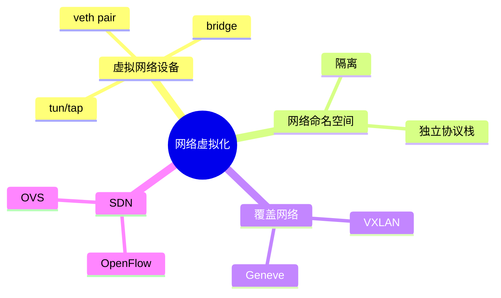
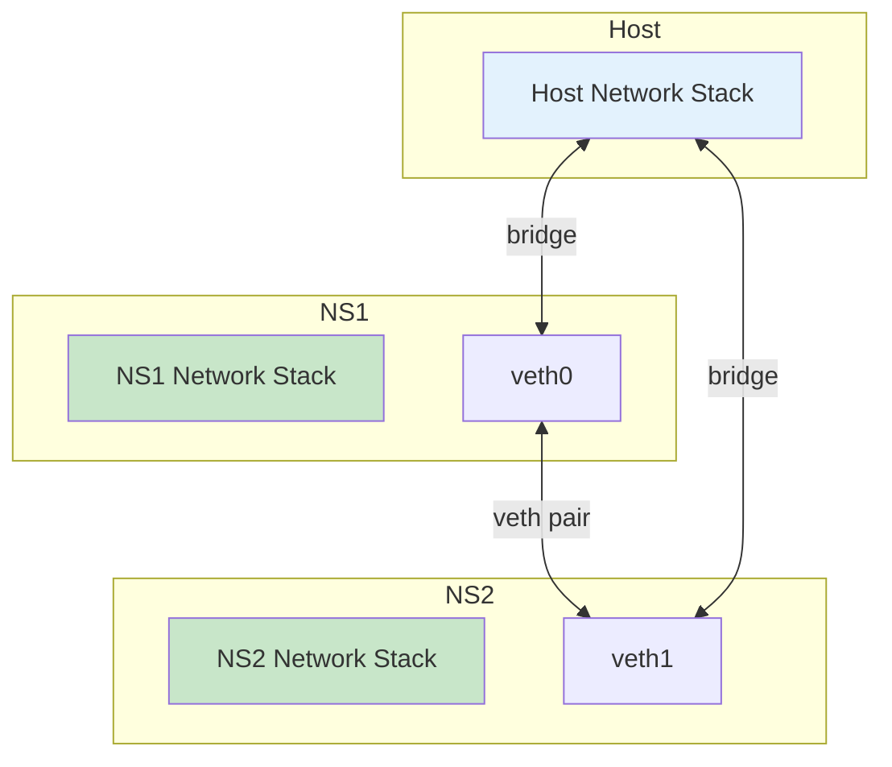

# 网络虚拟化技术

> 容器和云网络基础

---

## 📋 网络虚拟化概述



---

## 🔧 虚拟网络设备

### veth pair

```bash
# 创建 veth pair
ip link add veth0 type veth peer name veth1

# 查看设备
ip link show veth0
ip link show veth1

# 删除设备
ip link delete veth0
```

### Linux Bridge

```bash
# 创建网桥
ip link add name br0 type bridge
ip link set br0 up

# 添加接口到网桥
ip link set eth0 master br0

# 查看网桥
brctl show
```

### tun/tap 设备

```c
#include <linux/if.h>
#include <linux/if_tun.h>
#include <sys/ioctl.h>

int tun_alloc(char *dev, int flags) {
    struct ifreq ifr;
    int fd, err;
    
    if ((fd = open("/dev/net/tun", O_RDWR)) < 0)
        return fd;
    
    memset(&ifr, 0, sizeof(ifr));
    ifr.ifr_flags = flags;  // IFF_TUN or IFF_TAP
    
    if (dev)
        strncpy(ifr.ifr_name, dev, IFNAMSIZ);
    
    if ((err = ioctl(fd, TUNSETIFF, (void *)&ifr)) < 0) {
        close(fd);
        return err;
    }
    
    strcpy(dev, ifr.ifr_name);
    return fd;
}
```

---

## 🔧 网络命名空间

### 操作命令

```bash
# 创建命名空间
ip netns add ns1
ip netns add ns2

# 查看命名空间
ip netns list

# 在命名空间执行命令
ip netns exec ns1 ip addr show

# 连接命名空间
ip -n ns1 link add veth0 type veth peer name veth1 -n ns2

# 删除命名空间
ip netns del ns1
```

### 网络隔离



---

## 🔧 覆盖网络

### VXLAN

```bash
# 创建 VXLAN 接口
ip link add vxlan0 type vxlan \
    id 42 \
    dev eth0 \
    dstport 4789 \
    group 239.1.1.1 \
    ttl 3
    
# 启用接口
ip link set vxlan0 up
```

---

## ✅ 总结

网络虚拟化核心：

1. **veth pair** - 虚拟网线
2. **Bridge** - 虚拟交换机
3. **Namespace** - 网络隔离
4. **VXLAN** - 覆盖网络

---

*学习笔记由 全栈工程师 维护*
