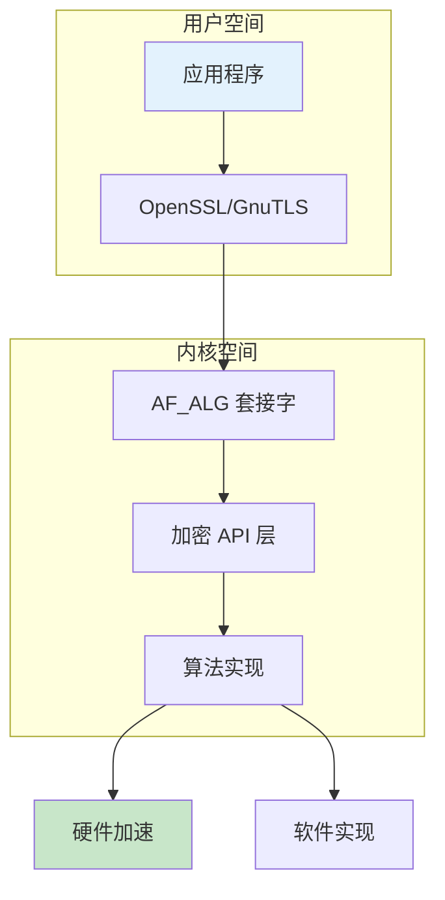
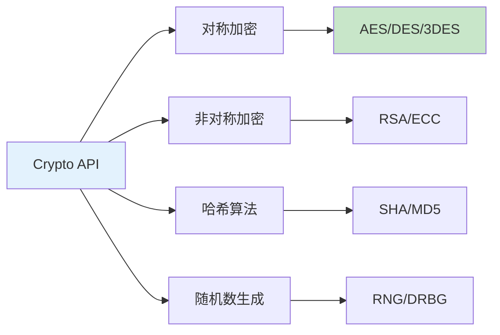

# Linux 加密架构详解

> 内核加密子系统完整指南

---

## 📋 加密架构概述



---

## 🏗️ 内核加密子系统

### Crypto API 层次



### 核心数据结构

```c
// 加密变换
struct crypto_tfm {
    u32 crt_flags;
    u32 crt_alignmask;
    struct crypto_alg *crt_alg;
    void *crt_module;
    union {
        struct crypto_cipher cipher;
        struct crypto_blkcipher blkcipher;
        struct crypto_hash hash;
        struct crypto_aead aead;
    };
};

// 哈希请求
struct ahash_request {
    struct crypto_async_request base;
    unsigned int nbytes;
    struct scatterlist *src;
    u8 *result;
    void (*complete)(struct crypto_async_request *req, int err);
    void *data;
    void *__ctx[];
};
```

---

## 🔧 加密算法分类

| 类型 | 算法 | 用途 | 密钥长度 |
|------|------|------|----------|
| 对称加密 | AES | 数据加密 | 128/192/256 位 |
| 对称加密 | DES/3DES | 遗留系统 | 56/168 位 |
| 非对称加密 | RSA | 密钥交换/签名 | 2048/4096 位 |
| 非对称加密 | ECC | 移动设备 | 256/384 位 |
| 哈希 | SHA-256 | 完整性校验 | 256 位 |
| 哈希 | SHA-3 | 新一代哈希 | 224-512 位 |
| AEAD | GCM/CCM | 认证加密 | 可变 |

---

## 📊 加密子系统架构

```mermaid
graph TB
    subgraph Crypto 核心
        A[Crypto API] --> B[算法管理]
        B --> C[变换管理]
    end
    
    subgraph 算法实现
        D[软件实现] --> E[硬件加速]
        E --> F[DSA 引擎]
        E --> G[QAT]
        E --> H[CE 引擎]
    end
    
    subgraph 用户接口
        I[/dev/crypto] --> J[AF_ALG]
        J --> K[dm-crypt]
    end
    
    style A fill:#e3f2fd
    style F fill:#c8e6c9
```

---

## ✅ 总结

Linux 加密架构核心：

1. **Crypto API** - 统一加密接口
2. **算法管理** - 动态注册/卸载
3. **硬件加速** - DSA/QAT/CE 引擎
4. **用户接口** - AF_ALG/dm-crypt

---

*学习笔记由 全栈工程师 维护*
