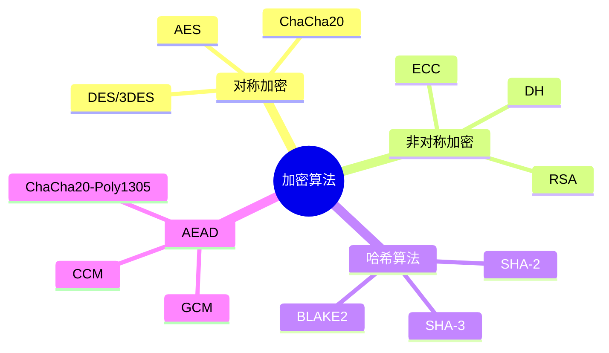

# 加密算法详解

> 对称/非对称/哈希算法完整指南

---

## 📋 算法分类



---

## 🔧 对称加密算法

### AES (Advanced Encryption Standard)

```c
#include <crypto/aes.h>

// AES 加密
int aes_encrypt(struct crypto_blkcipher *tfm, u8 *dst, const u8 *src,
                unsigned int nbytes)
{
    struct blkcipher_desc desc = { .tfm = tfm };
    struct scatterlist sg;
    
    sg_init_one(&sg, src, nbytes);
    return crypto_blkcipher_encrypt(&desc, &sg, &sg, nbytes);
}

// AES 解密
int aes_decrypt(struct crypto_blkcipher *tfm, u8 *dst, const u8 *src,
                unsigned int nbytes)
{
    struct blkcipher_desc desc = { .tfm = tfm };
    struct scatterlist sg;
    
    sg_init_one(&sg, src, nbytes);
    return crypto_blkcipher_decrypt(&desc, &sg, &sg, nbytes);
}
```

### AES 工作模式

| 模式 | 全称 | 特点 | 应用场景 |
|------|------|------|----------|
| ECB | Electronic Codebook | 简单、不安全 | 不推荐 |
| CBC | Cipher Block Chaining | 需要 IV | 通用加密 |
| CTR | Counter | 并行化 | 高性能 |
| GCM | Galois/Counter | 认证加密 | TLS/IPSec |
| XTS | XEX-based Tweakable | 磁盘加密 | FDE |

---

## 🔧 非对称加密算法

### RSA

```c
#include <crypto/akcipher.h>

// RSA 签名
int rsa_sign(struct crypto_akcipher *tfm, const void *src,
             unsigned int src_len, void *dst, unsigned int dst_len)
{
    struct akcipher_request *req;
    struct scatterlist src_sg, dst_sg;
    
    req = akcipher_request_alloc(tfm, GFP_KERNEL);
    
    sg_init_one(&src_sg, src, src_len);
    sg_init_one(&dst_sg, dst, dst_len);
    
    akcipher_request_set_crypt(req, &src_sg, &dst_sg, src_len, dst_len);
    
    return crypto_akcipher_sign(req);
}

// RSA 加密
int rsa_encrypt(struct crypto_akcipher *tfm, const void *src,
                unsigned int src_len, void *dst, unsigned int dst_len)
{
    // 类似签名实现
}
```

### ECC (Elliptic Curve Cryptography)

```c
// ECC 密钥对生成
struct crypto_kpp *tfm;
tfm = crypto_alloc_kpp("ecdh-nist-p256", 0, 0);

// ECDH 密钥交换
crypto_kpp_set_secret(tfm, private_key, private_key_len);
```

---

## 🔧 哈希算法

### SHA-256

```c
#include <crypto/hash.h>

int sha256_hash(const u8 *data, unsigned int len, u8 *digest)
{
    struct crypto_ahash *tfm;
    struct ahash_request *req;
    struct scatterlist sg;
    
    tfm = crypto_alloc_ahash("sha256", 0, 0);
    req = ahash_request_alloc(tfm, GFP_KERNEL);
    
    sg_init_one(&sg, data, len);
    
    ahash_request_set_crypt(req, &sg, digest, len);
    
    return crypto_ahash_digest(req);
}
```

### 哈希算法对比

| 算法 | 输出长度 | 速度 | 安全性 |
|------|----------|------|--------|
| MD5 | 128 位 | 快 | ❌ 已破解 |
| SHA-1 | 160 位 | 中 | ❌ 不推荐 |
| SHA-256 | 256 位 | 中 | ✅ 安全 |
| SHA-3 | 224-512 位 | 慢 | ✅ 最新 |
| BLAKE2 | 可变 | 快 | ✅ 高性能 |

---

## 🔧 AEAD (认证加密)

### AES-GCM

```c
#include <crypto/aead.h>

int aes_gcm_encrypt(struct crypto_aead *tfm, const u8 *ptext,
                    unsigned int ptext_len, u8 *ctext,
                    const u8 *aad, unsigned int aad_len,
                    const u8 *iv, unsigned int iv_len)
{
    struct aead_request *req;
    struct scatterlist sg;
    
    req = aead_request_alloc(tfm, GFP_KERNEL);
    
    // 设置关联数据 (AAD) 和 IV
    aead_request_set_ad(req, aad_len);
    aead_request_set_crypt(req, &sg, &sg, ptext_len, iv);
    
    return crypto_aead_encrypt(req);
}
```

---

## ✅ 总结

加密算法核心：

1. **对称加密** - AES/ChaCha20 (高性能)
2. **非对称加密** - RSA/ECC (密钥交换)
3. **哈希算法** - SHA-256/SHA-3 (完整性)
4. **AEAD** - GCM/CCM (认证加密)

---

*学习笔记由 全栈工程师 维护*
