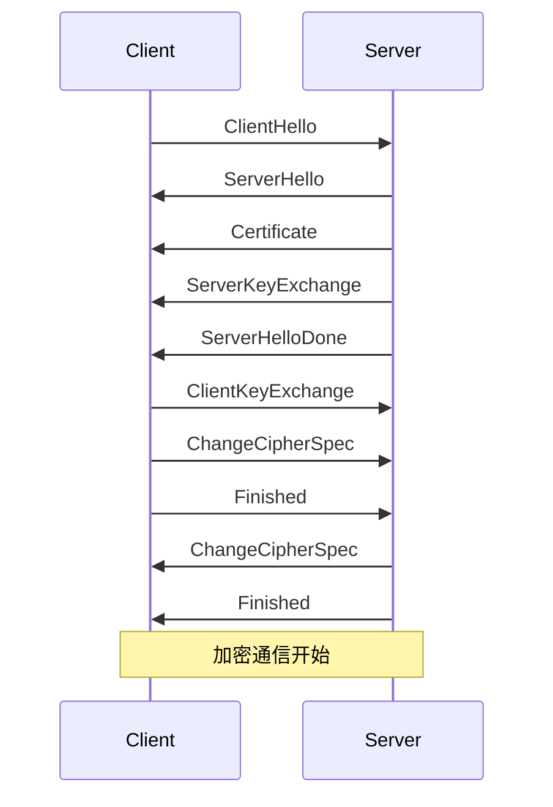
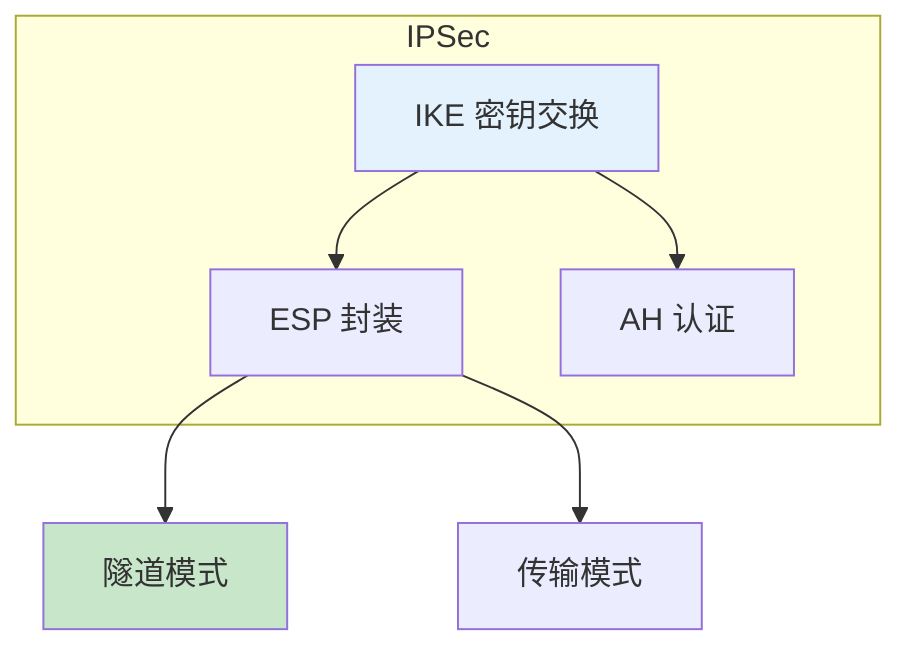

# 安全协议详解

> TLS/IPSec/SSH 协议原理

---

## 📋 TLS 协议

### TLS 握手流程

---

## 🔧 IPSec 协议

### IPSec 架构

---

## ✅ 总结

安全协议核心：

1. **TLS** - Web 安全通信
2. **IPSec** - VPN 隧道
3. **SSH** - 安全远程登录
4. **IKE** - 密钥交换

---

*学习笔记由 全栈工程师 维护*
