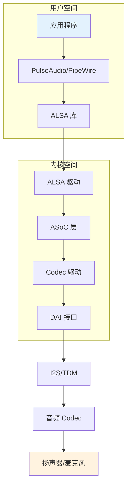
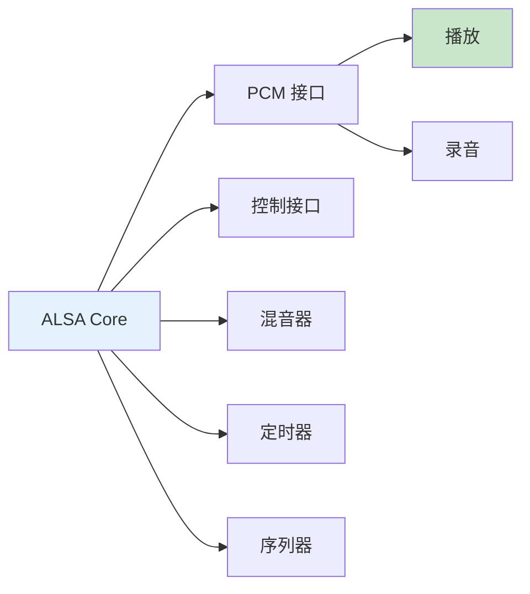
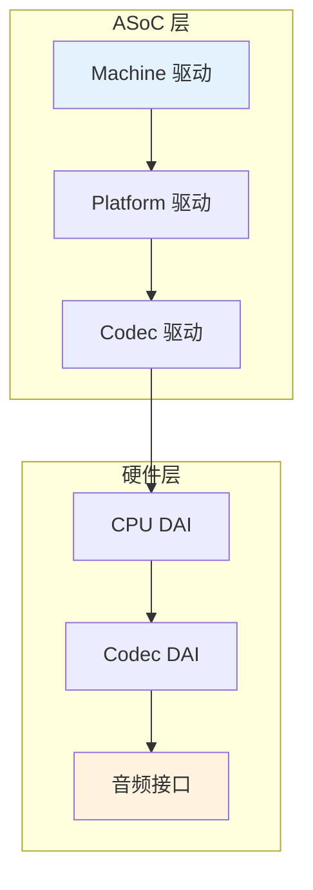

# Linux 音频架构详解

> 从硬件到应用的完整音频栈

---

## 📋 音频架构概述

---

## 🏗️ ALSA 架构

### ALSA 子系统

### 核心组件

| 组件 | 功能 | 设备节点 |
|------|------|----------|
| PCM | 音频数据流 | /dev/snd/pcm* |
| Control | 设备控制 | /dev/snd/control* |
| Mixer | 音量控制 | /dev/snd/mixer* |
| Timer | 音频定时器 | /dev/snd/timer |
| Sequencer | MIDI 序列 | /dev/snd/seq |

---

## 🔧 ASoC (ALSA System on Chip)

### ASoC 架构

### DAI 接口类型

| 接口 | 全称 | 通道数 | 应用场景 |
|------|------|--------|----------|
| I2S | Inter-IC Sound | 2 | 立体声音频 |
| TDM | Time Division Multiplex | 8+ | 多通道音频 |
| PDM | Pulse Density Modulation | 1+ | 数字麦克风 |
| S/PDIF | Sony/Philips Digital | 2 | 数字音频输出 |

---

## ✅ 总结

Linux 音频架构核心：

1. **ALSA** - 音频驱动框架
2. **ASoC** - SoC 音频子系统
3. **DAI** - 数字音频接口
4. **用户空间** - PulseAudio/PipeWire

---

*学习笔记由 全栈工程师 维护*
