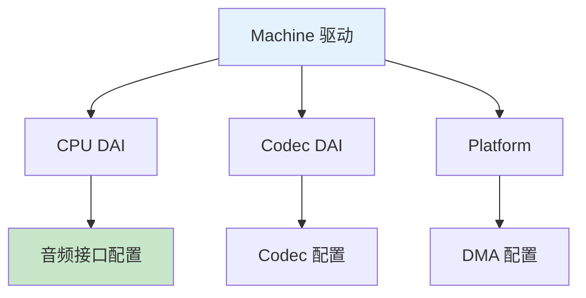

# ALSA 驱动开发

> SoC 音频驱动完整指南

---

## 📋 ASoC 驱动结构



---

## 🔧 Codec 驱动

### 基础结构

```c
#include <sound/soc.h>
#include <sound/soc-dapm.h>

// Codec 驱动
struct snd_soc_codec_driver my_codec_driver = {
    .probe = my_codec_probe,
    .remove = my_codec_remove,
    .suspend = my_codec_suspend,
    .resume = my_codec_resume,
    
    // 控件
    .controls = my_codec_controls,
    .num_controls = ARRAY_SIZE(my_codec_controls),
    
    // DAPM 控件
    .dapm_widgets = my_codec_dapm_widgets,
    .num_dapm_widgets = ARRAY_SIZE(my_codec_dapm_widgets),
    .dapm_routes = my_codec_dapm_routes,
    .num_dapm_routes = ARRAY_SIZE(my_codec_dapm_routes),
};

// DAI 操作
struct snd_soc_dai_ops my_codec_dai_ops = {
    .startup = my_codec_startup,
    .shutdown = my_codec_shutdown,
    .hw_params = my_codec_hw_params,
    .set_fmt = my_codec_set_fmt,
    .set_sysclk = my_codec_set_sysclk,
};

// DAI 驱动
struct snd_soc_dai_driver my_codec_dai = {
    .name = "my-codec-hifi",
    .playback = {
        .stream_name = "Playback",
        .channels_min = 2,
        .channels_max = 2,
        .rates = SNDRV_PCM_RATE_8000_192000,
        .formats = SNDRV_PCM_FMTBIT_S16_LE | SNDRV_PCM_FMTBIT_S24_LE,
    },
    .capture = {
        .stream_name = "Capture",
        .channels_min = 2,
        .channels_max = 2,
        .rates = SNDRV_PCM_RATE_8000_192000,
        .formats = SNDRV_PCM_FMTBIT_S16_LE,
    },
    .ops = &my_codec_dai_ops,
};
```

---

## 🔧 Machine 驱动

```c
#include <sound/soc.h>

// Machine 驱动
static struct snd_soc_card my_card = {
    .name = "My-Audio-Card",
    .owner = THIS_MODULE,
    .dai_link = my_dai_links,
    .num_links = ARRAY_SIZE(my_dai_links),
};

// DAI 链接
static struct snd_soc_dai_link my_dai_links[] = {
    {
        .name = "CPU-Codec",
        .stream_name = "HiFi",
        .cpu_dai_name = "my-cpu-dai",
        .codec_dai_name = "my-codec-hifi",
        .platform_name = "my-audio-platform",
        .codec_name = "my-codec.0-001a",
        .dai_fmt = SND_SOC_DAIFMT_I2S | SND_SOC_DAIFMT_NB_NF,
    },
};

// 探测函数
static int my_audio_probe(struct platform_device *pdev)
{
    struct snd_soc_card *card = &my_card;
    int ret;
    
    card->dev = &pdev->dev;
    platform_set_drvdata(pdev, card);
    
    ret = devm_snd_soc_register_card(&pdev->dev, card);
    if (ret) {
        dev_err(&pdev->dev, "Failed to register card: %d\n", ret);
        return ret;
    }
    
    return 0;
}

static struct platform_driver my_audio_driver = {
    .driver = {
        .name = "my-audio",
        .of_match_table = my_audio_of_match,
    },
    .probe = my_audio_probe,
    .remove = my_audio_remove,
};

module_platform_driver(my_audio_driver);
```

---

## ✅ 总结

ALSA 驱动开发核心：

1. **Codec 驱动** - 音频编解码器
2. **Machine 驱动** - 板级音频配置
3. **DAI 链接** - CPU 到 Codec 连接
4. **DAPM** - 动态电源管理

---

*学习笔记由 全栈工程师 维护*
