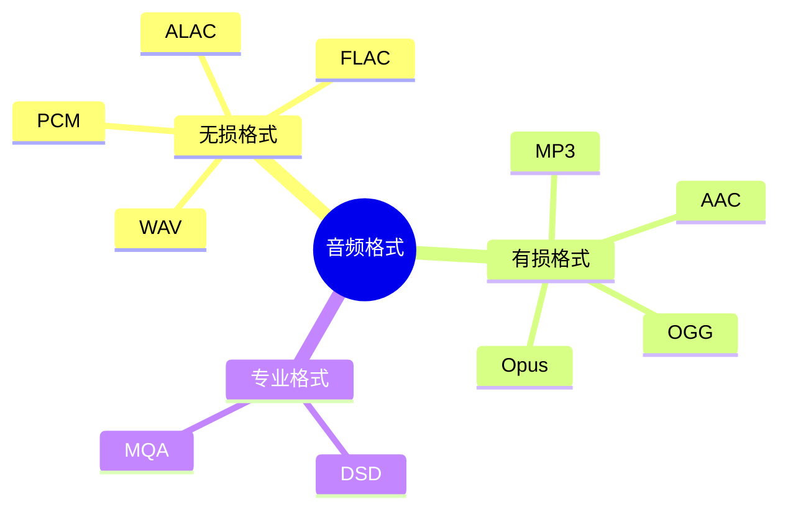

# 音频编解码技术

> 音频格式和编解码器详解

---

## 📋 音频格式分类



---

## 🔧 常见编解码器

### PCM (Pulse Code Modulation)

| 参数 | 说明 | 典型值 |
|------|------|--------|
| 采样率 | 每秒采样数 | 44.1kHz/48kHz/96kHz |
| 位深 | 每样本位数 | 16bit/24bit/32bit |
| 通道数 | 音频通道 | 2(立体声)/5.1/7.1 |
| 比特率 | 数据速率 | 1411kbps(CD 质量) |

### MP3 (MPEG Audio Layer 3)

```bash
# 使用 ffmpeg 转换
ffmpeg -i input.wav -codec:a libmp3lame -q:a 2 output.mp3

# 比特率选项
-q:a 0    # 245 kbps (最高质量)
-q:a 2    # 190 kbps (推荐)
-q:a 4    # 165 kbps (标准)
```

### AAC (Advanced Audio Coding)

```bash
# AAC 编码
ffmpeg -i input.wav -codec:a aac -b:a 256k output.aac

# HE-AAC (高效率 AAC)
ffmpeg -i input.wav -codec:a aac -profile:a aac_he -b:a 128k output.aac
```

---

## 🔧 编解码器对比

| 格式 | 压缩比 | 质量 | 延迟 | 应用场景 |
|------|--------|------|------|----------|
| PCM | 1:1 | 无损 | 最低 | 专业音频 |
| FLAC | 2:1 | 无损 | 低 | 音乐存档 |
| MP3 | 10:1 | 好 | 中 | 通用 |
| AAC | 10:1 | 优秀 | 中 | 流媒体 |
| Opus | 20:1 | 优秀 | 最低 | 实时通信 |

---

## ✅ 总结

音频编解码核心：

1. **PCM** - 原始音频数据
2. **FLAC** - 无损压缩
3. **AAC/MP3** - 有损压缩
4. **Opus** - 低延迟通信

---

*学习笔记由 全栈工程师 维护*
