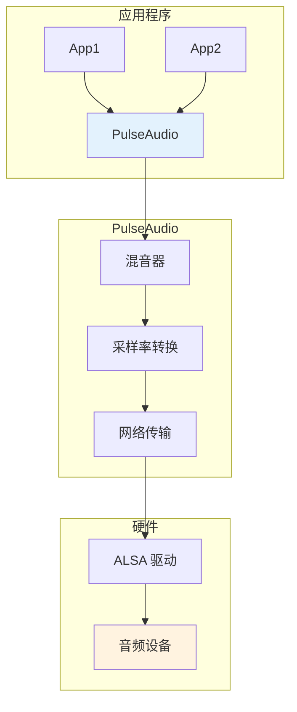

# PulseAudio 与 PipeWire

> 现代音频服务器

---

## 📋 PulseAudio 架构



---

## 🔧 PulseAudio 命令

```bash
# 查看音频设备
pactl list sinks
pactl list sources

# 设置默认输出
pactl set-default-sink alsa_output.pci-0000_00_1b.0.analog-stereo

# 调节音量
pactl set-sink-volume @DEFAULT_SINK@ 50%

# 静音
pactl set-sink-mute @DEFAULT_SINK@ 1

# 加载模块
pactl load-module module-echo-cancel

# 查看模块
pactl list modules short
```

---

## 🔧 PipeWire (新一代音频服务器)

### PipeWire 优势

| 特性 | PulseAudio | PipeWire |
|------|------------|----------|
| 延迟 | 高 | 低 |
| 专业音频 | ❌ | ✅ |
| 视频支持 | ❌ | ✅ |
| Bluetooth | 基本 | 完整 |
| 容器支持 | ❌ | ✅ |

### PipeWire 命令

```bash
# 查看节点
pw-cli list-objects | grep Node

# 查看设备
pw-cli list-objects | grep Device

# 重定向音频
pw-link <source-port> <sink-port>

# 监控事件
pw-cli monitor
```

---

## ✅ 总结

音频服务器核心：

1. **PulseAudio** - 传统音频服务器
2. **PipeWire** - 新一代统一架构
3. **低延迟** - 专业音频支持
4. **网络音频** - 远程播放

---

*学习笔记由 全栈工程师 维护*
