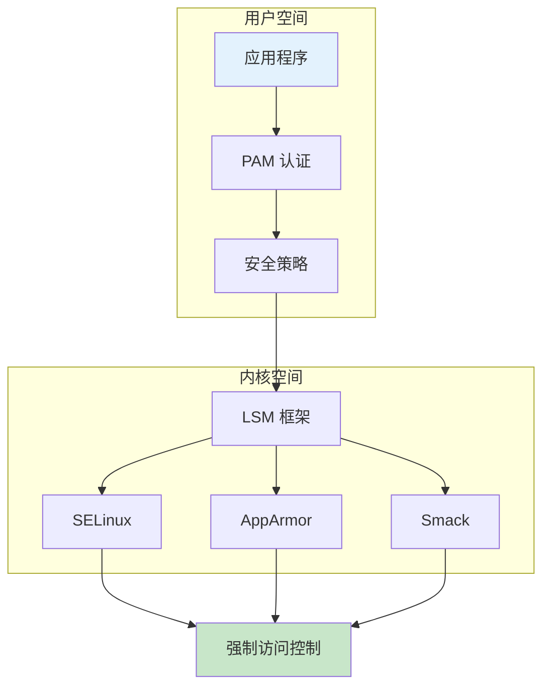
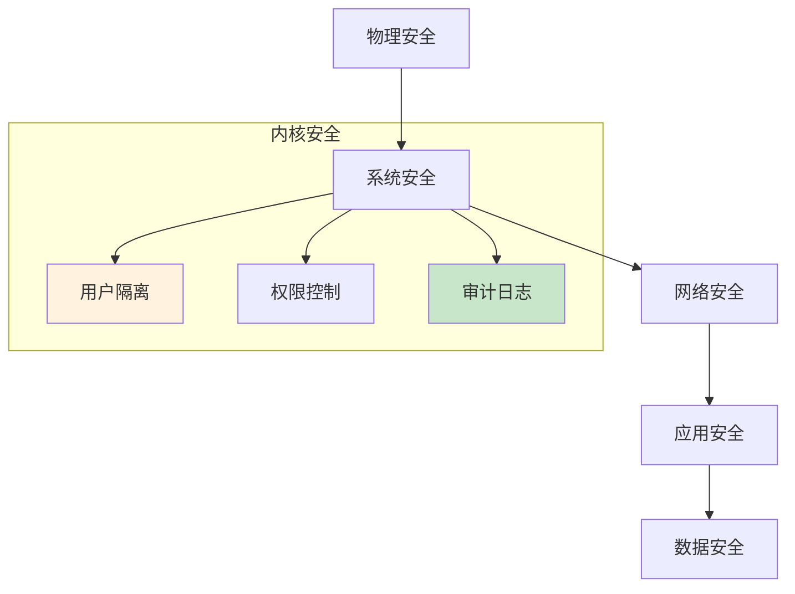
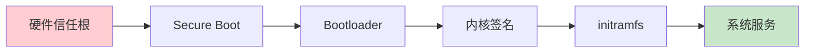

# Linux 安全架构详解

> 内核安全子系统完整指南

---

## 📋 安全架构概述



---

## 🏗️ 安全层次

### 纵深防御体系



### 安全机制分类

| 层次 | 机制 | 说明 |
|------|------|------|
| 用户层 | UID/GID | 用户身份标识 |
| 文件层 | 权限位 | rwx 权限控制 |
| 内核层 | LSM | 安全模块框架 |
| 网络层 | iptables/nftables | 防火墙 |
| 审计层 | auditd | 安全审计 |

---

## 🔧 用户和组管理

### 用户空间隔离

```bash
# 查看用户信息
id username
groups username

# 查看权限
getent passwd
getent group

# 切换用户
su - username
sudo -i
```

### 特殊权限

| 权限 | 说明 | 风险 |
|------|------|------|
| SUID | 以文件所有者身份执行 | ⚠️ 高 |
| SGID | 以文件所属组身份执行 | ⚠️ 中 |
| Sticky | 仅所有者可删除 | ✅ 低 |

```bash
# 查找 SUID 文件
find / -perm -4000 -type f

# 查找 SGID 文件
find / -perm -2000 -type f

# 移除 SUID
chmod u-s file
```

---

## 📊 安全启动链



---

## ✅ 总结

Linux 安全架构核心：

1. **用户隔离** - UID/GID 身份管理
2. **权限控制** - rwx/SUID/SGID
3. **LSM 框架** - 安全模块接口
4. **安全启动** - 信任链验证

---

*学习笔记由 全栈工程师 维护*
