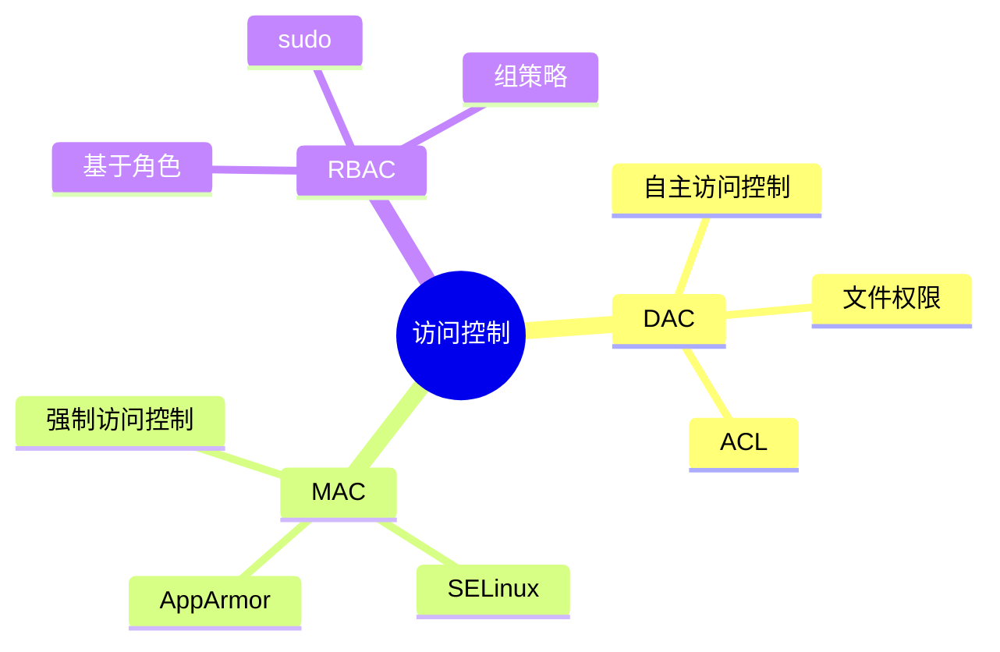

# 访问控制机制

> DAC/MAC/RBAC 完整指南

---

## 📋 访问控制类型



---

## 🔧 DAC (自主访问控制)

### 文件权限

```bash
# 查看权限
ls -l file

# 输出示例
-rwxr-xr-- 1 user group 4096 Mar 20 10:00 file
  ↑    ↑     ↑
  所有者  组    其他

# 修改权限
chmod 755 file
chmod u+x file
chmod g-w file

# 修改所有者
chown user:group file
```

### ACL (访问控制列表)

```bash
# 查看 ACL
getfacl file

# 设置 ACL
setfacl -m u:username:rw file
setfacl -m g:groupname:r file

# 删除 ACL
setfacl -x u:username file

# 递归设置
setfacl -R -m u:username:rw directory/
```

---

## 🔧 MAC (强制访问控制)

### SELinux

```bash
# 查看状态
getenforce
sestatus

# 设置模式
setenforce 0  # Permissive
setenforce 1  # Enforcing

# 查看上下文
ls -Z file
ps -eZ

# 设置上下文
chcon -t httpd_sys_content_t /var/www/html
restorecon -R /var/www/html

# 查看策略
semanage fcontext -l
semanage port -l
```

### AppArmor

```bash
# 查看状态
aa-status

# 启用配置文件
aa-enforce /usr/sbin/httpd

# 禁用配置文件
aa-complain /usr/sbin/httpd

# 生成配置文件
aa-genprof /usr/sbin/application

# 重新加载
apparmor_parser -r /etc/apparmor.d/profile
```

---

## 🔧 RBAC (基于角色的访问控制)

### sudo 配置

```bash
# /etc/sudoers 示例

# 允许 wheel 组执行所有命令
%wheel ALL=(ALL) ALL

# 允许用户执行特定命令
username ALL=(ALL) /usr/bin/systemctl, /usr/bin/journalctl

# 无需密码
username ALL=(ALL) NOPASSWD: /usr/bin/docker

# 验证语法
visudo -c
```

---

## 📊 访问控制对比

| 类型 | 优点 | 缺点 | 应用场景 |
|------|------|------|----------|
| DAC | 简单、灵活 | 权限提升风险 | 通用系统 |
| MAC | 安全性高 | 配置复杂 | 高安全环境 |
| RBAC | 管理方便 | 粒度较粗 | 企业环境 |

---

## ✅ 总结

访问控制核心：

1. **DAC** - 文件权限/ACL
2. **MAC** - SELinux/AppArmor
3. **RBAC** - sudo/角色管理
4. **最佳实践** - 最小权限原则

---

*学习笔记由 全栈工程师 维护*
