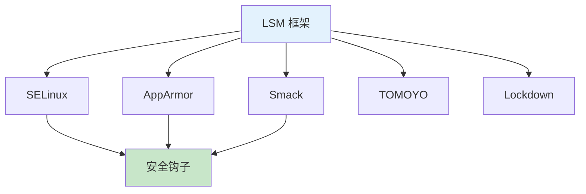

# Linux 安全模块详解

> LSM/SELinux/AppArmor 深度解析

---

## 📋 LSM 框架



### LSM 钩子

```c
// 安全钩子示例
struct security_hook_list {
    struct list_head list;
    const char *lsm;
    union {
        int (*inode_alloc_security)(struct inode *inode);
        int (*file_open)(struct file *file);
        int (*socket_create)(int family, int type, int protocol);
        // ... 更多钩子
    };
};

// 注册钩子
static struct security_hook_list my_hooks[] = {
    LSM_HOOK_INIT(inode_alloc_security, my_inode_alloc),
    LSM_HOOK_INIT(file_open, my_file_open),
    LSM_HOOK_INIT(socket_create, my_socket_create),
};

security_add_hooks(my_hooks, ARRAY_SIZE(my_hooks), "my_lsm");
```

---

## 🔧 SELinux 深度配置

### 策略类型

```bash
# targeted - 仅针对特定服务
# mls - 多级安全
# minimum - 最小策略

# 查看当前策略
sestatus | grep "Policy from config"

# 修改策略类型
# /etc/selinux/config
SELINUX=targeted
```

### 布尔值管理

```bash
# 查看布尔值
getsebool -a

# 搜索相关布尔值
getsebool -a | grep http

# 设置布尔值
setsebool httpd_can_network_connect 1
setsebool -P httpd_can_network_connect 1  # 永久生效
```

### 自定义策略

```bash
# 生成策略模块
audit2allow -a -M mypolicy

# 查看生成的策略
cat mypolicy.te

# 安装策略模块
semodule -i mypolicy.pp

# 列出模块
semodule -l | grep mypolicy

# 删除模块
semodule -r mypolicy
```

---

## 🔧 AppArmor 配置

### 配置文件结构

```apparmor
# /etc/apparmor.d/usr.bin.myapp

#include <tunables/global>

/usr/bin/myapp {
  # 包含的规则
  #include <abstractions/base>
  #include <abstractions/nameservice>
  
  # 文件访问
  /etc/myapp.conf r,
  /var/log/myapp.log w,
  /tmp/ rw,
  
  # 网络访问
  network inet tcp,
  network inet udp,
  
  # 能力
  capability net_bind_service,
  
  # 拒绝访问
  deny /etc/shadow r,
  deny /root/ r,
}
```

### 模式说明

| 模式 | 说明 | 命令 |
|------|------|------|
| Enforce | 强制执行 | aa-enforce |
| Complain | 仅记录 | aa-complain |
| Unconfined | 不限制 | aa-unconfined |

---

## 📊 LSM 对比

| 模块 | 复杂度 | 灵活性 | 性能 | 适用场景 |
|------|--------|--------|------|----------|
| SELinux | 高 | 高 | 中 | 企业/政府 |
| AppArmor | 中 | 中 | 高 | 桌面/服务器 |
| Smack | 低 | 低 | 高 | 嵌入式 |
| TOMOYO | 中 | 中 | 中 | 日本市场 |

---

## ✅ 总结

LSM 核心要点：

1. **LSM 框架** - 安全钩子接口
2. **SELinux** - 复杂但强大
3. **AppArmor** - 简单易用
4. **策略开发** - audit2allow 工具

---

*学习笔记由 全栈工程师 维护*
