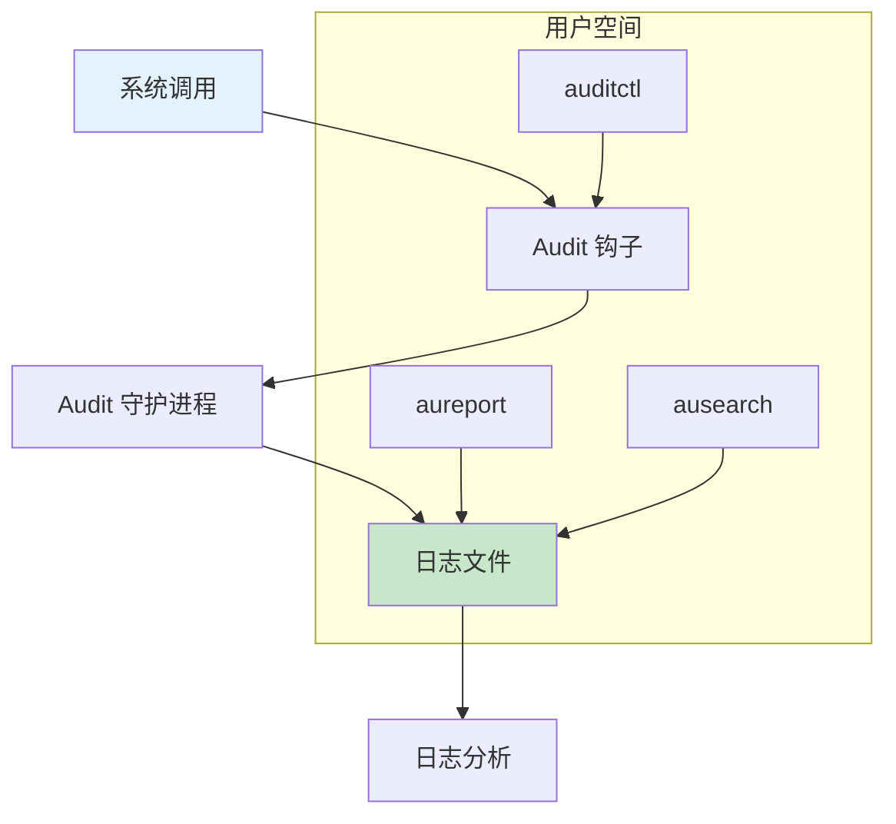

# 安全审计与日志

> auditd 和系统监控完整指南

---

## 📋 审计架构



---

## 🔧 auditd 配置

### 安装和启动

```bash
# 安装
apt install auditd audispd-plugins

# 启动服务
systemctl start auditd
systemctl enable auditd

# 查看状态
systemctl status auditd
```

### 配置文件

```bash
# /etc/audit/auditd.conf
log_file = /var/log/audit/audit.log
log_format = ENRICHED
max_log_file = 100
num_logs = 5
flush = INCREMENTAL_ASYNC
```

---

## 🔧 审计规则

### 文件监控

```bash
# 监控文件访问
auditctl -w /etc/passwd -p wa -k passwd_changes
auditctl -w /etc/shadow -p wa -k shadow_changes

# 监控目录
auditctl -w /etc/sudoers.d/ -p wa -k sudoers_changes

# 查看规则
auditctl -l

# 删除规则
auditctl -W /etc/passwd -k passwd_changes
```

### 系统调用监控

```bash
# 监控 execve 调用
auditctl -a exit,always -F arch=b64 -S execve -k exec_commands

# 监控 mount 调用
auditctl -a exit,always -F arch=b64 -S mount -k mount_operations

# 监控网络配置
auditctl -a exit,always -F arch=b64 -S sethostname -S setdomainname -k network_config
```

### 基于字段的过滤

```bash
# 监控特定用户
auditctl -a exit,always -F arch=b64 -S open -F auid=1000 -k user_access

# 监控特定程序
auditctl -a exit,always -F arch=b64 -F exe=/usr/bin/sudo -k sudo_usage

# 排除系统进程
auditctl -a exit,never -F auid<1000 -F auid!=4294967295
```

---

## 🔧 日志查询

### ausearch 命令

```bash
# 搜索特定密钥
ausearch -k passwd_changes

# 按时间搜索
ausearch -ts today -k sudo_usage

# 按用户搜索
ausearch -i -ua username

# 按文件搜索
ausearch -f /etc/passwd

# 查看详细信息
ausearch -i -m USER_LOGIN
```

### aureport 命令

```bash
# 生成摘要报告
aureport --summary

# 用户报告
aureport --user

# 文件访问报告
aureport --file

# 认证报告
aureport --auth

# 按时间生成报告
aureport --start today --end now
```

---

## 🔧 日志分析

### 可疑活动检测

```bash
# 失败的登录尝试
ausearch -m USER_LOGIN -sv no | aureport --auth

# sudo 失败
ausearch -m USER_AUTH -sv no | grep sudo

# 文件修改
ausearch -k passwd_changes -i

# 异常执行
ausearch -k exec_commands -i | sort | uniq -c | sort -rn
```

### 日志轮转

```bash
# 配置 logrotate
# /etc/logrotate.d/auditd

/var/log/audit/audit.log {
    weekly
    rotate 5
    compress
    missingok
    notifempty
    postrotate
        /sbin/service auditd restart > /dev/null 2>&1 || true
    endscript
}
```

---

## ✅ 总结

安全审计核心：

1. **auditd** - 审计守护进程
2. **规则配置** - auditctl 命令
3. **日志查询** - ausearch/aureport
4. **异常检测** - 日志分析

---

*学习笔记由 全栈工程师 维护*
