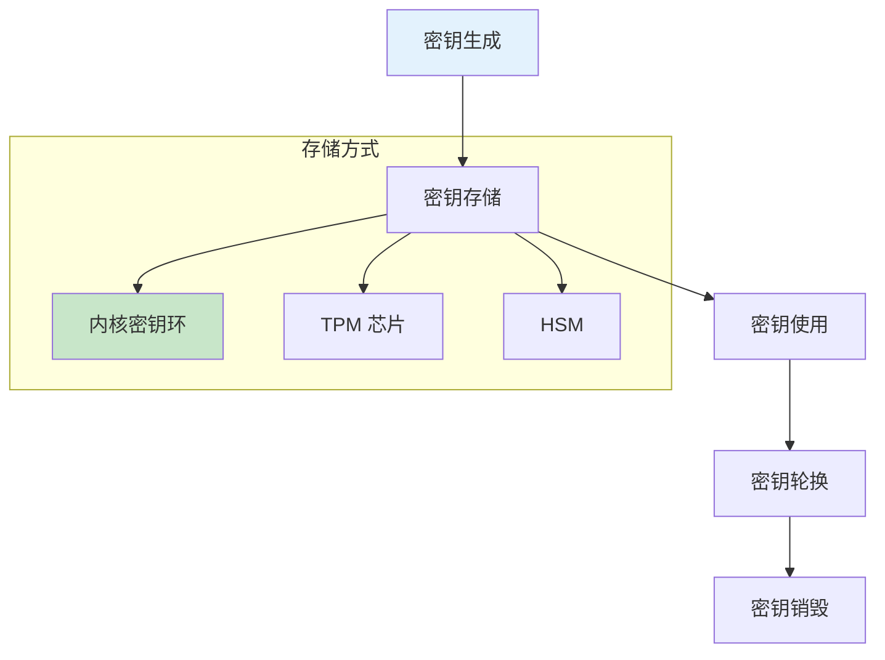

# 加密与密钥安全

> 密钥管理和加密实践

---

## 📋 密钥管理架构



---

## 🔧 内核密钥环

### 密钥环类型

| 类型 | 说明 | 生命周期 |
|------|------|----------|
| @keyring | 用户密钥环 | 用户会话 |
| @u | 用户密钥环 | 用户会话 |
| @s | 会话密钥环 | 会话期间 |
| @g | 组密钥环 | 组会话 |
| @p | 进程密钥环 | 进程期间 |

### 密钥环操作

```bash
# 添加密钥
keyctl add user mykey "secret_data" @u

# 查看密钥环
keyctl show

# 读取密钥
keyctl print <key_id>

# 设置权限
keyctl setattr <key_id> u:rwx g:r o:0

# 链接到密钥环
keyctl link <key_id> @u

# 撤销密钥
keyctl revoke <key_id>

# 删除密钥
keyctl unlink <key_id> @u
```

---

## 🔧 TPM 安全芯片

### TPM 工具

```bash
# 安装 TPM2 工具
apt install tpm2-tools tpm2-abrmd

# 检查 TPM 状态
tpm2_getcap handles-persistent

# 创建主密钥
tpm2_createprimary -C o -c primary.ctx -g sha256 -G rsa

# 创建密钥对
tpm2_create -C primary.ctx -u key.pub -r key.priv -G rsa

# 加载密钥
tpm2_load -C primary.ctx -u key.pub -r key.priv -c key.ctx

# 加密数据
echo "secret" | tpm2_encryptdecrypt -c key.ctx -o encrypted.dat

# 解密数据
tpm2_encryptdecrypt -d -c key.ctx -o decrypted.dat encrypted.dat
```

### TPM 应用

```bash
# LUKS + TPM 自动解锁
clevis luks bind -d /dev/sda2 tpm2 '{}'

# 测量启动
tpm2_pcrread

# 远程证明
tpm2_quote -c key.ctx -l sha256:0,1,2,3 -m quote.msg -s quote.sig
```

---

## 🔧 GPG 密钥管理

### 密钥生成

```bash
# 生成密钥
gpg --full-generate-key

# 选择密钥类型
# (1) RSA and RSA (default)
# 密钥大小：4096
# 有效期：2y

# 导出公钥
gpg --armor --export user@example.com > public.key

# 导出私钥
gpg --armor --export-secret-keys user@example.com > private.key
```

### 密钥使用

```bash
# 加密文件
gpg --encrypt --recipient user@example.com file.txt

# 解密文件
gpg --decrypt file.txt.gpg

# 签名文件
gpg --sign file.txt

# 验证签名
gpg --verify file.txt.gpg
```

---

## 🔧 安全最佳实践

### 密码策略

```bash
# /etc/pam.d/common-password
password requisite pam_pwquality.so retry=3 minlen=12 \
    dcredit=-1 ucredit=-1 ocredit=-1 lcredit=-1

# 密码历史
password required pam_pwhistory.so use_authtok remember=5
```

### SSH 安全

```bash
# /etc/ssh/sshd_config
PermitRootLogin no
PasswordAuthentication no
PubkeyAuthentication yes
PermitEmptyPasswords no
MaxAuthTries 3
X11Forwarding no
```

---

## ✅ 总结

加密安全核心：

1. **密钥环** - 内核密钥管理
2. **TPM** - 硬件安全模块
3. **GPG** - 密钥加密
4. **最佳实践** - 密码/SSH 安全

---

*学习笔记由 全栈工程师 维护*
